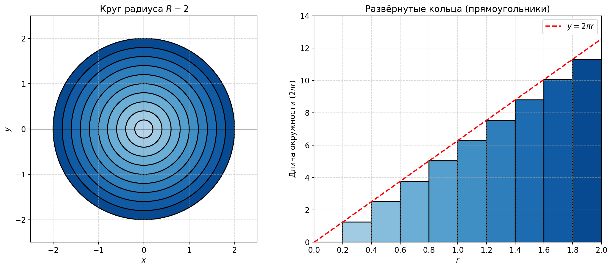
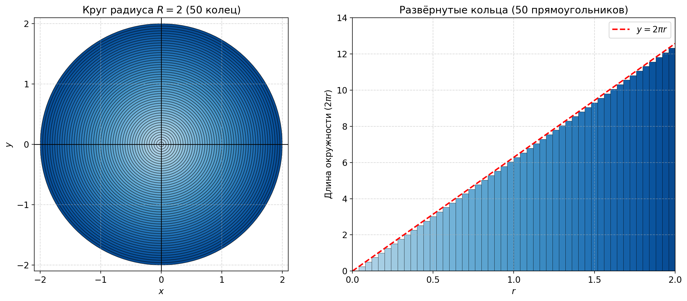
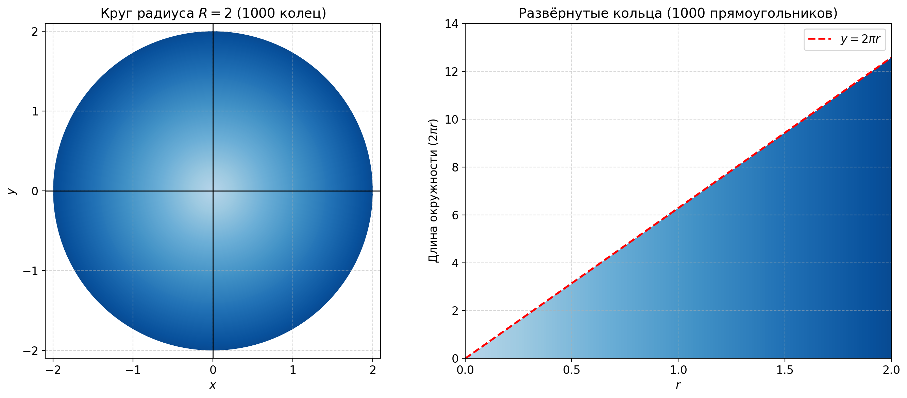
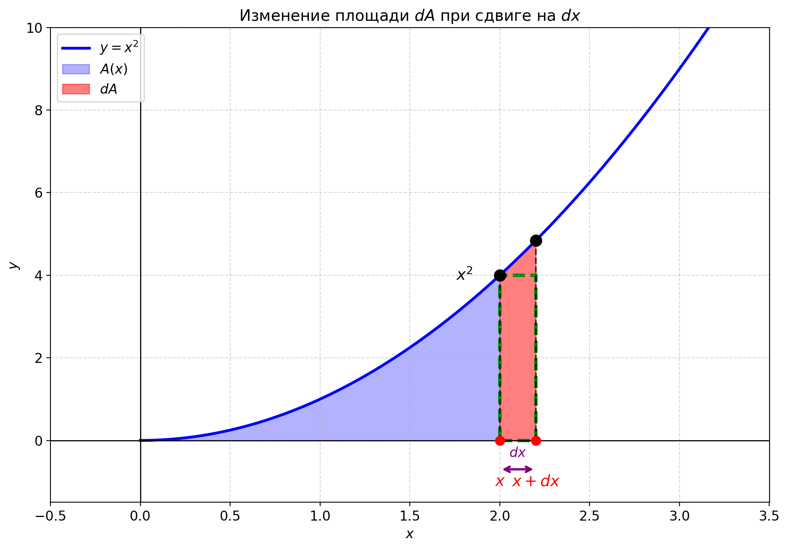
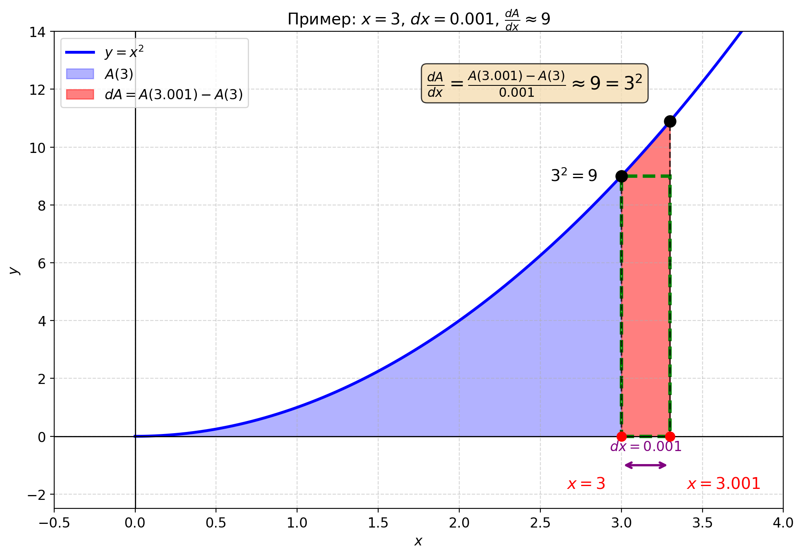

# Сущность математического анализа

## Главная задача: площадь круга

Почему площадь круга равна $\pi r^2$? Размышление над этим вопросом приводит к трём ключевым идеям: интегралам, производным и их связи.

> 📖 Подробнее о числе π: [что такое π и как его вычисляли](../uncat/pi.md)

## Разбиение круга на концентрические кольца

Круг разбивается на тонкие кольца. Каждое кольцо имеет радиус $r$ и толщину $dr$.

Каждое кольцо можно "развернуть" в прямоугольник с высотой $2\pi r$ (длина окружности) и шириной $dr$ (ширину мы выбираем сами: $0.2, 0.04, 0.002$). Площадь **одного** такого прямоугольника $\approx 2\pi r \cdot dr$.

Круг "разрезан" на 10 колец, толщина каждого $dr = 0.2$:

50 колец, толщиной $dr = 0.04$

1000 колец, толщиной $dr = 0.002$

## Сумма прямоугольников как площадь под графиком

Прямая $y = 2\pi r$ показывает высоту каждого прямоугольника — длину окружности кольца с радиусом $r$. Когда $dr \to 0$, прямоугольники становятся всё тоньше, и их суммарная площадь стремится к площади под графиком — то есть к площади треугольника.

Все прямоугольники выстраиваются вдоль оси — их суммарная площадь равна площади под прямой $y = 2\pi r$. 

Это треугольник с основанием $R$ и высотой $2\pi R$:

$$S = \frac{1}{2} \cdot R \cdot 2\pi R = \pi R^2$$

В нашем примере $R = 2$:

$$S = \frac{1}{2} \cdot 2 \cdot 2\pi \cdot 2 = \frac{1}{2} \cdot 2 \cdot 4\pi = 4\pi = \pi \cdot 2^2$$

<b>Подробнее: почему 0 × ∞ даёт конечный ответ?</b>

Парадокс кажущийся:
- При $dr \to 0$ площадь каждого прямоугольника $2\pi r \cdot dr \to 0$
- Но количество прямоугольников $\to \infty$

Мы получаем неопределённость $0 \times \infty$. Именно её разрешает **предел** (будет рассмотрено далее):

| $dr$ | Кол-во | Площадь одного (при $r=1$) | Сумма всех |
|------|--------|---------------------------|------------|
| $0.2$ | $10$ | $2\pi \cdot 0.2 \approx 1.26$ | $3.6\pi \approx 11.31$ |
| $0.04$ | $50$ | $2\pi \cdot 0.04 \approx 0.25$ | $3.92\pi \approx 12.32$ |
| $0.002$ | $1000$ | $2\pi \cdot 0.002 \approx 0.013$ | $3.996\pi \approx 12.55$ |
| $\to 0$ | $\to \infty$ | $\to 0$ | $= 4\pi \approx 12.57$ |

**Важно:** прямоугольники имеют **разную высоту** в зависимости от $r$! Колонка "Площадь одного" показывает только пример для $r = 1$.

Для 10 колец ($dr = 0.2$) суммируются площади:

$$dr \cdot 2\pi \cdot (0 + 0.2 + 0.4 + 0.6 + 0.8 + 1.0 + 1.2 + 1.4 + 1.6 + 1.8)$$
$$= 0.2 \cdot 2\pi \cdot 9 = 3.6\pi \approx 11.31$$

Ключевое: мы **никогда не подставляем** $dr = 0$. Мы смотрим, к чему **стремится** сумма при уменьшении $dr$.

### Что такое $dr$? Бесконечно малое число?

**Современный подход (через пределы):**
$dr$ — это обычное положительное число ($0.2, 0.04, 0.002...$), которое мы делаем всё меньше. Мы никогда не используем "бесконечно малое" число — мы смотрим, к чему стремится сумма.

**Исторический подход (Лейбниц, Ньютон):**
Они думали о $dr$ как о "бесконечно малой величине" — больше нуля, но меньше любого числа. Это работало, но было нестрого.

**Нестандартный анализ (Робинсон, 1960-е):**
Математик Абрахам Робинсон доказал, что "бесконечно малые" можно определить строго — это гиперреальные числа.

**Для практики:** думайте о $dr$ как об очень маленьком, но конечном числе. Интеграл — это предел, а не сумма "нулей".

## Обобщение метода: интегралы

Множество сложных задач в математике и физике можно разбить на **сумму маленьких величин**.

**Пример: пройденный путь по скорости**

Если автомобиль движется с переменной скоростью $v(t)$, то за маленький промежуток времени $dt$ он проходит:

$$\text{маленький путь} = v(t) \cdot dt$$

Суммируя все такие кусочки, получаем общий путь — это **площадь под графиком** $v(t)$.

**Общий принцип:** если задача сводится к сумме тонких прямоугольников, то она эквивалентна нахождению площади под графиком.

### Нам повезло с кругом

В задаче о круге площадь под графиком $y = 2\pi r$ оказалась **треугольником** — её легко вычислить по формуле $\frac{1}{2} \cdot \text{основание} \cdot \text{высота}$.

### А что если график сложнее?

Представьте параболу $y = x^2$. Какова площадь под ней от $x = 0$ до $x = 3$?

Это уже не треугольник, и простой формулы нет.

### Что такое интеграл?

**Интеграл** — это функция $A(x)$, которая даёт **площадь под графиком** от начальной точки до $x$.

Записывается так:

$$A(x) = \int_0^x f(t) \, dt$$

Читается: "интеграл от $f(t)$ по $t$ от $0$ до $x$".

Для параболы $y = x^2$:

$$A(x) = \int_0^x t^2 \, dt = \text{площадь под } y = t^2 \text{ от } 0 \text{ до } x$$

Пока что это "загадочная функция" — мы знаем, что она существует (площадь же есть!), но не знаем её формулу. Инструменты для её нахождения — главная тема анализа.

Таким образом, если задача сводится к нахождению площади под графиком (в примере с кругом это график линейной функции $y = 2\pi r$), то нам стоит задуматься о том, как найти площадь под другими графиками.

## Связь между площадью и функцией: производные

Мы не знаем формулу для $A(x)$ — площади под $x^2$. Но можем узнать кое-что важное о ней!

Попробуем выяснить, как связано изменение площади $dA(x)$ и изменение $dx$.

### Что происходит при малом изменении $x$?

Если немного увеличить $x$ на величину $dx$, площадь $A(x)$ увеличится на маленький кусочек $dA(x)$. Этот кусочек — почти прямоугольник:
- **Высота** $\approx x^2$ (значение функции в точке $x$)
- **Ширина** $= dx$

Значит:
$$dA(x) \approx x^2 \cdot dx$$

Или, переписав:

### Производная

$$\boxed{\frac{dA(x)}{dx} \approx x^2}$$

$$\boxed{\frac{dA(x)}{dx} = \frac{A(x + dx) - A(x)}{dx} \approx x^2}$$

Такая запись называется **производной функции $A(x)$**. И показывает что **отношение маленького изменения площади при маленьком изменении $x$** равно самой нашей функции $x^2$ или **высоте** "бесконечно"-тонкого **прямоугольника** в точке $x$ (ширина прямоугольника $dx \rightarrow 0$).

### Конкретный пример

Возьмём две близкие точки: $x = 3$ и $x = 3.001$. Разница $dx = 0.001$.

Изменение площади $dA(x) = A(3.001) - A(3)$.

Отношение $\frac{dA(x)}{dx} = \frac{A(3.001) - A(3)}{0.001}$ должно быть примерно равно $3^2 = 9$. Пока что мы не знаем, что за функция $A$, но мы выяснили её полезное свойство.

## Фундаментальная теорема анализа

Мы обнаружили удивительную связь:

**Производная интеграла равна самой функции**

- **Интеграл** $A(x)$ — это площадь под графиком функции $f(x)$ или, что-же самое сумма площадей всех тонких прямоугольников под графиком
- **Производная** функции этой площади (приращение площади при приращении $dx$, скорость роста площади) $\frac{dA(x)}{dx}$ равна исходной функции $f(x)$

$$\boxed{\frac{dA(x)}{dx} = f(x)}$$

Или словами: **производная интеграла равна исходной функции**.

### Почему это важно?

Это означает, что интегрирование и дифференцирование — **обратные операции** друг друга, как сложение и вычитание, умножение и деление.

Если вы знаете, как находить производные (а это проще!), вы можете **обратить процесс** и найти интегралы.

## Резюме

Мы увидели что интеграл позволяет находить площадь под графиком функции. Увидели что производная от интеграла есть сама функция. Пока что мы не знаем что это за функция такая - интеграл.

Дальше рассмотрим более подробно производную, интеграл и предел.
