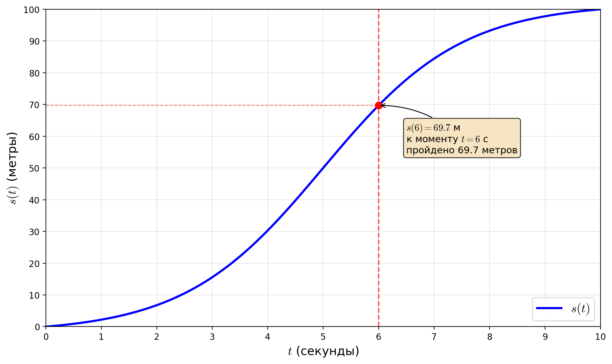
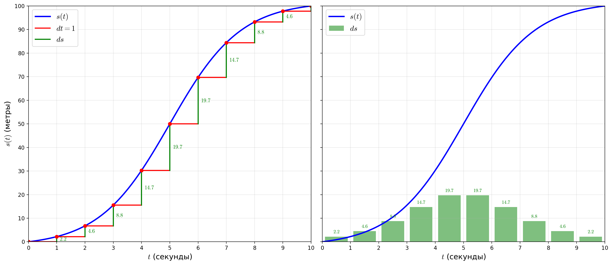
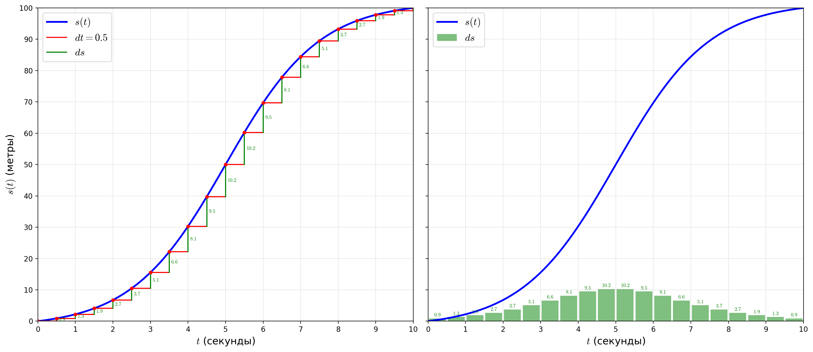
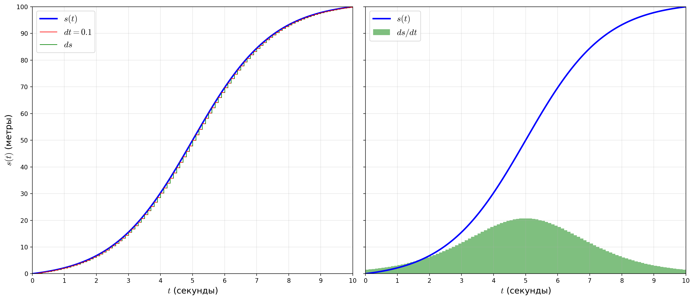

# Производная и парадокс скорости в момент времени

> **Парадокс Зенона про стрелу:** Летящая стрела в каждый момент времени занимает определённое положение в пространстве. Если она занимает определённое положение — значит, она покоится. Но если стрела покоится в каждый момент времени, то она покоится всегда. Значит, движения не существует. *Как можно двигаться, если в каждый момент ты "стоишь"?*

Скорость на отрезке пути измеряется в километрах в час, то есть нужно разделить пройденный путь на время, за которое путь был пройден. Но как измерить скорость в момент времени? Каждый момент времени это как-бы фотоснимок, на котором объект не движется. 

## Задача: Движение автомобиля. Скорость в момент времени

За время $t = 10 секунд$ автомобиль прошёл расстояние $S = 100 \text{ метров}$. Высота линии графика в каждой точке $t$ показывает пройденное расстояние к моменту времени $t$.

- Вертикальная ось — пройденное расстояние
- Горизонтальная ось — время
- Функция расстояния: $s(t)$

Форма кривой и её интерпретация:
- Пологая кривая в начале — медленный старт
- Крутой наклон — быстрое движение
- Снова пологая — торможение

## График изменения скорости

Можно построить столбиковый график скорости (или, что то-же самое, изменения пройденного пути $ds$ за время $dt) $ds(t) = \frac{s(t) - s(t - dt)}{dt}$ для каждой секунды ($dt = 1$). 

**Пример:** $t = 5$ $ds(5) = s(5) - s(4) = 50 - 30.3 = 19.7$

Для $dt = 0.5$

$dt = 0.1$.

## Парадокс: скорость в один момент не имеет смысла
- Спидометр показывает скорость «сейчас» — это интуитивно
- Но: по одному снимку автомобиля нельзя определить скорость
- Для вычисления скорости нужны две точки во времени
- $v = \frac{\Delta s}{\Delta t}$ — расстояние, делённое на время

## Как спидометр обходит парадокс
- Измеряет расстояние за очень малый промежуток времени
- Например: расстояние между 3 с и 3.01 с
- Делит малое расстояние на малое время

## Обозначения $dt$ и $ds$
- $dt$ — малое изменение времени (например, 0.01 с)
- $ds$ — соответствующее изменение расстояния
- Скорость ≈ $\frac{ds}{dt}$

## Графическая интерпретация $\frac{ds}{dt}$
- Увеличение (zoom) графика в точке
- $dt$ — шаг вправо по горизонтали
- $ds$ — изменение высоты графика
- Наклон (slope) между двумя близкими точками

## $\frac{ds}{dt}$ как функция времени
- Компьютер вычисляет $\frac{s(t + dt) - s(t)}{dt}$ для всех $t$
- Получаем кривую скорости

## Определение производной через предел
- Производная — это **не** отношение $\frac{ds}{dt}$ для конкретного $dt$
- Производная — это то, к чему **стремится** это отношение при $dt \to 0$

## Секущая и касательная
- При конкретном $dt$: наклон секущей (линия через две точки)
- При $dt \to 0$: точки сближаются
- Предел — наклон касательной к графику в одной точке

## Важное уточнение: $dt$ никогда не равен нулю
- $dt$ — конечное ненулевое значение
- Оно лишь стремится к нулю
- Это «хитрый чёрный ход» для разговора о скорости в точке

## Лучшая константная аппроксимация
- Наклон касательной — не «мгновенная скорость»
- Это лучшее константное приближение скорости вблизи точки

## О нотации в анализе
- Буква $d$ означает намерение взять предел при $dt \to 0$
- $\frac{ds}{dt}$ — не дробь, а предел дроби

## Пример: производная функции $s(t) = t^3$
- Задача: найти скорость при $t = 2$
- Вычисляем $\frac{s(2 + dt) - s(2)}{dt}$
- Раскрываем $(2 + dt)^3 - 2^3$

## Алгебраические преобразования
- $(2 + dt)^3 = 2^3 + 3 \cdot 2^2 \cdot dt + 3 \cdot 2 \cdot dt^2 + dt^3$
- $2^3$ сокращается
- Остаётся $3 \cdot 2^2 + (\text{члены с } dt)$
- При $dt \to 0$ остаётся $3 \cdot 2^2 = 12$

## Общая формула: производная $t^3$ равна $3t^2$
- Красота: сложная идея → простое выражение
- Это одна из формул, которые заучивают

## Почему это упрощает задачу
- Конкретное $dt$ даёт «беспорядок» в формуле
- Предел при $dt \to 0$ упрощает выражение
- В этом суть полезности математического анализа

## Парадокс в момент $t = 0$
- Функция $s(t) = t^3$, производная $s'(t) = 3t^2$
- При $t = 0$: производная = 0
- Касательная горизонтальна → «мгновенная скорость» = 0
- Вопрос: движется ли автомобиль в момент $t = 0$?

## Разрешение парадокса
- Вопрос «движется ли в момент» не имеет смысла
- Изменение в момент не существует — это не то, что измеряет производная
- Производная = 0 означает: лучшее константное приближение скорости около этой точки равно 0

## Автомобиль всё-таки движется
- Между $t = 0$ и $t = 0.1$ с автомобиль проезжает 0.001 м
- Средняя скорость = 0.01 м/с
- При меньших $dt$ отношение стремится к 0, но машина не статична

## Правильное понимание производной
- Не «мгновенная скорость изменения» (оксюморон)
- А **лучшее константное приближение скорости вблизи точки**

## Анонс следующих видео
- Производная в разных контекстах
- Как вычислять производные
- Почему это полезно
- Визуальная интуиция

