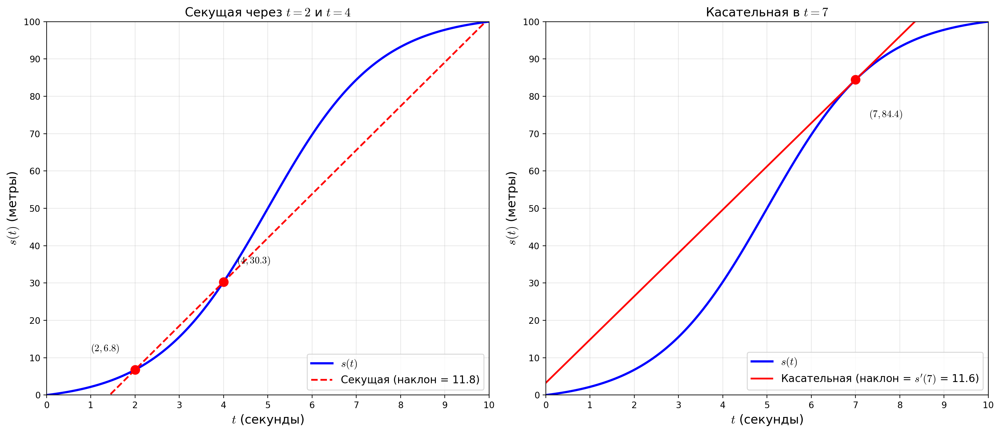
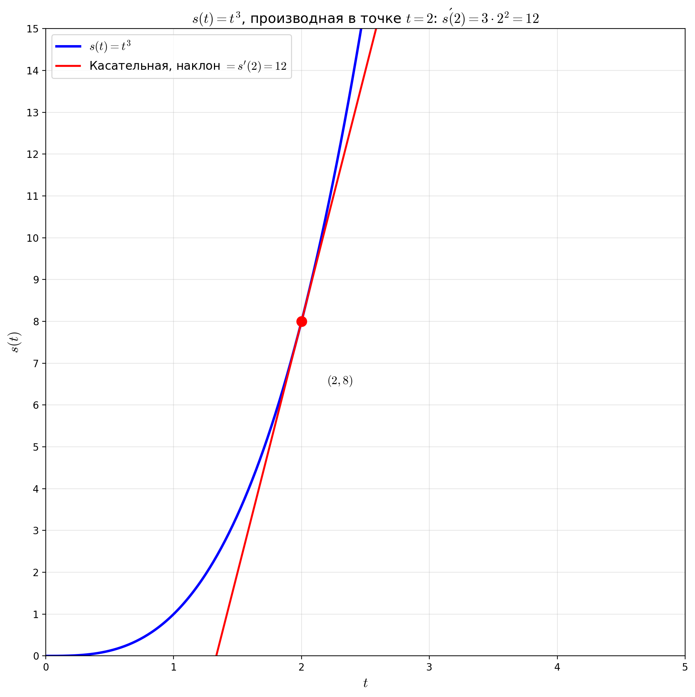

# Производная и парадокс скорости в момент времени

> **Парадокс Зенона про стрелу:** Летящая стрела в каждый момент времени занимает определённое положение в пространстве. Если она занимает определённое положение — значит, она покоится. Но если стрела покоится в каждый момент времени, то она покоится всегда. Значит, движения не существует. *Как можно двигаться, если в каждый момент ты "стоишь"?*

Скорость на отрезке пути измеряется в километрах в час, то есть нужно разделить пройденный путь на время, за которое путь был пройден. Но как измерить скорость в момент времени? Каждый момент времени это как-бы фотоснимок, на котором объект не движется. 

## Задача: Движение автомобиля. Скорость в момент времени

За время $t = 10 секунд$ автомобиль прошёл расстояние $S = 100 \text{ метров}$. Высота линии графика в каждой точке $t$ показывает пройденное расстояние к моменту времени $t$.

- Вертикальная ось — пройденное расстояние
- Горизонтальная ось — время
- Функция расстояния: $s(t)$

Форма кривой и её интерпретация:
- Пологая кривая в начале — медленный старт
- Крутой наклон — быстрое движение
- Снова пологая — торможение

## График изменения скорости

Можно построить столбиковый график скорости (или, что то-же самое, изменения пройденного пути $ds$ за время $dt) $ds(t) = \frac{s(t) - s(t - dt)}{dt}$ для каждой секунды ($dt = 1$). 

**Пример:** $t = 5$ $ds(5) = s(5) - s(4) = 50 - 30.3 = 19.7$

Для $dt = 0.5$

$dt = 0.1$

Начинает вырисовываться график изменения скорости (или производной от пройденного пути) $v(t) = s'(t)$.  Однако..

## Парадокс: скорость в один момент не имеет смысла

Функция производной, или скорости, которую мы ищем $v(t)$, вычисляется в один момент времени $t$, но для вычисления скорости нужны **две** разные точки во времени, так как **скорость** это **расстояние** пройденное **за промежуток времени**.

## Как спидометр обходит парадокс

Спидометр автомобиля измеряет расстояние за очень малый промежуток времении делит малое расстояние на малое время. 

Например: $v = \frac{\Delta s}{\Delta t} = \frac{ds}{dt} = \frac{20.21 - 20{\text{ метров}}}{3.01 - 3{\text{ секунд}}}$ (за $0.01{\text{ секунд}}$ было пройдено $20{\text{ метров}}$)

## Определение производной через предел

Производная $\frac{ds}{dt}(t) = \frac{s(t) - s(t - dt)}{dt}$ при $dt \rightarrow 0$

- Это **не** отношение $\frac{ds}{dt}(t)$ для конкретного $dt$
- Производная — это то, к чему **стремится** это отношение при $dt \to 0$
- $dt$ — конечное ненулевое значение
- Оно лишь стремится к нулю
- Наклон касательной — не «мгновенная скорость»
- Это лучшее константное приближение скорости вблизи точки

## Секущая и касательная

- При конкретном $dt$: наклон секущей (линия через две точки)
- При $dt \to 0$: точки сближаются и предел — наклон касательной к графику в одной точке

## О нотации в анализе

- Буква $d$ означает намерение взять предел при $dt \to 0$
- $\frac{ds}{dt}$ — не дробь, а предел дроби

## Пример: производная функции $s(t) = t^3$

Найдём производную функции $s(t) = t^3$.

По формуле куба суммы: $(a + b)^3 = a^3 + 3a^2b + 3ab^2 + b^3$

$$\frac{s(t + dt) - s(t)}{dt} = \frac{(t + dt)^3 - t^3}{dt} = \frac{t^3 + 3t^2 \cdot dt + 3t \cdot dt^2 + dt^3 - t^3}{dt} =$$

$$= \frac{3t^2 \cdot dt + 3t \cdot dt^2 + dt^3}{dt} = \frac{dt(3t^2 + 3t \cdot dt + dt^2)}{dt} = 3t^2 + 3t \cdot dt + dt^2$$

**Берём предел при $dt \to 0$:**

При $dt \to 0$ члены $3t \cdot dt$ и $dt^2$ исчезают:

$$s'(t) = 3t^2$$

**Подставляем $t = 2$:**

$$s'(2) = 3 \cdot 2^2 = 12$$

Мы нашли каково будет изменение расстояния в момент времени 2, то есть скорость в на второй секунде движения.

| $dt$ | Результат |
|------|-----------|
| $1$ | $19$ |
| $0.1$ | $12.61$ |
| $0.01$ | $12.06$ |
| $0.001$ | $12.006$ |

## Общая формула: производная $t^3$ равна $3t^2$
- Красота: сложная идея → простое выражение
- Это одна из формул, которые заучивают

## Почему это упрощает задачу
- Конкретное $dt$ даёт «беспорядок» в формуле
- Предел при $dt \to 0$ упрощает выражение
- В этом суть полезности математического анализа

## Парадокс в момент $t = 0$
- Функция $s(t) = t^3$, производная $s'(t) = 3t^2$
- При $t = 0$: производная = 0
- Касательная горизонтальна → «мгновенная скорость» = 0
- Вопрос: движется ли автомобиль в момент $t = 0$?

## Разрешение парадокса
- Вопрос «движется ли в момент» не имеет смысла
- Изменение в момент не существует — это не то, что измеряет производная
- Производная = 0 означает: лучшее константное приближение скорости около этой точки равно 0

## Автомобиль всё-таки движется
- Между $t = 0$ и $t = 0.1$ с автомобиль проезжает 0.001 м
- Средняя скорость = 0.01 м/с
- При меньших $dt$ отношение стремится к 0, но машина не статична

## Правильное понимание производной
- Не «мгновенная скорость изменения» (оксюморон)
- А **лучшее константное приближение скорости вблизи точки**
