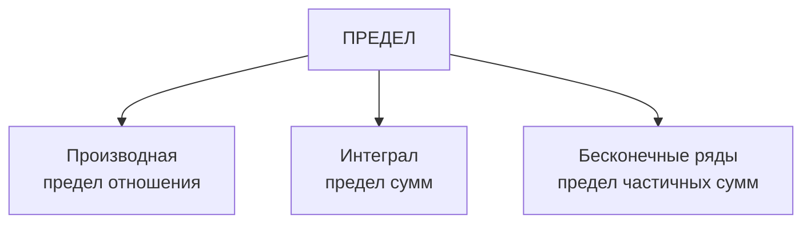

# Диалог: Что нового в матанализе по сравнению с алгеброй?

## Краткое содержание

| Понятие | Что нового |
|---------|-----------|
| **Предел** | "К чему стремится" вместо "чему равно" |
| **Производная** | Скорость изменения функции |
| **Интеграл** | Накопление, площадь под кривой |
| **Непрерывность** | Функция без разрывов |
| **Сходимость** | Бесконечная сумма с конечным ответом |

**Главное:** Алгебра — "чему равно?", Матанализ — "как изменяется?"

---

## Участники:
- **Ученик** — изучает матанализ
- **Учитель** — объясняет концепции

---

**Ученик:** Добавляет ли матанализ какие-то ещё понятия, которых нет в обычной математике и алгебре?

**Учитель:** Да! Матанализ добавляет несколько ключевых понятий:

| Понятие | Чего нет в алгебре | Что добавляет матанализ |
|---------|-------------------|------------------------|
| **Предел** | "Стремится к" | $\lim_{x \to a} f(x) = L$ |
| **Производная** | "Мгновенная скорость изменения" | $f'(x) = \frac{df}{dx}$ |
| **Интеграл** | "Сумма бесконечно малых" | $\int f(x)\,dx$ |
| **Непрерывность** | "Без разрывов" | Функция без скачков |
| **Сходимость** | "Бесконечная сумма имеет конечный ответ" | $\sum_{n=1}^{\infty} a_n = S$ |

---

**Ученик:** А как эти понятия связаны между собой?

**Учитель:** Все они построены на **пределе**:

**Предел** — это фундамент. Без него нельзя определить ни производную, ни интеграл.

---

**Ученик:** В чём принципиальная разница между алгеброй и матанализом?

**Учитель:** 

| В алгебре | В матанализе |
|-----------|--------------|
| Работаем с **конечными** величинами | Работаем с **бесконечными** процессами |
| Точные равенства: $x = 5$ | Приближения: $x \to 5$ |
| Статика: значения | Динамика: изменения |
| Дискретно: точки | Непрерывно: кривые |

---

**Ученик:** Можно одной фразой?

**Учитель:** 

**Алгебра** отвечает на вопрос: **"Чему равно?"**

**Матанализ** отвечает на вопросы: **"Как изменяется?"** и **"К чему стремится?"**

Это переход от изучения **состояний** к изучению **процессов**.

