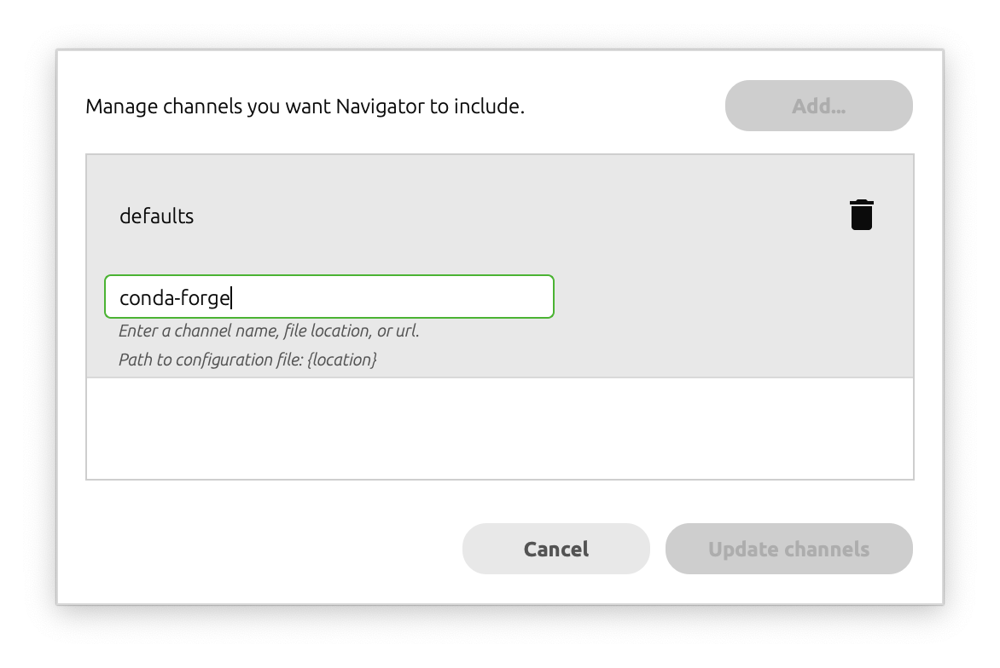
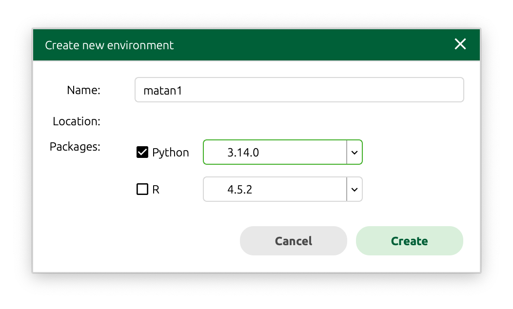
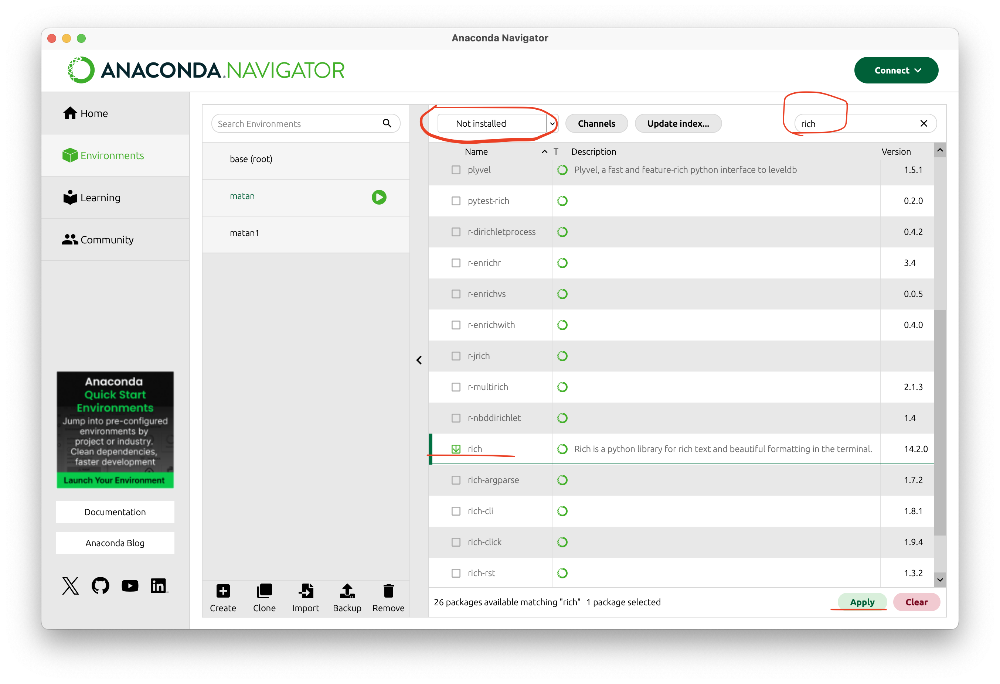

# Математика для Data Science. 1 часть. Математический анализ и линейная алгебра

## Описание курса

- Что такое математический анализ и где он применяется?
- Понятие функции, производной, интеграла, ряда.
- Что такое линейная алгебра и где она применяется?
- Понятие вектора, матрицы, определителя, операций над ними.

> На эти и множество других вопросов слушатель получит ответ. Полученные навыки и знания будут востребованы для изучения и применения алгоритмов ML (machine learning) и DL (deep learning).

## Цель курса

Получение знаний по высшей математике, а именно, по матанализу и линейной алгебре с использованием библиотеки символьных вычислений Sympy.

## Задачи курса

- **Математический анализ** – это фундамент высшей математики. Предстоит познакомиться с такими понятиями, как множество, бесконечная малая величина, предел, производная, интеграл и ряд.

- **Линейная алгебра** дает понятие того, что такое линейное пространство, правила работы с матрицами. Вы узнаете, что такое вектор, норма вектора, матрица Якоби и матрица Гессиана. Курс дает знания и навыки, необходимые для понимания принципов и алгоритмов градиентного спуска, которые положены в основу машинного обучения.

## Описание линейки курсов по математике на Python


## Conda и Anaconda — среда для Data Science

### Что такое Conda и зачем она нужна

**Conda** — это мощный менеджер пакетов и окружений с открытым исходным кодом, созданный специально для Data Science и научных вычислений. Conda решает две ключевые задачи:

1. **Управление пакетами** — устанавливает не только Python-библиотеки, но и системные зависимости (например, CUDA для GPU-вычислений, компиляторы C/C++, библиотеки R)
2. **Управление окружениями** — создает изолированные среды с разными версиями Python и библиотек, позволяя работать с несколькими проектами одновременно

**Ключевые особенности conda:**
- Кроссплатформенность (Windows, macOS, Linux)
- Универсальность — работает не только с Python, но и с R, Julia, C++ и другими языками
- Надежное разрешение конфликтов зависимостей с помощью SAT-решателя
- Предкомпилированные бинарные пакеты — быстрая установка без необходимости компиляции

#### Дистрибутивы на базе Conda

Существует три основных дистрибутива, включающих conda:

1. **Miniconda** — минималистичный установщик, включающий только:
   - Сам менеджер conda
   - Python
   - Базовый набор системных библиотек
   - Размер: ~50-100 MB
   - **Идеально для:** опытных пользователей, серверов, Docker-контейнеров

2. **Anaconda** — полный дистрибутив для Data Science, включающий:
   - Все из Miniconda
   - Более 250 предустановленных пакетов (NumPy, Pandas, Matplotlib, Scikit-learn, Jupyter и др.)
   - Anaconda Navigator — графический интерфейс для управления пакетами и окружениями
   - Размер: ~3-5 GB
   - **Идеально для:** начинающих, быстрого старта в Data Science

3. **Conda (standalone)** — чистая установка conda без Python:
   - Только менеджер conda
   - Python устанавливается при создании первого окружения
   - **Идеально для:** продвинутых пользователей с особыми требованиями

**Что выбрать?**
- Для этого курса рекомендуется **Anaconda** — все необходимые библиотеки уже предустановлены
- Если у вас ограничено место на диске или вы хотите больше контроля — используйте **Miniconda** и установите только нужные пакеты

### Conda VS pip

- pip — часть официальной экосистемы Python (разрабатывается Python Packaging Authority)
- conda — независимый проект, решающий более широкие задачи (не только Python-пакеты, но и системные зависимости)

| Характеристика | conda | pip |
|----------------|-------|-----|
| **Область применения** | Универсальный (Python, R, C++, Julia) | Только Python |
| **Тип пакетов** | Предкомпилированные бинарные файлы | Wheel или исходный код |
| **Зависимости** | Включая системные библиотеки | Только Python-пакеты |
| **Разрешение конфликтов** | SAT-решатель (надежнее) | Простой алгоритм |
| **Источник** | Anaconda, conda-forge | PyPI (Python Package Index) |

### Структура директории Anaconda

После установки Anaconda создается папка (обычно `/opt/anaconda3` или `~/anaconda3`) со следующей структурой:

```
anaconda3/
├── bin/              # Исполняемые файлы (python, conda, pip, jupyter)
├── lib/              # Библиотеки Python и системные библиотеки
├── pkgs/             # Кэш загруженных пакетов (может занимать много места!)
├── envs/             # Виртуальные окружения conda
├── conda-meta/       # Метаданные установленных пакетов
├── condabin/         # Вспомогательные скрипты для conda
├── etc/              # Конфигурационные файлы
├── include/          # C/C++ заголовочные файлы для компиляции
├── share/            # Общие данные, примеры, документация
├── ssl/              # SSL сертификаты
└── Anaconda-Navigator.app/  # GUI приложение (на macOS)
```

**Важные папки:**
- **`envs/`** — здесь хранятся все ваши виртуальные окружения
- **`pkgs/`** — кэш пакетов, можно очистить командой `conda clean --all`

### Автоактивация базового окружения

После установки Anaconda в терминале появляется префикс `(base)`:

```bash
(base) user@macbook ~ %
```

Это означает, что активировано базовое окружение с предустановленными пакетами.

#### Что такое (base)?

**`(base)`** — это название базового (корневого) окружения Anaconda. По сути, это виртуальное окружение, которое создается автоматически при установке Anaconda.

**Что находится в окружении base:**
- Интерпретатор Python (обычно последняя стабильная версия)
- Более 250 предустановленных пакетов для Data Science:
  - **NumPy** — работа с массивами и матрицами
  - **Pandas** — анализ и обработка данных
  - **Matplotlib, Seaborn** — визуализация данных
  - **Scikit-learn** — машинное обучение
  - **Jupyter Notebook** — интерактивная разработка
  - **SymPy** — символьные вычисления (для этого курса!)
  - И многие другие

**Когда вы видите `(base)` в терминале:**
- Все команды `python`, `pip`, `jupyter` будут использовать версии из Anaconda
- Все установленные пакеты доступны сразу
- Вы изолированы от системного Python (если он есть)

**Переключение между окружениями:**
```bash
(base) user@macbook ~ % conda activate myproject
(myproject) user@macbook ~ % conda deactivate
user@macbook ~ %  # нет активного окружения
```

Префикс в скобках всегда показывает имя текущего активного окружения.

#### Изменения в файле ~/.zshrc

При установке Anaconda автоматически модифицирует ваш файл конфигурации оболочки `~/.zshrc` (или `~/.bash_profile` для bash), добавляя в него блок инициализации:

```bash
# >>> conda initialize >>>
# !! Contents within this block are managed by 'conda init' !!
__conda_setup="$('/opt/anaconda3/bin/conda' 'shell.zsh' 'hook' 2> /dev/null)"
if [ $? -eq 0 ]; then
    eval "$__conda_setup"
else
    if [ -f "/opt/anaconda3/etc/profile.d/conda.sh" ]; then
        . "/opt/anaconda3/etc/profile.d/conda.sh"
    else
        export PATH="/opt/anaconda3/bin:$PATH"
    fi
fi
unset __conda_setup
# <<< conda initialize <<<
```

Этот блок кода:
- Инициализирует conda при каждом запуске терминала
- Добавляет команду `conda` в PATH
- Включает возможность активации окружений через `conda activate`
- Автоматически активирует базовое окружение (если не отключено)

**Важно:** Не удаляйте этот блок вручную! Если нужно удалить Anaconda, используйте официальный деинсталлятор или команду `conda init --reverse`.

#### Отключение автоактивации

Если вы не хотите, чтобы `(base)` появлялось при каждом запуске терминала:

```bash
conda config --set auto_activate_base false
```

После выполнения команды перезапустите терминал.

#### Включение обратно

```bash
conda config --set auto_activate_base true
```

#### Ручное управление окружениями

```bash
# Деактивировать текущее окружение
conda deactivate

# Активировать базовое окружение
conda activate base

# Создать новое окружение
conda create -n myenv python=3.11

# Активировать созданное окружение
conda activate myenv

# Посмотреть список окружений
conda env list
```

**Рекомендация:** Для работы с курсом лучше оставить автоактивацию включенной или создать отдельное окружение для курса.

### Зачем нужны виртуальные окружения?

Виртуальные окружения решают ключевую проблему: **изоляция зависимостей** между разными проектами.

#### Проблема без виртуальных окружений

Представьте ситуацию:

```
Проект А требует: Django 3.2, NumPy 1.20
Проект Б требует: Django 4.2, NumPy 1.24
```

Если установить всё в системный Python:
- При установке Django 4.2 старая версия 3.2 удалится
- Проект А перестанет работать
- Постоянные конфликты версий

#### Как решают виртуальные окружения

Каждый проект получает **собственную изолированную среду**:

```
📁 Система
├── 🐍 Системный Python 3.12 (не трогаем!)
├── 📦 Проект А
│   └── окружение: Python 3.10, Django 3.2, NumPy 1.20
└── 📦 Проект Б
    └── окружение: Python 3.11, Django 4.2, NumPy 1.24
```

#### Основные преимущества

1. **Изоляция зависимостей** — каждый проект имеет свои версии библиотек
2. **Воспроизводимость** — другой разработчик может создать точно такое же окружение
3. **Безопасность** — не засоряется системный Python, не ломаются системные утилиты
4. **Разные версии Python** — можно работать с Python 3.10 и 3.12 одновременно (в conda)
5. **Лёгкое удаление** — удалил папку окружения — и всё чисто

#### Примеры из реальной жизни

**Ситуация 1: Старый проект**
```bash
# Нужно поддерживать старый проект на Python 3.8
conda create -n old_project python=3.8 django=2.2
```

**Ситуация 2: Курс по Data Science**
```bash
# Для этого курса создаём окружение с нужными версиями
conda create -n ds_math python=3.11 numpy pandas sympy jupyter
conda activate ds_math
```

**Ситуация 3: Тестирование новой библиотеки**
```bash
# Хочу попробовать новую версию, не ломая рабочий проект
conda create -n test_env python=3.12
conda activate test_env
pip install experimental-package
# Не понравилось? Просто удаляю: conda remove -n test_env --all
```

### Conda env vs venv — в чём разница?

Conda окружения **не являются** стандартными Python `venv`. Это разные технологии:

| Характеристика | venv (стандартный Python) | conda env |
|----------------|---------------------------|-----------|
| **Изоляция** | Только Python-пакеты | Python + системные библиотеки |
| **Версия Python** | Фиксированная (от системы) | Можно выбрать любую |
| **Не-Python пакеты** | ❌ | ✅ (R, CUDA, OpenCV и т.д.) |
| **Расположение** | В папке проекта | Централизованно в `anaconda3/envs/` |
| **Размер** | Маленький (~10-50 MB) | Больше (сотни MB) |
| **Создание** | `python -m venv myenv` | `conda create -n myenv` |

**Ключевое отличие:** conda создает полностью независимую копию Python с собственными системными библиотеками, тогда как venv использует симлинки на существующий Python и изолирует только пакеты.

**Для этого курса** используйте conda окружения, так как они гарантируют правильные версии всех научных библиотек и их зависимостей.

## Anaconda Navigator

Рассмотрим как этим пользоваться

### Установка

Скачаем Anaconda (НЕ miniconda) с сайта [anaconda.com](https://www.anaconda.com/download)


### Conda Forge

Подключим репозиторий [Conda Forge](https://conda-forge.org)


- В Anaconda Navigator нажимаем `Channels`
- `Add`
- Пишем в поле `conda-forge` и нажимаем `<Enter>`
- Нажимаем `Update Channels`



> Если теперь снова зайти в `Channels` то увидим там только-что подключенный `conda-forge`

### Виртуальное окружение

В Anaconda Navigator:
- Переходим в `Environments`
- Нажимаем снизу `Create`
- Зполняем поля 



Переключиться в окружение

```shell
conda activate matan1
```

### Установка пакета в окружение

- Выбираем нужное окружение
- Пишем в строке поиска название пакета
- Отмечаем его галочкой
- Нажимаем **Apply**




### Сonda в терминале

##### Посмотреть доступные версии питона

```shell
conda search python
```

##### Создание окружения

```shell
conda create --name matan2 python=3.12
```

##### Удаление окружения

```shell
conda env remove --name matan2
```

##### Посмотреть список окружений (справа директория окружения)

```shell
conda env list
```
```shell
# conda environments:
#
base                   /opt/anaconda3
matan1                 /opt/anaconda3/envs/matan1
matan2               * /opt/anaconda3/envs/matan2
```

Также можно зайти в папку с окружением и посмотреть что там находится отдельная версия бинарника питона и всех установленных в это окружение пакетов


### Cheat Sheet

[Список команд conda](https://docs.conda.io/projects/conda/en/stable/user-guide/cheatsheet.html)

[conda-25.3.1.pdf](./conda-25.3.1.pdf)

