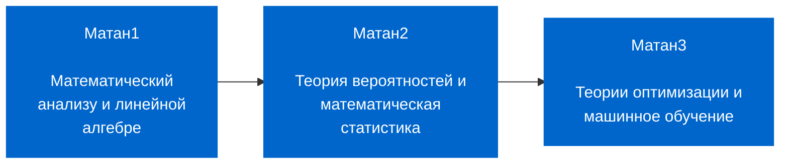

# Математика для Data Science. 1 часть. Математический анализ и линейная алгебра

## Описание курса

- Что такое математический анализ и где он применяется?
- Понятие функции, производной, интеграла, ряда.
- Что такое линейная алгебра и где она применяется?
- Понятие вектора, матрицы, определителя, операций над ними.

> На эти и множество других вопросов слушатель получит ответ. Полученные навыки и знания будут востребованы для изучения и применения алгоритмов ML (machine learning) и DL (deep learning).

## Цель курса

Получение знаний по высшей математике, а именно, по матанализу и линейной алгебре с использованием библиотеки символьных вычислений SymPy.

## Задачи курса

- **Математический анализ** – это фундамент высшей математики. Предстоит познакомиться с такими понятиями, как множество, бесконечная малая величина, предел, производная, интеграл и ряд.

- **Линейная алгебра** дает понятие того, что такое линейное пространство, правила работы с матрицами. Вы узнаете, что такое вектор, норма вектора, матрица Якоби и матрица Гессиана. Курс дает знания и навыки, необходимые для понимания принципов и алгоритмов градиентного спуска, которые положены в основу машинного обучения.

## Описание линейки курсов по математике на Python

