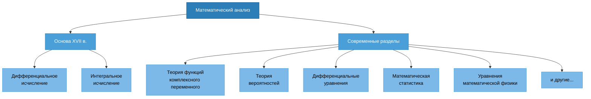

# Математический Анализ

## Литература

- Матанализ с человеческим лицом
- Ильин В. А., Садовничий В. А., Сендов Б. Х. Математический анализ в 2 ч.
- Архипов Г.И., Садовничий В.А., Чубариков В.Н. Лекции по математическому анализу
- Фихтенгольц Г. М. Курс дифференциального и интегрального исчисления. В 3 т.
- Кудрявцев Л.Д. Курс математического анализа (в двух томах)
- Демидович Б.П. Сборник задач и упражнений по математическому анализу
- Кудрявцев Л.Д. Сборник задач по математическому анализу

## Основные понятия математического анализа. Предмет

Под термином «математический анализ» подразумевается прежде всего дифференциальное и интегральное исчисление, созданное Ньютоном и Лейбницем в XVII в.

Составные части математического анализа разрослись, что стали отдельными математическими дисциплинами: теория функции комплексного переменного, теория вероятностей, дифференциальные уравнения, математическая статистика, уравнения математической физики и т.д.

В широком смысле математический анализ включает в себя все эти области.



## История математического анализа

### Античность: зарождение идей

**Эвклид** (ок. 325–265 до н.э.) в своих "Началах" заложил основы аксиоматического метода и геометрии. Хотя анализа как такового ещё не было, идеи о бесконечно малых величинах уже начинали формироваться.

**Архимед** (287–212 до н.э.) — истинный предтеча математического анализа:
- Разработал **метод исчерпывания** для вычисления площадей и объёмов
- Вычислил площадь параболического сегмента, используя суммирование бесконечного ряда
- Нашёл объём шара и площадь его поверхности
- Фактически использовал идеи, близкие к интегрированию

**Пример метода Архимеда:**

Для вычисления площади круга он вписывал и описывал вокруг круга многоугольники с всё большим числом сторон:

$$A_{\text{вписанного}} < A_{\text{круга}} < A_{\text{описанного}}$$

При увеличении числа сторон обе площади стремились к площади круга.

### Средневековье и Возрождение

**XIV век** — схоласты Оксфордского университета (Томас Брадвардин, Уильям Хейтсбери) изучали:
- Мгновенную скорость
- Равномерно ускоренное движение
- Понятие производной (неявно)

**Николь Орем** (ок. 1320–1382):
- Разработал графические методы представления движения
- Использовал идеи, близкие к координатной системе (за 250 лет до Декарта!)

### XVII век: революция в математике

**Иоганн Кеплер** (1571–1630):
- Вычислял объёмы винных бочек, используя "неделимые" (infinitesimales)
- Работа "Новая стереометрия винных бочек" (1615)

**Бонавентура Кавальери** (1598–1647):
- Метод неделимых — предшественник интегрального исчисления
- "Геометрия, изложенная новым способом при помощи неделимых непрерывного" (1635)

**Пьер Ферма** (1601–1665):
- Разработал метод нахождения максимумов и минимумов
- Метод построения касательных к кривым
- Фактически открыл правила дифференцирования

**Рене Декарт** (1596–1650):
- Создал аналитическую геометрию (1637)
- Связал алгебру и геометрию
- Ввёл координатную систему, без которой анализ был бы невозможен

**Джон Валлис** (1616–1703):
- Работал с бесконечными рядами
- Ввёл символ бесконечности $\infty$ (1655)
- Вычислял интегралы степенных функций

**Блез Паскаль** (1623–1662):
- Работал над площадями криволинейных фигур
- Разработал методы интегрирования тригонометрических функций

**Исаак Барроу** (1630–1677):
- Учитель Ньютона
- Обнаружил **взаимную обратность** дифференцирования и интегрирования
- Фундаментальная теорема анализа (в геометрической форме)

### Ньютон и Лейбниц: создание математического анализа

#### Исаак Ньютон (1643–1727)

**1665–1666 годы** — "чудесные годы" (annus mirabilis):
- Разработал **метод флюксий** (производных)
- Создал теорию **флюэнт** (интегралов)
- Применил анализ к механике и физике

**Основные идеи Ньютона:**
- Флюксия — скорость изменения величины (производная)
- Обозначение: $\dot{x}, \dot{y}$ для производных по времени
- Физическая интерпретация: скорость, ускорение
- **"Метод флюксий и бесконечных рядов"** (написан в 1671, опубликован в 1736)

**Главное достижение:** Ньютон понял, что:
1. Вычисление касательной (дифференцирование)
2. Вычисление площади (интегрирование)

— это **взаимно обратные операции**.

#### Готфрид Вильгельм Лейбниц (1646–1716)

**1675–1676 годы** — независимо от Ньютона создал исчисление бесконечно малых:

**Вклад Лейбница:**
- Разработал удобную **символику**: $dx, dy, \int, \frac{dy}{dx}$
- Эта нотация используется до сих пор!
- Рассматривал дифференциал как бесконечно малое приращение
- Формализовал правила дифференцирования

**Публикации:**
- 1684 — "Новый метод максимумов и минимумов" (первая публикация о дифференциальном исчислении)
- 1686 — "О скрытой геометрии" (интегральное исчисление)

**Обозначения Лейбница:**

$$\frac{dy}{dx} \quad \text{(производная)}$$

$$\int y \, dx \quad \text{(интеграл)}$$

$$d(uv) = u \, dv + v \, du \quad \text{(правило произведения)}$$

### Спор о приоритете

**1699–1716** — ожесточённый спор между сторонниками Ньютона и Лейбница о первенстве:
- Ньютон разработал метод раньше (1665–1666), но опубликовал позже
- Лейбниц опубликовал первым (1684)
- Оба пришли к идеям **независимо**

**Современный взгляд:** оба математика независимо создали математический анализ. Ньютон дал физическую интерпретацию, Лейбниц — удобный математический формализм.

### Значение открытия

Создание математического анализа Ньютоном и Лейбницем стало:
- Величайшей революцией в математике
- Основой всей современной науки и техники
- Инструментом для описания динамических процессов
- Фундаментом физики, инженерии, экономики

### XVIII век: развитие и применение анализа

После создания основ математического анализа наступил период интенсивного развития и применения новых методов.

#### Якоб Бернулли (1654–1705) и Иоганн Бернулли (1667–1748)

**Семья Бернулли** — династия математиков, которые внесли огромный вклад в развитие анализа:
- Решали дифференциальные уравнения
- Разработали вариационное исчисление
- Изучали бесконечные ряды
- Иоганн был учителем Эйлера

**Вклад:**
- Задача о брахистохроне (кривая наибыстрейшего спуска)
- Числа Бернулли
- Неравенство Бернулли

#### Леонард Эйлер (1707–1783)

**Величайший математик XVIII века:**

**Достижения в математическом анализе:**
- Систематизировал и развил всю область анализа
- Ввёл понятие **функции** в современном смысле: $f(x)$
- Ввёл обозначения: $e$ (основание натурального логарифма), $i$ (мнимая единица), $\pi$
- Разработал теорию рядов
- Создал вариационное исчисление

**Знаменитая формула Эйлера:**

$$e^{i\pi} + 1 = 0$$

Связывает пять фундаментальных математических констант.

**Общая формула:**

$$e^{ix} = \cos x + i \sin x$$

**Книги Эйлера:**
- "Введение в анализ бесконечных" (1748)
- "Дифференциальное исчисление" (1755)
- "Интегральное исчисление" (1768–1770)

Эти труды стали основой обучения математическому анализу на столетия.

#### Жозеф Луи Лагранж (1736–1813)

**Вклад в анализ:**
- Попытался освободить анализ от геометрических представлений
- Ввёл обозначение производной: $f'(x), f''(x), ...$
- Разработал теорию аналитических функций
- Формула Тейлора с остаточным членом в форме Лагранжа
- Множитель Лагранжа для задач на условный экстремум

**Главный труд:** "Теория аналитических функций" (1797)

#### Пьер-Симон Лаплас (1749–1827)

- Применял анализ к теории вероятностей и небесной механике
- Преобразование Лапласа (используется в дифференциальных уравнениях)
- Оператор Лапласа: $\Delta = \nabla^2$

### XIX век: строгое обоснование математического анализа

К началу XIX века математический анализ успешно применялся, но его **логические основания** оставались нечёткими. Понятия "бесконечно малых" и "предела" не были строго определены, что приводило к парадоксам.

#### Огюстен Луи Коши (1789–1857)

**Революция в строгости:**

Коши был первым, кто систематически ввёл строгие определения основных понятий анализа:

**Основные достижения:**
- Строгое определение **предела**: 

$$\lim_{x \to a} f(x) = L \iff \forall \varepsilon > 0 \, \exists \delta > 0: \, 0 < |x - a| < \delta \Rightarrow |f(x) - L| < \varepsilon$$

- Строгое определение **непрерывности** функции
- Определение **производной** через предел
- Определение **интеграла** (интеграл Коши)
- Теорема Коши о среднем значении
- Критерий Коши сходимости последовательностей

**Труды:**
- "Курс анализа" (1821)
- "Резюме лекций по исчислению бесконечно малых" (1823)

#### Карл Вейерштрасс (1815–1897)

**"Отец современного математического анализа":**

Вейерштрасс довёл до совершенства программу строгого обоснования анализа:

**Вклад:**
- Введение **$\varepsilon$-$\vardelta$ определений** (современный стандарт строгости)
- Арифметизация анализа (освобождение от геометрических представлений)
- Теория степенных рядов
- Примеры функций, показавших ограниченность интуиции:
  - Непрерывная, но нигде не дифференцируемая функция Вейерштрасса

**Теорема Вейерштрасса:** 

Всякая непрерывная на отрезке $[a, b]$ функция достигает своих наибольшего и наименьшего значений.

#### Бернхард Риман (1826–1866)

**Вклад в анализ:**
- Определение **интеграла Римана** (современное определение определённого интеграла)
- Условия интегрируемости функций
- Теория тригонометрических рядов
- Риманова геометрия (обобщение математического анализа на искривлённые пространства)

**Определение интеграла Римана:**

Разбиение отрезка на части, составление интегральных сумм:

$$\int_a^b f(x) \, dx = \lim_{n \to \infty} \sum_{i=1}^{n} f(\xi_i) \Delta x_i$$

#### Георг Кантор (1845–1918)

**Создатель теории множеств:**
- Теория множеств стала **фундаментом** всей математики, включая анализ
- Понятия: мощность множества, счётные и несчётные множества
- Континуум-гипотеза

**Значение для анализа:**

Теория Кантора позволила:
- Строго определить действительные числа
- Понять природу непрерывности
- Различать разные типы бесконечностей

#### Анри Лебег (1875–1941)

**Создатель современной теории интеграла:**

**Интеграл Лебега:**
- Обобщение интеграла Римана
- Позволяет интегрировать более широкий класс функций
- Основа функционального анализа и теории вероятностей

**Преимущества интеграла Лебега:**
- Предельный переход под знаком интеграла (теорема Лебега о мажорируемой сходимости)
- Интеграл от предела = предел интегралов (при определённых условиях)

### XX век: новые направления и обобщения

#### Функциональный анализ

**Основатели:** Давид Гильберт, Стефан Банах, Джон фон Нейман

Функциональный анализ — обобщение математического анализа на **бесконечномерные пространства**:
- Гильбертовы пространства
- Банаховы пространства
- Линейные операторы
- Спектральная теория

**Применения:**
- Квантовая механика
- Дифференциальные уравнения в частных производных
- Теория управления

#### Топология и дифференциальная геометрия

**Развитие анализа на многообразиях:**
- Анри Пуанкаре — основатель топологии
- Дифференциальная геометрия (Риман, Картан, Гаусс)
- Тензорный анализ

**Применение:**
- Общая теория относительности Эйнштейна
- Современная физика элементарных частиц

#### Комплексный анализ

**Теория функций комплексного переменного:**
- Коши, Риман, Вейерштрасс
- Интеграл Коши
- Теорема о вычетах
- Конформные отображения

**Применения:**
- Гидродинамика
- Электродинамика
- Теория чисел

#### Теория распределений (обобщённых функций)

**Создатель:** Сергей Львович Соболев, Лоран Шварц (1950-е)

**Идея:**
- Обобщение понятия функции
- Дельта-функция Дирака получила строгое математическое обоснование
- Производные существуют для более широкого класса функций

**Применения:**
- Квантовая механика
- Теория дифференциальных уравнений
- Обработка сигналов

### Современность: анализ в XXI веке

#### Вычислительная математика

**Численные методы:**
- Численное дифференцирование и интегрирование
- Методы решения дифференциальных уравнений
- Метод конечных элементов
- Вейвлет-анализ

#### Нелинейный анализ

**Направления:**
- Теория хаоса
- Фракталы
- Катастрофы
- Динамические системы

#### Применения математического анализа

**Современные приложения:**

1. **Физика:**
   - Квантовая механика
   - Теория поля
   - Статистическая механика

2. **Инженерия:**
   - Обработка сигналов
   - Теория управления
   - Аэродинамика

3. **Компьютерные науки:**
   - Machine Learning и Deep Learning
   - Компьютерная графика
   - Оптимизация

4. **Экономика и финансы:**
   - Модель Блэка-Шоулза для опционов
   - Стохастический анализ
   - Эконометрика

5. **Биология и медицина:**
   - Моделирование эпидемий
   - Популяционная динамика
   - Обработка медицинских изображений

6. **Искусственный интеллект:**
   - Градиентный спуск
   - Обратное распространение ошибки
   - Оптимизация нейронных сетей

### Итоги: от Ньютона до наших дней

**Путь длиной в 350 лет:**

| Период | Ключевые фигуры | Достижения |
|--------|----------------|------------|
| **XVII век** | Ньютон, Лейбниц | Создание основ анализа |
| **XVIII век** | Эйлер, Бернулли, Лагранж | Развитие и применение |
| **XIX век** | Коши, Вейерштрасс, Риман | Строгое обоснование |
| **XX век** | Лебег, Гильберт, Банах | Обобщения и абстракции |
| **XXI век** | — | Вычисления и приложения |

**Современное состояние:**

Математический анализ сегодня — это:
- **Фундамент** всех точных наук
- **Язык** современной физики и инженерии
- **Инструмент** для Machine Learning и Data Science
- **Основа** экономического моделирования
- **Метод** решения прикладных задач

От интуитивных идей Ньютона и Лейбница до строгой аксиоматики Вейерштрасса, от конечномерных пространств до бесконечномерного функционального анализа — математический анализ прошёл грандиозный путь развития и остаётся одной из самых активных и важных областей математики.

## Теория множеств

**Множество** — совокупность объектов любой природы.

> «Под многообразием или множеством я понимаю вообще всякое многое, т.е. всякую совокупность определённых элементов, которая может быть связана в одно целое с помощью некоторого закона».
> 
> — **Георг Кантор**

**Обозначения:**

- $a \in M$ — элемент $a$ принадлежит множеству $M$
- $a \notin M$ — элемент $a$ не принадлежит множеству $M$

### Способы задания множеств

**1) Указанием признаков (характеристических свойств)**

Указываются свойства, присущие всем элементам множества и только им:

$$M = \{x \mid P(x)\}$$

где $P(x)$ — свойство.

**Пример:**

$$A = \{x \mid x \in \mathbb{R}, \, x^2 - 4 = 0\}$$

**2) Перечислением всех элементов множества**

Если это возможно, элементы перечисляются явно:

$$M = \{a; b; ...\}$$

**Пример:**

$$A = \{-2; 2\}$$

**Пустое множество** $\emptyset$

Множество, не содержащее ни одного элемента:

$$B = \{x \mid x \in \mathbb{R}, \, x^2 + 1 = 0\}$$

Это пустое множество, так как нет действительных чисел, квадрат которых равен $-1$.

### Стандартные числовые множества

- $\mathbb{N}$ — множество натуральных чисел
- $\mathbb{R}$ — множество действительных чисел

**Примеры:**

$$A = \{x \mid x \in \mathbb{R}, \, 0 \leq x \leq 4\}$$

Множество всех действительных чисел от 0 до 4 включительно (отрезок $[0, 4]$).

$$C = \{x \mid x \in \mathbb{N}, \, 0 \leq x \leq 4\} = \{1; 2; 3; 4\}$$

Множество натуральных чисел от 0 до 4. Так как натуральные числа начинаются с 1, получаем конечное множество $\{1; 2; 3; 4\}$.

## Операции над множествами

### Равенство множеств

Два множества $A$ и $B$ называются **равными**, если каждый элемент множества $A$ является элементом множества $B$ и, наоборот, каждый элемент множества $B$ является элементом множества $A$.

$$A = B \text{ — множество } A \text{ равно множеству } B$$

**Свойства отношения равенства множеств:**

1. $A = A$ — **рефлексивность**

2. $(A = B) \Rightarrow (B = A)$ — **симметричность**

3. $((A = B) \land (B = C)) \Rightarrow (A = C)$ — **транзитивность**

### Подмножество

Множество $A$ называется **подмножеством** множества $B$, если каждый элемент множества $A$ является элементом множества $B$.

**Обозначение:** $A \subseteq B$

$$A \neq B \land A \subseteq B \Rightarrow A \subset B$$

$\subset$ — отношение **строгого включения**

### Объединение множеств

**Объединением** двух множеств $A$ и $B$ называется множество $C$, состоящее из элементов, которые принадлежат хотя бы одному из этих множеств.

**Обозначение:**

$$C = A \cup B$$

**Определение через свойства элементов:**

$$C = A \cup B = \{x \mid (x \in A) \lor (x \in B) \lor ((x \in A) \land (x \in B))\}$$

где $\lor$ — логическое "или", $\land$ — логическое "и".

### Пересечение множеств

**Пересечением** двух множеств $A$ и $B$ называется множество $C$, состоящее из элементов, которые принадлежат обоим множествам одновременно.

**Обозначение:**

$$C = A \cap B$$

**Определение через свойства элементов:**

$$C = A \cap B = \{x \mid (x \in A) \land (x \in B)\}$$

### Разность множеств

**Разностью** двух множеств $A$ и $B$ называется множество $C$, состоящее из элементов множества $A$, не принадлежащих множеству $B$.

**Обозначение:**

$$C = A \setminus B$$

**Определение через свойства элементов:**

$$C = A \setminus B = \{x \mid (x \in A) \land (x \notin B)\}$$

### Пример операций над множествами

Даны множества:

$$A = \{1; 2; 3; 4; 5\}$$

$$B = \{3; 4; 5; 6; 7\}$$

**Объединение:**

$$A \cup B = \{1; 2; 3; 4; 5; 6; 7\}$$

**Пересечение:**

$$A \cap B = \{3; 4; 5\}$$

**Разность:**

$$A \setminus B = \{1; 2\}$$

## Диаграммы Эйлера-Венна

Диаграммы Эйлера-Венна — это графический способ представления множеств и операций над ними.

### Универсальное множество

$U$ — **универсальное множество** — множество, содержащее все рассматриваемые элементы в данной задаче.

### Дополнение множества

**Дополнением множества** $A$ до универсального множества $U$ называется множество $\overline{A}$, состоящее из элементов универсального множества, не принадлежащих $A$.

**Обозначение:** $\overline{A}$ (читается "A с чертой" или "дополнение A")

**Определение:**

$$\overline{A} = U \setminus A = \{x \mid x \notin A\}$$

### Визуализация операций


## Свойства операций над множествами

**1. Коммутативность объединения:**

$$A \cup B = B \cup A$$

**2. Ассоциативность объединения:**

$$A \cup (B \cup C) = (A \cup B) \cup C$$

**3. Коммутативность пересечения:**

$$A \cap B = B \cap A$$

**4. Ассоциативность пересечения:**

$$A \cap (B \cap C) = (A \cap B) \cap C$$

**5. Дистрибутивность (распределительное свойство):**

$$A \cup (B \cap C) = (A \cup B) \cap (A \cup C)$$

$$A \cap (B \cup C) = (A \cap B) \cup (A \cap C)$$

**6. Идемпотентность:**

$$A \cup A = A$$

$$A \cap A = A$$

**7. Свойства пустого множества:**

$$A \cap \emptyset = \emptyset$$

$$A \cup \emptyset = A$$

**8. Свойства универсального множества:**

$$A \cup U = U$$

$$A \cap U = A$$

**9. Свойства дополнения:**

$$A \cap \overline{A} = \emptyset$$

$$A \cup \overline{A} = U$$

$$\overline{\overline{A}} = A$$

**10. Дополнение универсального и пустого множества:**

$$\overline{\emptyset} = U$$

$$\overline{U} = \emptyset$$

## Числовые множества

### Множество натуральных чисел $\mathbb{N}$

$$\mathbb{N} = \{1, 2, 3, ...\}$$

**Множество $\mathbb{N}$ упорядочено**, т.е. для любых $a, b \in \mathbb{N}$ выполняется:

$$\forall a, b \in \mathbb{N} \Rightarrow (a > b) \lor (a = b) \lor (a < b)$$

### Множество целых чисел $\mathbb{Z}$

$$\mathbb{Z} = \{0, \pm 1, \pm 2, \pm 3, ...\}$$

При этом:

$$\mathbb{N} \subset \mathbb{Z}$$

### Множество рациональных чисел $\mathbb{Q}$

$$\mathbb{Q} = \{ q \mid q = \frac{p}{n}, \, p \in \mathbb{Z}, \, n \in \mathbb{N} \}$$

Рациональные числа — это все числа, которые можно представить в виде дроби $\frac{p}{n}$, где $p$ — целое число (числитель), $n$ — натуральное число (знаменатель).

### Множество действительных чисел $\mathbb{R}$

Множество $\mathbb{R}$ включает в себя все рациональные и иррациональные числа.

**Иерархия числовых множеств:**

$$\mathbb{N} \subset \mathbb{Z} \subset \mathbb{Q} \subset \mathbb{R}$$

## Подмножества числовой прямой

Вся числовая прямая: $\mathbb{R} = (-\infty; +\infty)$

| Название | Обозначение | Изображение |
|----------|-------------|-------------|
| **Отрезок** | $[a; b] = \{x \mid x \in \mathbb{R}, \, a \leq x \leq b\}$ | ●———————● <br/>(оба конца закрашены) |
| **Интервал** | $(a; b) = \{x \mid x \in \mathbb{R}, \, a < x < b\}$ | ○———————○ <br/>(оба конца пустые) |
| **Полуинтервалы** | $[a; b) = \{x \mid x \in \mathbb{R}, \, a \leq x < b\}$ <br/><br/> $(a; b] = \{x \mid x \in \mathbb{R}, \, a < x \leq b\}$ | ●———————○ <br/><br/> ○———————● |

### Бесконечные промежутки

| Обозначение | Определение |
|-------------|-------------|
| $[a; +\infty)$ | $\{x \mid x \in \mathbb{R}, \, x \geq a\}$ |
| $(a; +\infty)$ | $\{x \mid x \in \mathbb{R}, \, x > a\}$ |
| $(-\infty; b]$ | $\{x \mid x \in \mathbb{R}, \, x \leq b\}$ |
| $(-\infty; b)$ | $\{x \mid x \in \mathbb{R}, \, x < b\}$ |

**Примечание:** Символы $\infty$ и $-\infty$ не являются числами, поэтому около них всегда используется круглая скобка (они не могут быть включены в множество).

### Пример: объединение и пересечение промежутков

**Найти объединение и пересечение множеств:**

$$A = [0; 5]$$

$$B = (1; 6)$$

**Визуализация на числовой прямой:**

```
    ●═══════════════════●
    0   1   2   3   4   5   6
        ○═══════════════════○
```

Отрезок $A = [0; 5]$ включает концы 0 и 5.
Интервал $B = (1; 6)$ не включает концы 1 и 6.

**Пересечение:**

$$A \cap B = (1; 5]$$

Пересечение включает все точки, которые принадлежат одновременно обоим промежуткам. Это полуинтервал от 1 (не включая) до 5 (включая).

**Объединение:**

$$A \cup B = [0; 6)$$

Объединение включает все точки, которые принадлежат хотя бы одному из промежутков. Это полуинтервал от 0 (включая) до 6 (не включая).

## Мощность множества

### Эквивалентные множества

Множества $A$ и $B$ называются **эквивалентными**, если между ними существует взаимно однозначное соответствие, т.е.

$$\forall a \in A \mapsto b \in B$$

$$\forall b \in B \mapsto a \in A$$

**Обозначение:** $A \sim B$

### Конечное множество

$M$ — **конечное множество**, если:

$$\forall M \quad \exists n \in \mathbb{N}: \quad M \sim \{1, 2, ..., n\}$$

### Мощность множества

$n$ — **мощность множества** $M$

**Обозначение:** $|M| = n$

# Математический Анализ. Занятие 2


