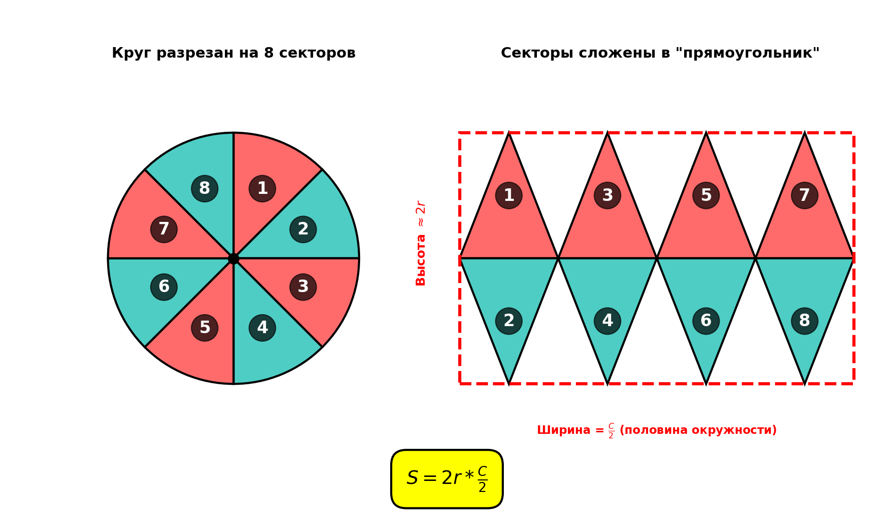
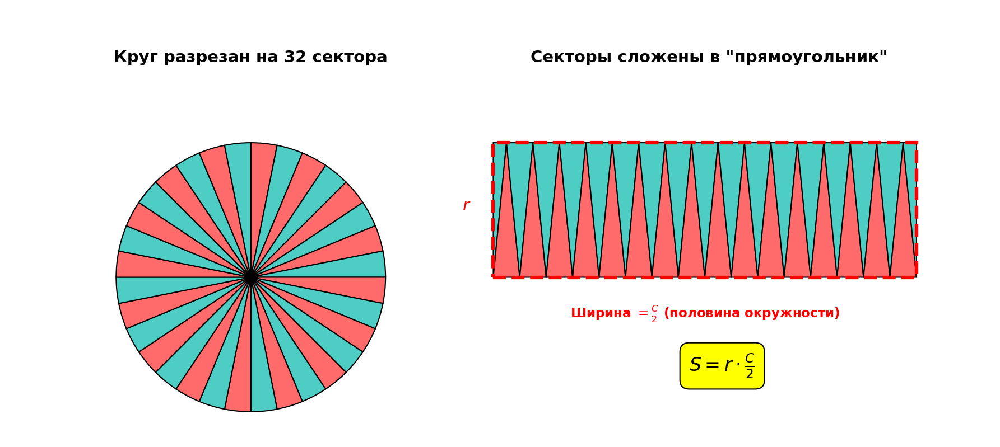
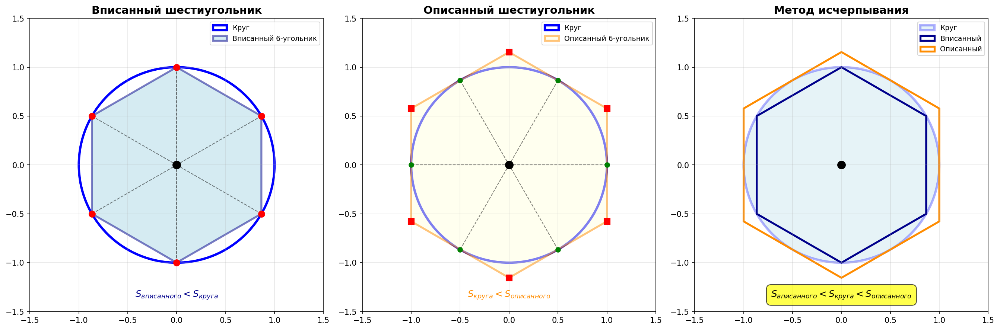

# Античность: Метод исчерпывания — первые шаги к интегралу

## Историческая справка

**V-III века до н.э.** Древняя Греция. Математики сталкиваются с проблемой измерения площадей и объёмов криволинейных фигур.

**Ключевые персоны:**
- **Евдокс Книдский** (~408-355 до н.э.) — разработал метод исчерпывания
- **Архимед Сиракузский** (~287-212 до н.э.) — довёл метод до совершенства

---

## Постановка задачи

### Задача 1: Площадь круга

**Что мы умеем:**
- Измерять площадь прямоугольника: $S = a \times b$
- Измерять площадь треугольника: $S = \frac{1}{2} \times \text{основание} \times \text{высота}$
- Измерять площадь многоугольника (разбиваем на треугольники)

**Что НЕ умеем:**
Как найти площадь **круга**? У него нет прямых сторон!

### Интуитивное понимание

Древние знали **экспериментально**, что площадь круга связана с радиусом:
- Чем больше радиус, тем больше площадь
- Если радиус увеличить в 2 раза, площадь увеличится в 4 раза

**Гипотеза:** $S_{круга} = \pi r^2$ (где $\pi \approx 3.14...$)

**Проблема:** Как это **доказать**? Как вообще строго определить площадь круга?

---

## Наивный подход: "Разрезать на кусочки"

> ⚠️ **Важно:** Это **НЕ метод Архимеда**! Это современная интуитивная иллюстрация, которая помогает понять проблему. Архимед использовал совсем другой подход — вписанные и описанные многоугольники (см. следующий раздел).

Представим что мы умеем измерять только длину прямого отрезка и длину окружности (например с помощью нити). Тогда как мы можем измерить площадь круга? Каким-то образом сделать из него прямоугольник..

### Попытка 1

Представим, что разрезаем круг на множество тонких "лепестков", как пиццу на очень много кусочков:



Первый полутреугольник без номера это половина последнего полутреугольника.



Если разрезать на **бесконечно много бесконечно тонких** кусочков, можно "выпрямить" их в прямоугольник?


Кажется что можно, тогда высота такого прямоугольника будет равна $r$ а ширина $\frac{C}{2}$ и мы сможем найти площадь.

Впервые сталкиваемся с **бесконечностью** в вычислениях.

### Почему этот подход не годится?

**Проблема 1: Нестрогость.** Что значит "бесконечно много бесконечно тонких" кусочков? Как обосновать, что они "выпрямляются" в прямоугольник?

**Проблема 2: Парадоксы.** Древние греки знали парадоксы Зенона (Ахиллес и черепаха, летящая стрела). Работа с бесконечностью без строгих определений приводит к противоречиям.

**Проблема 3: Форма кусочков.** "Лепестки" имеют криволинейные стороны — мы всё ещё не умеем измерять их площадь!

Этот подход даёт **правильную интуицию**, но не является **доказательством**. Древние греки понимали это и искали строгий метод.

---

## Метод Евдокса: Метод исчерпывания

> ✅ **Это настоящий метод Архимеда!** В отличие от наивного подхода с "лепестками", здесь используются только многоугольники с прямыми сторонами, площадь которых мы умеем вычислять.

### Ключевое отличие от наивного подхода

| Наивный подход ("лепестки") | Метод исчерпывания (Архимед) |
|----------------------------|------------------------------|
| Разрезаем круг на части | Вписываем/описываем многоугольники |
| Криволинейные "лепестки" | Только прямые линии |
| Требует "бесконечности" | Работает с конечными фигурами |
| Интуитивно, но не строго | Строгое доказательство |

### Основная идея ⭐

Вместо того чтобы работать с "бесконечно малыми", будем **приближать** круг многоугольниками!

**Шаг 1:** Впишем в круг правильный многоугольник
**Шаг 2:** Опишем вокруг круга правильный многоугольник
**Шаг 3:** Увеличиваем число сторон → многоугольники всё точнее приближают круг

### Вписанный и описанный многоугольники

Для круга радиуса $r = 1$:



**Очевидно:**
$$S_{вписанный} < S_{круга} < S_{описанный}$$

<details>
<summary><b>Как Архимед вычислял площади многоугольников?</b> (раскрыть)</summary>

Архимед использовал чисто геометрический метод без тригонометрии (её ещё не изобрели!).

**Метод последовательного удвоения:**

1. **Начало:** Вписанный и описанный шестиугольники
   - Для правильного шестиугольника длины сторон легко вычислить геометрически
   - Вписанный: сторона равна радиусу $r$
   - Описанный: стороны касаются круга

   **Почему именно шестиугольник?**
   
   Шестиугольник — единственный правильный многоугольник, сторона которого равна радиусу описанной окружности! Это делает его идеальной отправной точкой для вычислений.
   
   *Доказательство:* Центральный угол сектора = $\frac{360°}{6} = 60°$. Треугольник, образованный двумя радиусами и стороной шестиугольника:
   - Равнобедренный (две стороны — радиусы)
   - Угол при вершине = 60°
   - Углы при основании = $\frac{180° - 60°}{2} = 60°$ каждый
   
   Все углы по 60° → треугольник равносторонний → сторона = радиус ✓
   
   Это можно проверить экспериментально: раскройте циркуль на радиус круга и отложите эту длину по окружности — ровно 6 отрезков уложатся и вернут вас в начальную точку!

2. **Удвоение числа сторон:** $6 \to 12 \to 24 \to 48 \to 96$
   
   **Геометрический трюк:** Как из 6-угольника получить 12-угольник?
   
   Пусть $AB$ — сторона вписанного шестиугольника, $O$ — центр круга, $r$ — радиус.
   
   - Точка $C$ — середина дуги $AB$ (новая вершина 12-угольника)
   - Хорда $AC$ — сторона 12-угольника
   
   Чтобы найти длину $AC$:
   1. Опускаем перпендикуляр $OM$ на хорду $AB$ → $M$ — середина $AB$
   2. Точка $C$ лежит на продолжении $OM$ до окружности
   3. Из прямоугольного треугольника $AMC$ по теореме Пифагора:
      $$AC^2 = AM^2 + MC^2$$
   4. Зная $AB$ (сторона 6-угольника) и $r$, вычисляем $AM$, $OM$, затем $MC = OC - OM = r - OM$
   5. Находим $AC$ — сторону 12-угольника!
   
   Этот метод повторяется: $12 \to 24 \to 48 \to 96$ сторон.

3. **Вычисление площади:**
   
   Для многоугольника с $n$ сторонами длиной $a$:
   - Разбивал на $n$ треугольников с вершиной в центре
   - Вычислял высоту каждого треугольника $h$ через теорему Пифагора
   - Площадь: $S = n \cdot \frac{1}{2} \cdot a \cdot h$

4. **Периметр и площадь:**
   
   Зная периметр многоугольника $P$ и радиус (или апофему) $r$:
   $$S = \frac{1}{2} \cdot P \cdot r$$

**Пример для шестиугольника:**

Вписанный правильный шестиугольник при радиусе $r = 1$:
- Сторона $a = 1$ (равна радиусу)
- Периметр $P = 6$
- Апофема (высота треугольника) $h = \frac{\sqrt{3}}{2}$
- Площадь $S = \frac{1}{2} \cdot 6 \cdot \frac{\sqrt{3}}{2} = \frac{3\sqrt{3}}{2} \approx 2.598$

Так, шаг за шагом удваивая стороны и используя только геометрию, Архимед дошёл до 96-угольника и получил границы для числа $\pi$!

</details>


### Увеличиваем число сторон

| Число сторон | $S_{вписанный}$ | $S_{описанный}$ |
|-------------|----------------|----------------|
| 6 | 2.598 | 3.464 |
| 12 | 3.000 | 3.215 |
| 24 | 3.106 | 3.160 |
| 48 | 3.133 | 3.146 |
| 96 | 3.140 | 3.143 |
| ... | ... | ... |
| $\infty$ | **3.14159...** | **3.14159...** |

**Наблюдение:** При увеличении числа сторон оба многоугольника **стремятся к одному числу**!

**Вывод:** Площадь круга радиуса 1 равна $\pi \approx 3.14159...$

---

## Архимед: Строгое вычисление $\pi$

### Метод Архимеда (250 до н.э.)

Архимед использовал вписанные и описанные **правильные 96-угольники** и получил оценку:

$$3 + \frac{10}{71} < \pi < 3 + \frac{1}{7}$$

то есть:

$$3.1408... < \pi < 3.1428...$$

**Точность:** 2 знака после запятой! Невероятное достижение для древности!

---

## Другие достижения Архимеда

### Задача 2: Объём шара

**Задача:** Найти объём шара радиуса $r$

**Метод Архимеда:**

Архимед вписывал и описывал вокруг шара многогранники и показал:

$$V_{шара} = \frac{4}{3}\pi r^3$$

### Задача 3: Площадь сегмента параболы

**Задача:** Найти площадь под параболой $y = x^2$ на отрезке $[0, 1]$

```
y
↑
|     •
|   •   •
| •       •
|___________• x
0           1
```

**Метод:** Вписываем прямоугольники (как ступеньки лестницы)

**Результат Архимеда:**

$$S = \frac{1}{3}$$

Это можно проверить современным интегралом:

$$\int_0^1 x^2 \, dx = \left[\frac{x^3}{3}\right]_0^1 = \frac{1}{3}$$

Архимед получил правильный ответ за 2000 лет до изобретения интеграла! ⭐

---

## Философия метода исчерпывания

### Принцип Евдокса

**Аксиома Архимеда (принцип исчерпывания):**

> Для любых двух величин $A$ и $B$ (где $A < B$) можно найти такое натуральное число $n$, что $n \cdot A > B$

**Смысл:** Даже очень маленькую величину можно "накопить" до сколь угодно большой.

### Метод доказательства от противного

Архимед использовал **reductio ad absurdum** (доказательство от противного):

1. Предположим, что площадь круга $S \neq \pi r^2$
2. Тогда либо $S > \pi r^2$, либо $S < \pi r^2$
3. Вписываем/описываем многоугольник с достаточно большим числом сторон
4. Получаем противоречие с предположением
5. Значит, $S = \pi r^2$ ✓

---

## Почему это не совсем математический анализ?

### Что есть у Архимеда:

✅ Идея **приближения** криволинейной фигуры многоугольниками  
✅ Идея **предельного перехода** (увеличение числа сторон)  
✅ Точные числовые результаты

### Чего НЕТ у Архимеда:

❌ **Понятия предела** в современном смысле  
❌ Работы с **бесконечными процессами** явно  
❌ **Общего метода** для произвольных функций  
❌ **Алгебраической записи**

**Архимед избегал бесконечности!** Он всегда работал с конечными многоугольниками и доказывал от противного.

---

## От Архимеда к Ньютону: 2000 лет паузы

### Почему метод не развивался?

**1. Философские причины:**
- Греки боялись "актуальной бесконечности"
- Парадоксы Зенона подрывали доверие к бесконечным процессам

**2. Технические причины:**
- Не было удобной алгебраической записи
- Каждую задачу решали заново (не было общего метода)
- Тригонометрия была не развита

**3. Исторические причины:**
- Упадок античной науки после падения Рима
- Труды Архимеда были почти утеряны
- Возрождение интереса только в XVI веке

### Что изменилось к XVII веку?

✅ **Алгебра Виета** (1591) — символьная запись  
✅ **Координатная геометрия Декарта** (1637) — графики функций  
✅ **Физика Галилея** (1638) — практические задачи о движении  
✅ **Перевод Архимеда** на латынь (1544) — возрождение античных идей

**Результат:** Почва для создания математического анализа готова!

---

## Связь с современным курсом

### Что мы узнали:

1. **Идея предельного перехода** существовала уже в античности
2. **Приближение** криволинейных фигур прямолинейными — основа интеграла
3. Архимед фактически вычислял **интегралы**, хотя не знал этого термина

### Что дальше:

**→ Следующая тема:** [Задача о мгновенной скорости](02-derivative.md)

После паузы в 2000 лет математики вернутся к идеям Архимеда, но с новыми инструментами:
- **Производная** (XVII век) — мгновенная скорость
- **Интеграл** (XVII век) — площадь под кривой (возрождение метода исчерпывания!)
- **Формула Ньютона-Лейбница** — связь производной и интеграла

---

## Философское значение

### Величие античной математики

Архимед **за 2000 лет** до создания математического анализа:
- Вычислил площадь круга: $S = \pi r^2$ ✓
- Вычислил объём шара: $V = \frac{4}{3}\pi r^3$ ✓
- Нашёл площадь под параболой: $S = \frac{1}{3}$ ✓

Без:
- Алгебраической записи
- Тригонометрии
- Понятия функции
- Декартовых координат
- Понятия предела

**Урок:** Глубокие идеи не зависят от формальных инструментов! Инструменты лишь упрощают работу.

### Цитата Архимеда

> "Дайте мне точку опоры, и я переверну Землю!"

Эта фраза отражает дух античной науки — уверенность в силе математического разума.

---

## Дополнительные материалы

### Рекомендуемая литература:

- **Архимед** — "О шаре и цилиндре", "Измерение круга" (III век до н.э.)
- **Б.Л. ван дер Варден** — "Пробуждающаяся наука. Математика Древнего Египта, Вавилона и Греции"
- **И. Дьёдонне** — "История функционального анализа" (глава об античности)

### Интересные факты:

1. **Эпитафия Архимеда:** На его могиле была изображена сфера, вписанная в цилиндр — его любимое открытие (отношение объёмов = 2:3).

2. **Смерть Архимеда:** Погиб во время осады Сиракуз римлянами (212 до н.э.), работая над геометрической задачей. Последние слова: "Не трогай мои чертежи!"

3. **Утраченное наследие:** Многие труды Архимеда дошли до нас только в арабских переводах или были обнаружены случайно в XIX-XX веках.

---

## Резюме


### Ключевая идея:

**Метод исчерпывания Архимеда** = прообраз **интеграла** Ньютона-Лейбница!

Приближаем кривую ступеньками → увеличиваем число ступенек → в пределе получаем точную площадь.

---

**Следующая тема:** [📘 Задача о мгновенной скорости: рождение производной →](02-derivative.md)

