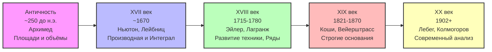
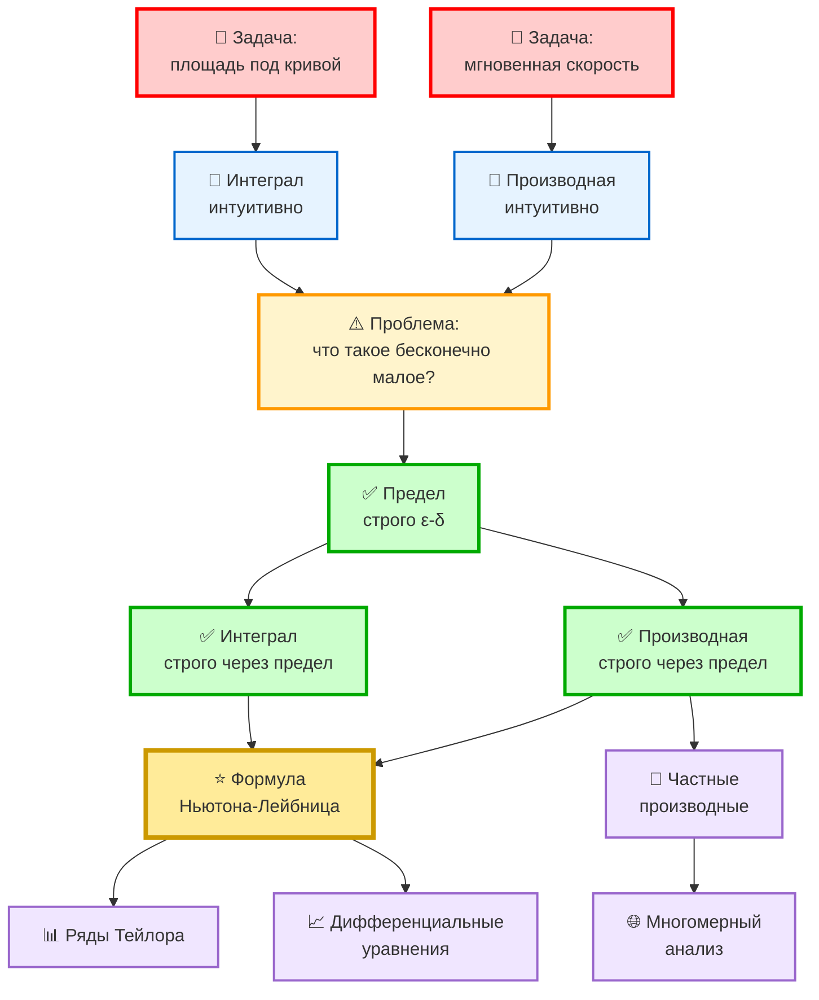

# Исторический путь развития математического анализа

## Принцип изучения

Каждая тема начинается с **практической задачи**, которая исторически привела к развитию нового математического инструмента. Мы следуем по стопам великих математиков, повторяя их путь от проблемы к решению.

## Исторический путь развития (краткая карта)

### Основные вехи по темам:

| Глава | Эпоха | Практическая задача | Математический инструмент | Ключевые персоны | Год |
|-------|-------|---------------------|---------------------------|------------------|-----|
| [01](01-ancient.md) | **Античность** | Площадь круга, объём шара | Метод исчерпывания (прото-интеграл) | Евдокс, Архимед | ~250 до н.э. |
| [02](02-derivative.md) | **XVII век** | Мгновенная скорость | **Производная** | Ньютон, Лейбниц | ~1670 |
| 03 | **XVII век** | Касательная к кривой | Производная (геометрия) | Ферма, Барроу | ~1630-1670 |
| 04 | **XVII век** | Работа переменной силы, площади | **Интеграл** | Ньютон, Лейбниц | ~1670 |
| 05 | **XVII век** | Связь производной и интеграла | Формула Ньютона-Лейбница | Ньютон, Лейбниц, Барроу | ~1670 |
| 06 | **XVIII век** | Вычисление функций | **Ряды** (Тейлор, Фурье) | Тейлор, Эйлер, Фурье | 1715-1822 |
| 07 | **XVIII век** | Температура, волны | Частные производные, ДУ | Д'Аламбер, Эйлер, Лаплас | 1743-1780 |
| 08 | **XIX век** | Кризис оснований | **Предел** (ε-δ определение) | Коши, Больцано | 1817-1821 |
| 09 | **XIX век** | Строгий анализ | Формализация производной и интеграла | Вейерштрасс, Риман | 1854-1870 |
| 10 | **XIX век** | Непрерывность без производной | Патологические примеры | Вейерштрасс, Кантор | 1872 |
| 11 | **XX век** | Мера множеств | Интеграл Лебега | Лебег | 1902 |

### Логическая последовательность инструментов:

**Ключевая идея:** Сначала была **практика** (XVII век), потом **строгая теория** (XIX век)!

---

## Этап 1: Античность (V век до н.э. - III век н.э.)

### Задача 1.1: Площадь круга и объём шара

**Практическая проблема:**
Как найти точную площадь круга или объём пирамиды? Прямоугольники и параллелепипеды мы умеем измерять, но криволинейные фигуры?

**Интуитивное решение (Евдокс, Архимед):**
- Метод исчерпывания: вписываем всё больше многоугольников
- Многоугольник с 6 сторонами, потом 12, потом 24, потом 48...
- "В пределе" многоугольник становится кругом

**Проблема:** 
Что значит "в пределе"? Многоугольник никогда не станет кругом!

**Результат:** 
Архимед находит площадь круга и объём шара, но без строгой теории пределов.

**Современное решение:** Интеграл + предел

**Изучаем:** 
- Понятие приближения
- Интуитивное понимание предела
- Метод исчерпывания как предшественник интеграла

---

## Этап 2: Рождение исчисления (XVII век)

### Задача 2.1: Мгновенная скорость падающего тела ⭐

**Историческая задача (Галилей, ~1590):**

Тело падает с башни. Закон движения: $s(t) = \frac{gt^2}{2}$ (где $g \approx 10$ м/с²)

**Вопрос:** Какая скорость **в момент времени** $t_0 = 2$ секунды?

**Попытка решения:**

1. **Средняя скорость** за промежуток времени от $t_0 = 2$ до $t_0 + \Delta t = 2.1$ сек:
   $$v_{ср} = \frac{s(2.1) - s(2)}{2.1 - 2} = \frac{22.05 - 20}{0.1} = 20.5 \text{ м/с}$$

2. Берём меньший промежуток, $\Delta t = 0.01$ сек:
   $$v_{ср} = \frac{s(2.01) - s(2)}{0.01} = 20.05 \text{ м/с}$$

3. Ещё меньше, $\Delta t = 0.001$ сек:
   $$v_{ср} = \frac{s(2.001) - s(2)}{0.001} = 20.005 \text{ м/с}$$

**Наблюдение:** Похоже, что ответ стремится к $20$ м/с!

**Проблема:** 
Как это записать строго? Мгновенная скорость — это "скорость за 0 секунд", но тогда $\frac{0}{0}$ — неопределённость!

**Решение Ньютона/Лейбница (интуитивное, ~1670):**
"Берём бесконечно малое приращение времени $dt$"

$$v(t) = \frac{ds}{dt}$$

Это работает на практике, но что такое "$dt$"?

**Современное строгое решение (Коши, 1821):**

$$v(t_0) = \lim_{\Delta t \to 0} \frac{s(t_0 + \Delta t) - s(t_0)}{\Delta t} = s'(t_0)$$

Это **производная**!

**Изучаем:**
- Понятие производной через практическую задачу
- Интуитивный подход Ньютона-Лейбница
- Геометрический смысл (касательная к графику)
- Примеры вычисления производных

---

### Задача 2.2: Касательная к кривой

**Практическая задача (оптика, ~1630):**

Свет отражается от кривого зеркала. Под каким углом он отразится? Нужно знать направление **касательной** к кривой в точке.

**Решение:** Та же идея — предел наклона секущей

$$\tan \alpha = f'(x) = \lim_{\Delta x \to 0} \frac{f(x + \Delta x) - f(x)}{\Delta x}$$

**Изучаем:**
- Геометрический смысл производной
- Уравнение касательной
- Связь физики и геометрии

---

### Задача 2.3: Площадь под кривой (работа силы)

**Практическая задача (механика):**

Сила меняется при движении: $F(x) = x^2$. Какую работу совершит сила при перемещении от $x = 0$ до $x = 1$?

**Если бы сила была постоянной:** $A = F \cdot \Delta x$

**Но сила меняется!** Как найти работу?

**Интуитивное решение (Ньютон, Лейбниц):**

1. Разбиваем путь на маленькие кусочки: $\Delta x = \frac{1}{n}$
2. На каждом кусочке сила примерно постоянна: $F(x_i) \approx const$
3. Работа на кусочке: $\Delta A_i = F(x_i) \cdot \Delta x$
4. Суммируем: $A \approx \sum_{i=1}^{n} F(x_i) \Delta x$
5. Устремляем $n \to \infty$ (кусочки становятся бесконечно малыми)

**Современное строгое решение:**

$$A = \int_0^1 F(x)\,dx = \lim_{n \to \infty} \sum_{i=1}^{n} F(x_i) \Delta x$$

Это **определённый интеграл**!

**Изучаем:**
- Понятие интеграла через практическую задачу
- Связь с площадью под графиком
- Формула Ньютона-Лейбница (связь производной и интеграла!)

---

## Этап 3: Кризис оснований (XVIII век)

### Проблема 3.1: Что такое "бесконечно малая величина"?

**Философская критика (епископ Беркли, 1734):**

> "Что такое $dx$? Если это ноль, то $\frac{dy}{dx} = \frac{0}{0}$ — бессмыслица. Если это не ноль, то это какое-то число, и почему мы можем им пренебрегать?"

**Проблема:** Вся математика Ньютона и Лейбница висит на интуиции, нет строгих определений!

**Математики XVIII века (Эйлер, Лагранж):**
Продолжают развивать технику, игнорируя философские вопросы. Метод работает — и ладно!

**Результат:** Огромный прогресс в технике вычислений, но отсутствие строгих оснований.

---

## Этап 4: Строгие основания (XIX век) ⭐

### Задача 4.1: Строгое определение предела (Коши, 1821)

**Проблема:** Нужно строго определить, что значит "стремится к"

**Решение Коши (ε-δ определение):**

$$\lim_{x \to a} f(x) = L$$

означает: для любого (сколь угодно малого) $\varepsilon > 0$ существует $\delta > 0$ такое, что при $0 < |x - a| < \delta$ выполняется $|f(x) - L| < \varepsilon$

**Прорыв:** Нет никаких "бесконечно малых"! Есть чёткий процесс проверки.

**Изучаем:**
- Строгое определение предела (ε-δ)
- Примеры доказательств
- Свойства пределов

---

### Задача 4.2: Строгое определение производной

**После определения предела:**

$$f'(x) = \lim_{\Delta x \to 0} \frac{f(x + \Delta x) - f(x)}{\Delta x}$$

Теперь это строгое определение!

**Изучаем:**
- Определение производной через предел
- Правила дифференцирования (доказательство!)
- Теоремы (Ролля, Лагранжа, Коши)

---

### Задача 4.3: Строгое определение интеграла (Риман, 1854)

**Строгое определение:**

Интеграл существует, если для любого разбиения при $\Delta x \to 0$ суммы Римана стремятся к одному и тому же пределу:

$$\int_a^b f(x)\,dx = \lim_{\max \Delta x_i \to 0} \sum_{i=1}^{n} f(\xi_i) \Delta x_i$$

**Изучаем:**
- Определение интеграла Римана
- Интегрируемые функции
- Формула Ньютона-Лейбница (строгое доказательство!)

---

## Этап 5: Непрерывность и её свойства

### Задача 5.1: Когда функция имеет производную?

**Проблема:** Не всякая функция дифференцируема

**Примеры:**
- $f(x) = |x|$ — не дифференцируема в точке $x = 0$ (излом)
- Функция Вейерштрасса — непрерывна всюду, но нигде не дифференцируема!

**Изучаем:**
- Понятие непрерывности
- Связь непрерывности и дифференцируемости
- Теоремы о непрерывных функциях (Больцано, Вейерштрасс)

---

## Этап 6: Ряды и их применение

### Задача 6.1: Как вычислить $\sin(x)$ или $e^x$?

**Практическая проблема:**
Калькулятора нет. Как вычислить $\sin(0.5)$ или $e^2$?

**Решение (Тейлор, ~1715):**

Любую "хорошую" функцию можно разложить в степенной ряд:

$$e^x = 1 + x + \frac{x^2}{2!} + \frac{x^3}{3!} + \ldots = \sum_{n=0}^{\infty} \frac{x^n}{n!}$$

$$\sin x = x - \frac{x^3}{3!} + \frac{x^5}{5!} - \ldots = \sum_{n=0}^{\infty} \frac{(-1)^n x^{2n+1}}{(2n+1)!}$$

**Изучаем:**
- Числовые ряды и их сходимость
- Степенные ряды
- Ряд Тейлора
- Применение для вычислений

---

## Этап 7: Функции нескольких переменных

### Задача 7.1: Температура в комнате

**Практическая задача:**
Температура в каждой точке комнаты своя: $T(x, y, z)$

Как найти, в каком направлении температура растёт быстрее всего?

**Решение:** Частные производные и градиент

$$\nabla T = \left(\frac{\partial T}{\partial x}, \frac{\partial T}{\partial y}, \frac{\partial T}{\partial z}\right)$$

**Изучаем:**
- Функции нескольких переменных
- Частные производные
- Градиент, дивергенция, ротор
- Экстремумы функций нескольких переменных

---

## Этап 8: Дифференциальные уравнения

### Задача 8.1: Остывание чашки кофе

**Практическая задача (закон Ньютона):**

Скорость остывания пропорциональна разности температур:

$$\frac{dT}{dt} = -k(T - T_{окр})$$

Как найти $T(t)$ — температуру в момент времени $t$?

**Решение:** Это дифференциальное уравнение!

$$T(t) = T_{окр} + (T_0 - T_{окр})e^{-kt}$$

**Изучаем:**
- Обыкновенные дифференциальные уравнения
- Методы решения
- Физические приложения

---

## Краткая дорожная карта

| Этап | Задача | Инструмент | Эпоха |
|------|--------|-----------|-------|
| **1** | Площадь круга | Метод исчерпывания (прото-интеграл) | Античность |
| **2** | Мгновенная скорость | **Производная** | XVII век |
| **3** | Касательная к кривой | Производная (геометрия) | XVII век |
| **4** | Работа переменной силы | **Интеграл** | XVII век |
| **5** | Строгие основания | **Предел** (ε-δ) | XIX век |
| **6** | Вычисление функций | **Ряды** | XVIII век |
| **7** | Температура в пространстве | Частные производные | XVIII-XIX век |
| **8** | Остывание тела | Дифференциальные уравнения | XVIII век |

---

## Философия подхода

### Почему это лучше традиционного курса?

**Традиционный подход:**
1. Определение предела (абстрактно)
2. Свойства пределов
3. Определение производной
4. Правила дифференцирования
5. ...

**Проблема:** "Зачем это всё нужно?" — непонятно до самого конца.

**Исторический подход:**
1. **Задача** (понятная и конкретная)
2. **Попытка решения** (интуитивная)
3. **Проблемы** (почему интуиции недостаточно)
4. **Строгое решение** (новый инструмент)
5. **Обобщение** (теория)

**Преимущество:** На каждом шаге понятно, зачем нужен новый инструмент.

---

## Рекомендуемая литература

### Исторические источники:
- **Ньютон** — "Математические начала натуральной философии" (1687)
- **Эйлер** — "Введение в анализ бесконечных" (1748)
- **Коши** — "Курс анализа" (1821)

### Современные исторические обзоры:
- В.И. Арнольд — "Гюйгенс и Барроу, Ньютон и Гук"
- К. Бойер — "История математики"
- Э.Т. Белл — "Творцы математики"

### Учебники с историческими отступлениями:
- Г.М. Фихтенгольц — "Курс дифференциального и интегрального исчисления"
- В.А. Зорич — "Математический анализ"

---

## Структура материалов в этой папке

- ✅ `01-ancient.md` — Античность: метод исчерпывания Архимеда (площадь круга, прообраз интеграла)
- ✅ `02-derivative.md` — Рождение производной (задача о мгновенной скорости Галилея)
- `03-integral.md` — Рождение интеграла (задача о площади)
- `04-limits.md` — Строгие основания (определение предела)
- `05-series.md` — Ряды и их применение
- `06-multivariable.md` — Функции нескольких переменных
- `07-diff-equations.md` — Дифференциальные уравнения

---

## С чего начать?

### Вариант 1: С самого начала истории

**Начните здесь:** [🏛️ Античность: Метод исчерпывания Архимеда](01-ancient.md)

Узнайте, как Архимед вычислял площадь круга за 2000 лет до изобретения интеграла!

### Вариант 2: С ключевой задачи XVII века

**Или начните здесь:** [📘 Задача о мгновенной скорости](02-derivative.md) ⭐

Это ключевая задача, которая привела к созданию дифференциального исчисления! В документе:
- Конкретные вычисления с числами
- Таблица экспериментов с разными $\Delta t$
- Критика Беркли и ответ Коши
- Полное вычисление производной $s(t) = 5t^2$
- Упражнения трёх уровней сложности

