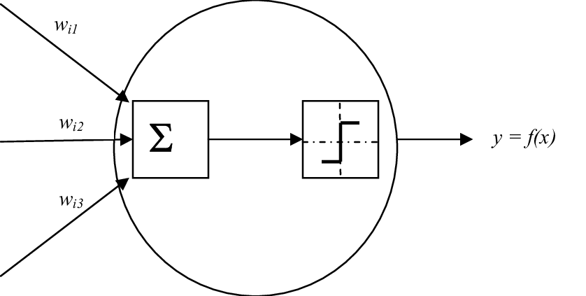
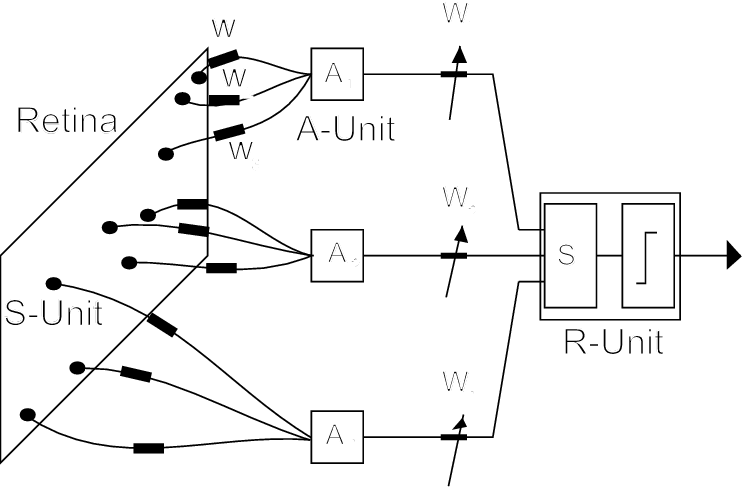

# История разваития ИИ

https://youtu.be/T2ZlOCGRA2Q?si=z3nyb7Oqx6HxuwJ3

## 1943. Модель формального нейрона

В 1943 году нейропсихолог Уоррен МакКаллок и математик Уолтер Питтс опубликовали статью "[A Logical Calculus of the Ideas Immanent in Nervous Activity](https://www.cs.cmu.edu/~epxing/Class/10715/reading/McCulloch.and.Pitts.pdf)" ("[Логическое исчисление идей, относящихся к нервной активности](https://raai.robofob.ru/library/books/mcculloch/mcculloch.pdf)"), которая заложила теоретический фундамент искусственных нейронных сетей. Основываясь на принципе "всё или ничего" в работе нейронов, они показали изоморфизм между нейронными сетями и пропозициональной логикой, связав бинарное состояние нейрона (включён/выключен) с логическим высказыванием (истина/ложь). Предложенная модель формального нейрона включала взвешенные входы, суммирование сигналов и пороговую функцию активации. 

Авторы доказали, что для любого логического выражения можно построить нейронную сеть с соответствующим поведением, а комбинируя нейроны в цепочки и циклы, можно реализовать любые логические операции и вычисления, доступные машине Тьюринга. 

Эта работа объединила нейробиологию, математическую логику и теорию вычислений, показав, что мышление — это процесс обработки информации, и заложила основы кибернетики и искусственного интеллекта.

Это ещё **не была нейросеть**, так как не было предусмотрено обучения.

<figure>
  
  <figcaption>Формальный нейрон с 3-мя входами (дендритами) и 1-м выходом (аксоном).</figcaption>
</figure>

### Подробнее

[The McCulloch-Pitts model](https://youtu.be/gqYnOU2TJF4?si=ttPRHCKPKDNnR4cb)

## 1958. Перцептрон

В 1958 году психолог Фрэнк Розенблатт опубликовал статью "[The Perceptron: A Probabilistic Model for Information Storage and Organization in the Brain](https://www.ling.upenn.edu/courses/cogs501/Rosenblatt1958.pdf)" ("Перцептрон: вероятностная модель хранения и организации информации в мозге"). В отличие от модели МакКаллока-Питтса, перцептрон Розенблатта стал первой нейронной сетью, **способной к обучению**. Перцептрон состоял **из нескольких сотен модифицированных нейронов** МакКаллока-Питтса. Каждый нейрон связывался с некоторым случайным числом других нейронов из числа ближайших соседей.

Перцептрон представляет из себя 3 слоя: сенсорный (S), ассоциативный (A) и реагирующий (R), при этом обучаемые веса находились только между последними двумя слоями. Ключевым достижением стал **алгоритм обучения с учителем**, основанный на коррекции ошибок: веса автоматически корректировались на основе разности между желаемым и фактическим выходом, что позволяло перцептрону самостоятельно настраиваться для решения задач классификации. 

Розенблатт реализовал перцептрон не только как программу, но и построил физическое устройство "Марк-1" (1960), которое стало первым нейрокомпьютером и успешно демонстрировало способность машин к обучению на примерах. Эта работа заложила основы машинного обучения и показала, что искусственные системы могут улучшать свою производительность через опыт.

<figure>
  
  <figcaption>Перцептрон Розенблата.</figcaption>
</figure>