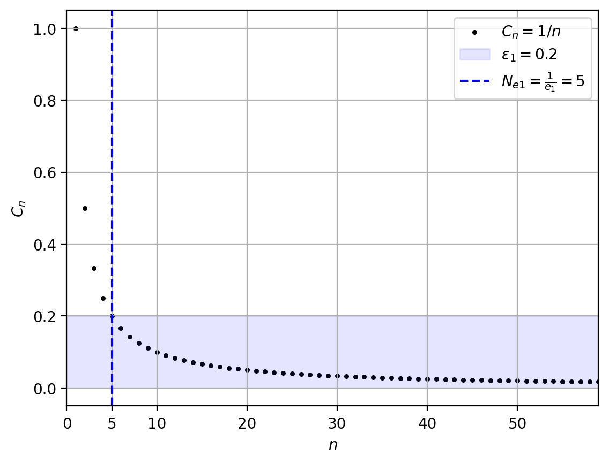
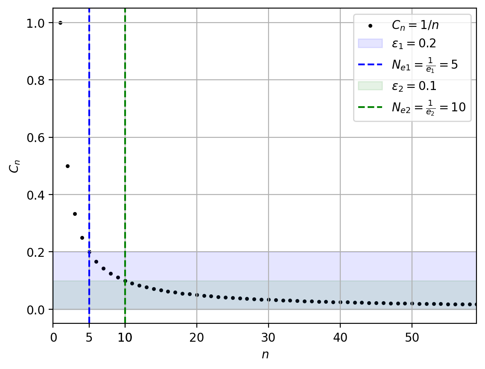
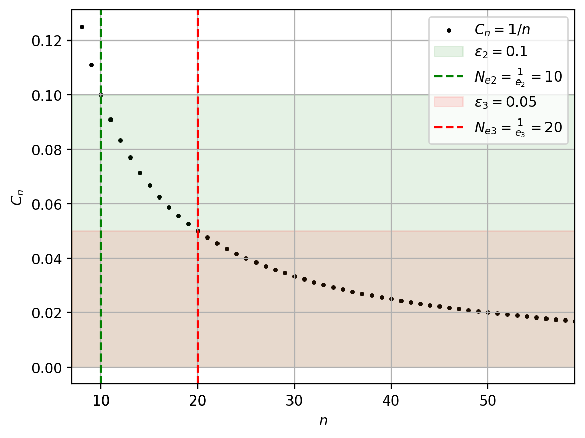
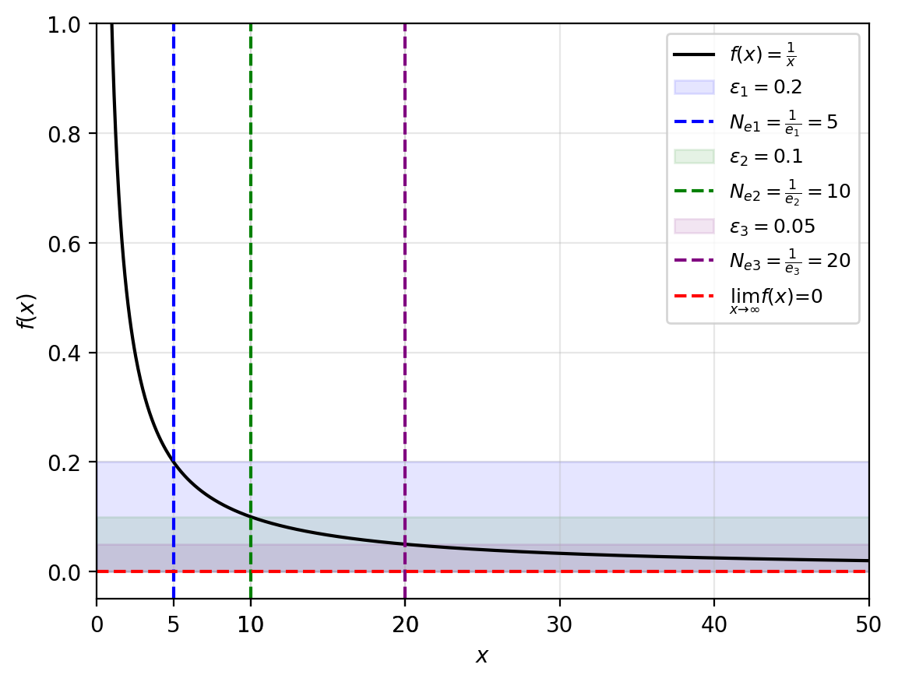

# Предел последовательности

Коши разработал два строгих определения предела: **$\varepsilon-N$** для последовательностей (дискретная переменная $n \in \mathbb{N}$) и **$\varepsilon-\delta$** для функций (непрерывная переменная $x \in \mathbb{R}$). Первое используется, когда переменная принимает только целые значения ($1, 2, 3, \ldots$), второе — когда нужно найти предел в конкретной точке или исследовать непрерывные функции.

## Определение в ε-N

Определение для последовательностей, то есть переменная принимает только целые значения (1-й элемент, 2-й и т.д.).

[Видео объяснение](https://www.youtube.com/watch?v=pmT4aAtwpfY&list=PLztBpqftvzxWo4HxUYV58ENhxHV32Wxli)

### Неформальное определение

Говорят, что число $A$ является пределом последовательности $x_n$ при $n$, стремящемся к бесконечности ($n \rightarrow \infty$), если можно задать такое число $\varepsilon > 0$ (маленькое и положительное), что начиная с некоторого номера $N_\varepsilon$, все элементы последовательности, следующие за этим номером ($\forall x_n$ при $n > N_\varepsilon$), будут находиться на расстоянии меньше указанного маленького числа $\varepsilon$ от значения предела ($|x_n - A| < \varepsilon$).

**Пояснение:**

При изображении последовательнсти на графике:

- $n$ - ось $x$
- $N_\varepsilon$ - порядковый номер элемента последовательности - значение по оси $x$
- $A$ - предел - значение по оси $y$
- $\varepsilon$ - значение по оси $y$
- $|x_n - A| < \varepsilon$ - окрестность предела по оси $y$

### Пример

Рассмотрим последовательность $С_n = 1/n$, элементы такой последовательности следующие: 

$$1, \frac{1}{2}, \frac{1}{3}, \frac{1}{4}, \frac{1}{5}, ...$$

Интуитивно понятно, что предел такой последовательности равен $0$ при $n \rightarrow \infty$. Разберём это наглядно.

**Зададим $\varepsilon = 0.2$**

Вычислим $N_\varepsilon = \lceil 1/0.2 \rceil = 5$. Это значит, что все элементы последовательности начиная с номера **5** будут отличаться от предела $\lim_{n \to \infty} C_n = 0$ меньше чем на $\varepsilon = 0.2$.

**Зададим $\varepsilon = 0.1$**

Вычислим $N_\varepsilon = \lceil 1/0.1 \rceil = 10$. Все элементы последовательности начиная с номера **10** будут отличаться от предела $0$ меньше чем на $\varepsilon = 0.1$.

**Зададим $\varepsilon = 0.05$**

Вычислим $N_\varepsilon = \lceil 1/0.05 \rceil = 20$. Все элементы последовательности начиная с номера **20** будут отличаться от предела $0$ меньше чем на $\varepsilon = 0.05$.

График $x \in [10, 80]$.

## Формальное определение

Число $A$ называется **пределом последовательности** $\{x_n\}$ при $n$, стремящемся к бесконечности, если для любого $\varepsilon > 0$ существует натуральное число $N_\varepsilon$, такое, что для любого натурального числа $n$, большего $N_\varepsilon$, выполняется неравенство $|x_n - A| < \varepsilon$.

**Запись:**

$$\lim_{n \to \infty} x_n = A$$

**Определение в кванторах:**

$$\forall \varepsilon > 0 \quad \exists N_\varepsilon \in \mathbb{N}: \quad \forall n \in \mathbb{N} \, (n > N_\varepsilon \Longrightarrow |x_n - A| < \varepsilon)$$

## Определение в ε-δ (по Коши)

Определение для функций непрерывной переменной, когда нужно найти предел в конкретной точке.

### Неформальное определение

Число $L$ называется пределом функции $f(x)$ при $x$, стремящемся к $a$, если для любого сколь угодно малого положительного числа $\varepsilon$ можно найти такое положительное число $\delta$, что для всех $x$, находящихся в $\delta$-окрестности точки $a$ (но не равных самой точке $a$), значения функции $f(x)$ будут находиться в $\varepsilon$-окрестности предела $L$.

### Формальное определение

Число $L$ называется **пределом функции** $f(x)$ в точке $a$, если для любого $\varepsilon > 0$ существует такое $\delta > 0$, что для всех $x$, удовлетворяющих условию $0 < |x - a| < \delta$, выполняется неравенство $|f(x) - L| < \varepsilon$.

**Запись:**

$$\lim_{x \to a} f(x) = L$$

**Определение в кванторах:**

$$\forall \varepsilon > 0 \quad \exists \delta > 0: \quad \forall x \in \mathbb{R} \, (0 < |x - a| < \delta \Longrightarrow |f(x) - L| < \varepsilon)$$

**Пояснение:**
- $0 < |x - a|$ означает, что $x \neq a$ (сама точка $a$ не рассматривается)
- $|x - a| < \delta$ означает, что $x$ находится в $\delta$-окрестности точки $a$
- $|f(x) - L| < \varepsilon$ означает, что значение функции отличается от предела меньше чем на $\varepsilon$

### Отличия от ε-N определения

| Характеристика | ε-N (последовательности) | ε-δ (функции) |
|----------------|--------------------------|---------------|
| Переменная | Дискретная: $n \in \mathbb{N}$ | Непрерывная: $x \in \mathbb{R}$ |
| Предел | При $n \to \infty$ | При $x \to a$ (в любой точке) |
| Параметр | $N$ — номер элемента | $\delta$ — радиус окрестности |
| Условие | $n > N$ | $0 < \|x - a\| < \delta$ |

## Алгебра последовательностей и пределов

### Определение операций над последовательностями

Для последовательностей $A = (A_1, A_2, A_3, \ldots)$ и $B = (B_1, B_2, B_3, \ldots)$ операции определяются **поэлементно**:

$$
\begin{aligned}
&(A + B)_n = A_n + B_n \quad \text{(сумма)} \\
&(A - B)_n = A_n - B_n \quad \text{(разность)} \\
&(A \cdot B)_n = A_n \cdot B_n \quad \text{(произведение)} \\
&\left(\frac{A}{B}\right)_n = \frac{A_n}{B_n} \quad \text{(частное, если } B_n \neq 0\text{)}
\end{aligned}
$$

**Важно:** Это **определения**, а не теоремы. Мы просто договариваемся складывать, вычитать, умножать и делить последовательности поэлементно.

### Пример

Даны последовательности:
- $A_n = n$ (натуральные числа: $1, 2, 3, 4, \ldots$)
- $B_n = n^2$ (квадраты: $1, 4, 9, 16, \ldots$)

Тогда:
- $(A + B)_n = n + n^2$ дает последовательность $(2, 6, 12, 20, \ldots)$
- $(A \cdot B)_n = n \cdot n^2 = n^3$ дает последовательность $(1, 8, 27, 64, \ldots)$

### Теоремы о пределах

Если $\lim_{n \to \infty} A_n = a$ и $\lim_{n \to \infty} B_n = b$, то:

$$
\begin{aligned}
&\lim_{n \to \infty} (A + B)_n = a + b \quad \text{(предел суммы = сумме пределов)}\\
&\lim_{n \to \infty} (A - B)_n = a - b \quad \text{(предел разности = разности пределов)}\\
&\lim_{n \to \infty} (A \cdot B)_n = ab \quad \text{(предел произведения = произведению пределов)}\\
&\lim_{n \to \infty} \left(\frac{A}{B}\right)_n = \frac{a}{b} \quad \text{(предел частного = частному пределов, если } b \neq 0\text{)}
\end{aligned}
$$

**Это уже теоремы**, которые требуют доказательства (см. [доказательства](./proofs.md)).

## Асимптотическое равенство

Асимптотические последовательности очень похоже ведут себя при большом значении $n$. 

**Определение:** Две последовательности $A$ и $B$ называются **асимптотически равными** (или асимптотически эквивалентными), если:

$$\lim_{n \to \infty} \frac{A_n}{B_n} = 1$$

**Обозначение:**

$$A \sim B$$

### Свойства

Если $A$ и $B$ асимптотически эквивалентны и имеют пределы $a$ и $b$, то эти пределы равны:

$$\lim_{n \to \infty} \frac{A_n}{B_n} = \frac{\lim_{n \to \infty} A_n}{\lim_{n \to \infty} B_n} = \frac{a}{b} = 1$$

Следовательно, $a = b$.

**Важно:** Две последовательности могут быть асимптотически эквивалентны, даже если у них нет пределов.

### Пример

Рассмотрим последовательности:

$$A_n = 2n + n^2, \quad B_n = n^2$$

Найдем предел их отношения:

$$\lim_{n \to \infty} \frac{A_n}{B_n} = \lim_{n \to \infty} \frac{2n + n^2}{n^2} = \lim_{n \to \infty} \left(\frac{2n}{n^2} + \frac{n^2}{n^2}\right) = \lim_{n \to \infty} \left(\frac{2}{n} + 1\right) = 0 + 1 = 1$$

Так как $\frac{1}{n} \to 0$, получаем, что $A_n \sim B_n$ (последовательности асимптотически эквивалентны).

## Пределы отношений

Асимптотическое равенство полезно для вычисления пределов отношений последовательностей.

**Свойство:** Если $A \sim C$ и $B \sim D$, то:

$$\lim_{n \to \infty} \frac{A_n}{B_n} = \lim_{n \to \infty} \frac{C_n}{D_n}$$

Это полезно, потому что $C$ и $D$ могут быть проще, чем $A$ и $B$.

### Пример

Найти предел:

$$\lim_{n \to \infty} \frac{A_n}{B_n}$$

где:

$$A_n = 3 + n + 4n^2, \quad B_n = 1 + n^2$$

**Решение:**

При больших $n$ старшие члены доминируют, поэтому:

$$A_n \sim C_n = 4n^2, \quad B_n \sim D_n = n^2$$

Следовательно:

$$\lim_{n \to \infty} \frac{A_n}{B_n} = \lim_{n \to \infty} \frac{3 + n + 4n^2}{1 + n^2} = \lim_{n \to \infty} \frac{C_n}{D_n} = \lim_{n \to \infty} \frac{4n^2}{n^2} = 4$$

