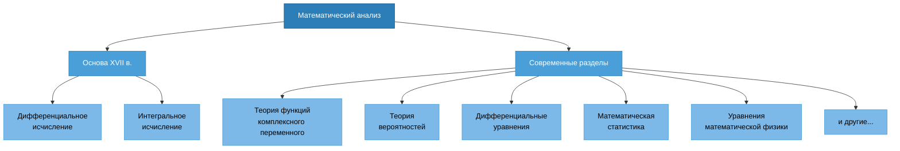
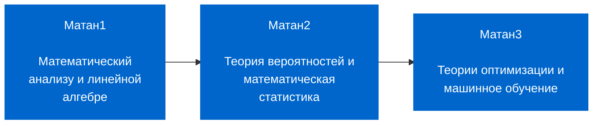

# Математический Анализ

## Литература

- Матанализ с человеческим лицом
- Ильин В. А., Садовничий В. А., Сендов Б. Х. Математический анализ в 2 ч.
- Архипов Г.И., Садовничий В.А., Чубариков В.Н. Лекции по математическому анализу
- Фихтенгольц Г. М. Курс дифференциального и интегрального исчисления. В 3 т.
- Кудрявцев Л.Д. Курс математического анализа (в двух томах)
- Демидович Б.П. Сборник задач и упражнений по математическому анализу
- Кудрявцев Л.Д. Сборник задач по математическому анализу

## Основные понятия математического анализа. Предмет

Под термином «математический анализ» подразумевается прежде всего дифференциальное и интегральное исчисление, созданное Ньютоном и Лейбницем в XVII в.

Составные части математического анализа разрослись, что стали отдельными математическими дисциплинами: теория функции комплексного переменного, теория вероятностей, дифференциальные уравнения, математическая статистика, уравнения математической физики и т.д.

В широком смысле математический анализ включает в себя все эти области.

## Описание курса

- Что такое математический анализ и где он применяется?
- Понятие функции, производной, интеграла, ряда.
- Что такое линейная алгебра и где она применяется?
- Понятие вектора, матрицы, определителя, операций над ними.

> На эти и множество других вопросов слушатель получит ответ. Полученные навыки и знания будут востребованы для изучения и применения алгоритмов ML (machine learning) и DL (deep learning).

## Цель курса

Получение знаний по высшей математике, а именно, по матанализу и линейной алгебре с использованием библиотеки символьных вычислений SymPy.

## Задачи курса

- **Математический анализ** – это фундамент высшей математики. Предстоит познакомиться с такими понятиями, как множество, бесконечная малая величина, предел, производная, интеграл и ряд.

- **Линейная алгебра** дает понятие того, что такое линейное пространство, правила работы с матрицами. Вы узнаете, что такое вектор, норма вектора, матрица Якоби и матрица Гессиана. Курс дает знания и навыки, необходимые для понимания принципов и алгоритмов градиентного спуска, которые положены в основу машинного обучения.

## Описание линейки курсов по математике на Python

