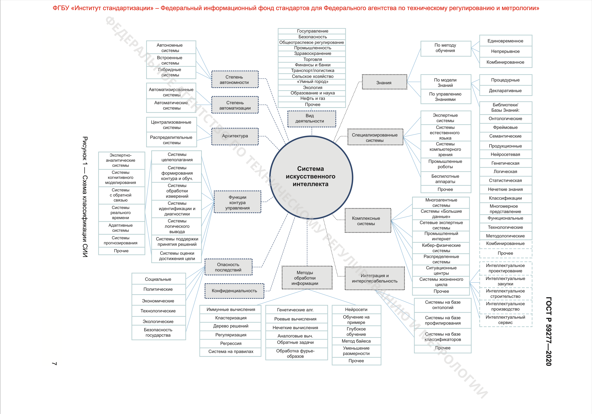
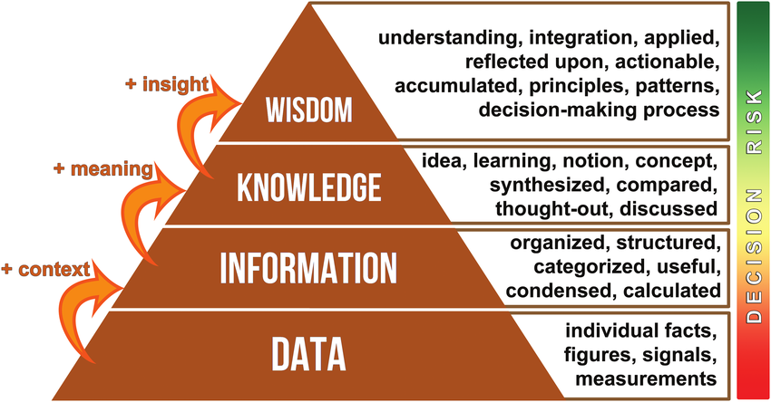
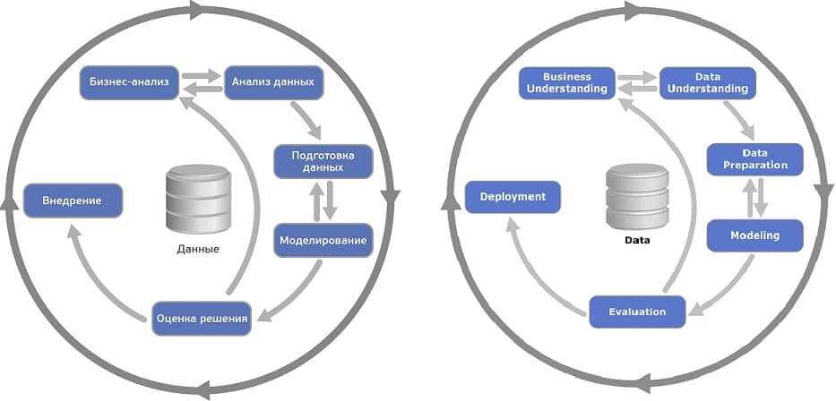

# Введение в Data Science

[Презентация](https://docs.yandex.ru/docs/view?url=ya-disk-public%3A%2F%2F3xs3DkSMawrEZ6kRQrOeB5EtCaoB%2FjzsZZ7D%2BxwzSGFAfOGHvznjItrO6uk9i8T9q%2FJ6bpmRyOJonT3VoXnDag%3D%3D%3A%2FDS_Fundamentals_v6_2025.pptx&name=DS_Fundamentals_v6_2025.pptx)

[ГОСТ Р 59277-2020](./gost-r-59277-2020.pdf)

## [Модуль 1] Область применения больших данных. Постановка задачи

### Информация общего характера

- Для построения нейронной сети используется **метод наименьших квадратов** (изобретённый математиками в XVII веке). В настоящее время просто появились достаточные вычислительные мощности для такого построения, этим объясняется хайп вокруг данной темы (генерируется больше данных, для обработки которых нужны большие мощности, которые могут генерировать и обрабатывать ещё больше данных, в частности большие количества переборов, которые нужны для обучения нейросетей)
- Нейросеть это граф (очень упрощённый). (см. "Задачу о Кенигсбергских мостах")
- Современные "Новые модели" сетей это очень частные модификации общих алгоритмов, заточнные под конкретные задачи

### История

- XVII в. Сэр Исаак Ньютон анализ типа зависимости между двумя переменными (метод Ньютона)
- 1920-е, сэр Фишер – основы статистики
- 1960-е гг. Комитет по данным для науки и техники (CODATA)
- 1974 г. Первое использование термина Data Science (Питер Наур)
- 2002 г. Начат выпуск Data Science Journal
- 2011 – н.в. – взлет популярности, массовые конференции,
открытие учебных программ в ведущих учебных заведениях.
- 2023 – массовое применение генеративных (GPT) сетей

### Основные понятия и термины

#### Искуственный интеллект

Искуственный интеллект, ИИ (англ. Artificial intelligence, AI) это *(Определение крайне размытое)*:

1. Наука и технология создания
интеллектуальных машин, особенно
интеллектуальных компьютерных
программ
2. Свойство интеллектуальных
систем выполнять творческие
функции, которые традиционно
считаются прерогативой человека

#### Большие данные
**Cовокупность подходов, инструментов и методов** (а не только сами данные) обработки структурированных и неструктурированных данных огромных объёмов и значительного многообразия для получения воспринимаемых человеком результатов, эффективных в условиях непрерывного прироста, распределения по многочисленным узлам вычислительной сети.

#### Машинное обучение (англ. Machine Learning)
Класс методов искусственного интеллекта, характерной чертой которых является не прямое решение задачи, а обучение в процессе применения решению множества сходных задач. Для построения таких методов используются средства математической статистики, численных методов, методов оптимизации, теории вероятностей, теории графов, различные техники работы с данными в цифровой форме.

### Классификация систем искусственного интеллекта

Из [ГОСТа Р 59277-2020](./gost-r-59277-2020.pdf).

### Скрытые знания

Обучение нейросетей помогает (в том числе) выявить скрытые (ранее неизвестные) зависимости

- Ранее неизвестные — то есть такие знания, которые должны быть новыми (а не подтверждающими какие-то ранее
полученные сведения)
- Нетривиальные, неочевидные — то есть такие, которые нельзя просто увидеть при непосредственном визуальном анализе данных
- Практически полезные — то есть такие знания, которые
представляют ценность для исследователя или потребителя (современные AI модели могут генерировать галлюцинации)
- Доступные для интерпретации — знания, которые легко
представить в наглядной для пользователя форме и легко
объяснить в терминах предметной области (невозможно/сложно объяснить почему AI модель выдаёт определённый ответ)

## [Модуль 2] Сбор и подготовка исходных данных. Методика CRISP-DM

### Знание из данных (KDD)

KDD (Knowledge Discovery in Databases) – извлечение знаний из
баз данных это процесс поиска полезных знаний в «сырых данных».

KDD включает в себя вопросы подготовки данных, выбора
информативных признаков, очистки данных, применения
методов Data Mining (DM), постобработки данных и
интерпретации полученных результатов.

### Модель DIKW (Data - Information - Knowledge - Wisdom)

DIKW — это иерархическая модель, описывающая переход от данных к мудрости через информацию и знания. Каждый уровень пирамиды добавляет ценность предыдущему

#### 1. Data (Данные) — базовый уровень

- **Определение**: Необработанные факты, символы, цифры без контекста
- **Характеристики**: 
  - Неструктурированные или структурированные наблюдения
  - Не имеют значения сами по себе
  - Количественные или качественные показатели
- **Примеры**: температура 25°C, число 42, набор пикселей изображения, строки в базе данных
- **В Data Science**: логи, сенсорные показания, транзакции

#### 2. Information (Информация) — данные в контексте

- **Определение**: Обработанные, организованные данные, имеющие контекст и значение. Связанные друг с другом данные
- **Характеристики**:
  - Данные с добавленным контекстом (кто, что, где, когда)
  - Отвечает на вопросы: "Что произошло?"
  - Результат агрегации, фильтрации, анализа данных
- **Примеры**: "Температура повысилась на 5°C за час", "Продажи выросли на 20%"
- **В Data Science**: визуализации, отчеты, дашборды, статистические сводки

#### 3. Knowledge (Знания) — информация с пониманием

- **Определение**: Информация с добавленным пониманием связей, паттернов и закономерностей
- **Характеристики**:
  - Отвечает на вопрос "Как?" и "Почему?"
  - Включает опыт, контекст и интерпретацию
  - Позволяет делать прогнозы
- **Примеры**: "Повышение температуры вызывает рост продаж мороженого", понимание корреляций и причинно-следственных связей
- **В Data Science**: модели машинного обучения, правила, паттерны, выявленные зависимости

#### 4. Wisdom (Мудрость) — высший уровень

- **Определение**: Способность принимать оптимальные решения на основе знаний с учетом этики, ценностей и последствий
- **Характеристики**:
  - Отвечает на вопрос "Что делать?" и "Зачем?"
  - Включает суждения, оценку и предвидение
  - Учитывает долгосрочные последствия
- **Примеры**: "Стоит ли увеличивать производство мороженого, учитывая сезонность и экологические факторы?"
- **В Data Science**: стратегические решения на основе аналитики, этические соображения при использовании AI

---

**Ключевая идея**: В Data Science мы собираем **данные**, преобразуем их в **информацию** через анализ, извлекаем **знания** с помощью ML/AI моделей, и применяем **мудрость** для принятия обоснованных бизнес-решений.

Эта иерархия соответствует процессу KDD (Knowledge Discovery in Databases), описанному выше.

### Инструменты обработки данных

- Excel
- IBM SPSS, GNU PSPP
- Tableau – инструмент визуализации аналитики, интерпретируемый язык для статистической обработки данных и работы с графикой. Использует режим командной строки
- Python - высокоуровневый язык программирования, поддерживающий  структурное, объектно-ориентированное, функциональное, императивное и аспектно-ориентированное программирование
- Octave - система для математических вычислений, использующая совместимый с MATLAB язык высокого уровня
- NoSQL базы данных, в которых делается попытка решить проблемы масштабируемости и доступности за счёт атомарности (англ. atomicity) и согласованности данных:
    - Хранилища «ключ-значение», документоориентированные БД (Cache, MongoSQL), разреженные (bigtable OLAP, Hadoop) БД, графовые БД.
- ИИ ассистенты
- ИИ агенты

### Методология CRISP-DM

**CRISP-DM** (Cross-Industry Standard Process for Data Mining) — стандартная отраслевая методология для проектов по анализу данных и машинному обучению, разработанная в 1996 году консорциумом европейских компаний.

#### Что это такое

CRISP-DM — это итеративный циклический процесс, описывающий жизненный цикл проекта Data Science от начала до конца. Методология не привязана к конкретным инструментам или отраслям и применима к любым проектам анализа данных.

#### Зачем нужен CRISP-DM

- **Структурированный подход**: Предоставляет четкий план действий для организации и выполнения Data Science проектов
- **Снижение рисков**: Помогает избежать типичных ошибок благодаря проверенной последовательности этапов
- **Коммуникация**: Обеспечивает общий язык между бизнесом, аналитиками и техническими специалистами
- **Итеративность**: Позволяет возвращаться к предыдущим этапам при необходимости улучшения результатов
- **Масштабируемость**: Применим как к небольшим, так и к крупным проектам

#### Шесть этапов CRISP-DM

**1. Business Understanding (Понимание бизнеса)**
- Определение бизнес-целей
- Оценка ситуации и ресурсов
- Определени целей аналитики
- Подготовка плана проекта

**2. Data Understanding (Понимание данных)**
- Сбор данных
- Описание данных
- Изучение данных (EDA)
- Проверка качества данных

**3. Data Preparation (Подготовка данных)**
- Выборка данных
- Очистка данных. Трансформация и нормализация
- Генерация данных
- Форматирование данных

**4. Modeling (Моделирование)**
- Выбор методов и алгоритмов моделирования
- Подготовка плана тестирования
- Обучение моделей
- Оценка качества моделей

**5. Evaluation (Оценка)**
- Оценка результатов
- Оценка процесса
- Определение следующих шагов

**6. Deployment (Развертывание)**
- Внедрение
- Планирование мониторинга и поддержки
- Подготовка отчёта
- Ревью проекта

#### Циклический характер

CRISP-DM — это не линейный процесс. На любом этапе может потребоваться вернуться к предыдущим шагам:
- Низкое качество данных → возврат к сбору данных
- Плохие результаты моделирования → возврат к подготовке данных
- Изменение бизнес-требований → возврат к пониманию бизнеса

**Вывод**: CRISP-DM обеспечивает систематический и воспроизводимый подход к реализации Data Science проектов, увеличивая вероятность их успешного завершения.

### Обработка данных

#### Подготовка исходного набора данных
Этот этап заключается в создании набора данных, в том числе консолидации сведений из различных источников, определение выборки, которая и будет в последствии анализироваться.

#### Предобработка и очистка данных
Данные могут содержать пропуски, шумы, аномальные значения, могут быть избыточны, недостаточны и т.д. В некоторых задачах требуется дополнить данные некоторой априорной информацией. Данные должны быть качественны и корректны с точки зрения используемого метода анализа.

#### Трансформация данных
Для различных методов анализа требуются данные, подготовленные в специальном виде. Например, некоторые методы анализа в качестве входных полей могут использовать только числовые данные, а некоторые, наоборот,только категориальные.

#### Data Mining
На этом шаге применяются различные алгоритмы для поиска зависимостей, новых знаний, или говорят, что строятся модели. Выделяют два больших класса моделей – описательные и предсказательные. Для этого используются как классические статистические методы, так и самообучающиеся алгоритмы и машинное обучение (нейронные сети, деревья решений и др.).

#### Постобработка данных
Тестирование, интерпретация результатов и практическое применение полученных знаний в выбранной прикладной области.

### Очистка и подготовка данных

- Удалить дублирующие записи (могут возникнуть вследствие использования различных источников первичных данных)
- Заполнить пропущенные значение (например, с помощью средних значений или ожидаемых (математическое ожидание))
- Преобразовать данные к сравнимым значения (например, вместо количество покупателей и сумма покупок использовать средний чек).
- Сгруппировать значения по «корзинам». Например, уровень дохода: низкий, средний, высокий.
- Свести данные к единым временным интервалам. Обычно наиболее длительному из имеющихся
- Удалить случайные значения (например, данные о случайно крупной покупке).
- Проверить данные на соответствие выборки реальным распределениям по типам (например, в выборке данные 80% мужчин и 20% женщин, что нерепрезентативно для популяции).

### «Добыча» данных. Data mining

#### Ассоциация
Выявление зависимостей между связанными событиями, указывающих, что из события X следует событие Y. Такие правила называются ассоциативными.

#### Регрессия
Установление функциональной зависимости между входными и непрерывными выходными переменными.

#### Классификация
Установление функциональной зависимости между входными и дискретными выходными переменными.

#### Кластеризация
Группировка объектов (наблюдений, событий) на основе данных (свойств), описывающих сущность объектов. Чем больше похожи объекты внутри кластера и чем больше отличий между кластерами, тем точнее кластеризация.

### Озера данных (Data Lakes)

Это метод хранения данных системой или репозиторием в натуральном (RAW) формате, который предполагает одновременное хранение данных в различных схемах и форматах. Обычно используется blob-объект (binary large object) или файл. Идея озера данных в том чтобы иметь логически определенное, единое хранилище всех данных в организации (enterprise data) начиная от сырых, необработанных исходных данных (RAW data) до предварительно обработанных (transformed) данных, которые используются для различных задач: отчеты, визуализация, аналитика и машинное обучение.

Data lake включает структурированные данные из реляционных баз данных (строки и колонки), полуструктурированные данные (CSV, лог файлы, XML, JSON), неструктурированные данные (почтовые сообщения, документы, pdf) и даже бинарные данные (видео, аудио, графические файлы).
