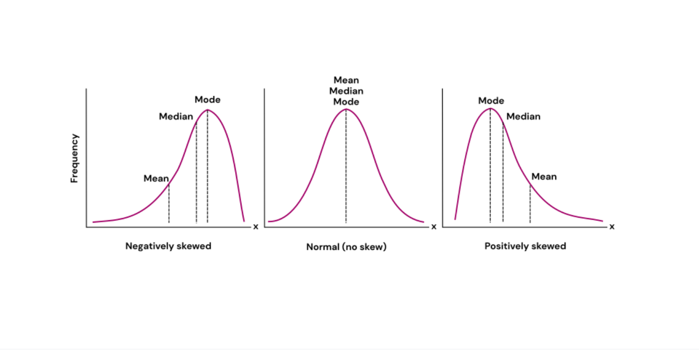

# Введение в Data Science

[Презентация](https://docs.yandex.ru/docs/view?url=ya-disk-public%3A%2F%2F3xs3DkSMawrEZ6kRQrOeB5EtCaoB%2FjzsZZ7D%2BxwzSGFAfOGHvznjItrO6uk9i8T9q%2FJ6bpmRyOJonT3VoXnDag%3D%3D%3A%2FDS_Fundamentals_v6_2025.pptx&name=DS_Fundamentals_v6_2025.pptx)

[ГОСТ Р 59277-2020](./gost-r-59277-2020.pdf)

## [Модуль 1] Область применения больших данных. Постановка задачи

### Информация общего характера

- Для построения нейронной сети используется **метод наименьших квадратов** (изобретённый математиками в XVII веке). В настоящее время просто появились достаточные вычислительные мощности для такого построения, этим объясняется хайп вокруг данной темы (генерируется больше данных, для обработки которых нужны большие мощности, которые могут генерировать и обрабатывать ещё больше данных, в частности большие количества переборов, которые нужны для обучения нейросетей)
- Нейросеть это граф (очень упрощённый). (см. "Задачу о Кенигсбергских мостах")
- Современные "Новые модели" сетей это очень частные модификации общих алгоритмов, заточнные под конкретные задачи

### История

- XVII в. Сэр Исаак Ньютон анализ типа зависимости между двумя переменными (метод Ньютона)
- 1920-е, сэр Фишер — основы статистики
- 1960-е гг. Комитет по данным для науки и техники (CODATA)
- 1974 г. Первое использование термина Data Science (Питер Наур)
- 2002 г. Начат выпуск Data Science Journal
- 2011 — н.в. — взлет популярности, массовые конференции,
открытие учебных программ в ведущих учебных заведениях.
- 2023 — массовое применение генеративных (GPT) сетей

### Основные понятия и термины

#### Искуственный интеллект

Искуственный интеллект, ИИ (англ. Artificial intelligence, AI) это *(Определение крайне размытое)*:

1. Наука и технология создания
интеллектуальных машин, особенно
интеллектуальных компьютерных
программ
2. Свойство интеллектуальных
систем выполнять творческие
функции, которые традиционно
считаются прерогативой человека

#### Большие данные
**Cовокупность подходов, инструментов и методов** (а не только сами данные) обработки структурированных и неструктурированных данных огромных объёмов и значительного многообразия для получения воспринимаемых человеком результатов, эффективных в условиях непрерывного прироста, распределения по многочисленным узлам вычислительной сети.

#### Машинное обучение (англ. Machine Learning)
Класс методов искусственного интеллекта, характерной чертой которых является не прямое решение задачи, а обучение в процессе применения решению множества сходных задач. Для построения таких методов используются средства математической статистики, численных методов, методов оптимизации, теории вероятностей, теории графов, различные техники работы с данными в цифровой форме.

### Классификация систем искусственного интеллекта

Из [ГОСТа Р 59277-2020](./gost-r-59277-2020.pdf).

### Скрытые знания

Обучение нейросетей помогает (в том числе) выявить скрытые (ранее неизвестные) зависимости

- Ранее неизвестные — то есть такие знания, которые должны быть новыми (а не подтверждающими какие-то ранее
полученные сведения)
- Нетривиальные, неочевидные — то есть такие, которые нельзя просто увидеть при непосредственном визуальном анализе данных
- Практически полезные — то есть такие знания, которые
представляют ценность для исследователя или потребителя (современные AI модели могут генерировать галлюцинации)
- Доступные для интерпретации — знания, которые легко
представить в наглядной для пользователя форме и легко
объяснить в терминах предметной области (невозможно/сложно объяснить почему AI модель выдаёт определённый ответ)

## [Модуль 2] Сбор и подготовка исходных данных. Методика CRISP-DM

### Знание из данных (KDD)

KDD (Knowledge Discovery in Databases) — извлечение знаний из
баз данных это процесс поиска полезных знаний в «сырых данных».

KDD включает в себя вопросы подготовки данных, выбора
информативных признаков, очистки данных, применения
методов Data Mining (DM), постобработки данных и
интерпретации полученных результатов.

### Модель DIKW (Data - Information - Knowledge - Wisdom)

DIKW — это иерархическая модель, описывающая переход от данных к мудрости через информацию и знания. Каждый уровень пирамиды добавляет ценность предыдущему

#### 1. Data (Данные) — базовый уровень

- **Определение**: Необработанные факты, символы, цифры без контекста
- **Характеристики**: 
  - Неструктурированные или структурированные наблюдения
  - Не имеют значения сами по себе
  - Количественные или качественные показатели
- **Примеры**: температура 25°C, число 42, набор пикселей изображения, строки в базе данных
- **В Data Science**: логи, сенсорные показания, транзакции

#### 2. Information (Информация) — данные в контексте

- **Определение**: Обработанные, организованные данные, имеющие контекст и значение. Связанные друг с другом данные
- **Характеристики**:
  - Данные с добавленным контекстом (кто, что, где, когда)
  - Отвечает на вопросы: "Что произошло?"
  - Результат агрегации, фильтрации, анализа данных
- **Примеры**: "Температура повысилась на 5°C за час", "Продажи выросли на 20%"
- **В Data Science**: визуализации, отчеты, дашборды, статистические сводки

#### 3. Knowledge (Знания) — информация с пониманием

- **Определение**: Информация с добавленным пониманием связей, паттернов и закономерностей
- **Характеристики**:
  - Отвечает на вопрос "Как?" и "Почему?"
  - Включает опыт, контекст и интерпретацию
  - Позволяет делать прогнозы
- **Примеры**: "Повышение температуры вызывает рост продаж мороженого", понимание корреляций и причинно-следственных связей
- **В Data Science**: модели машинного обучения, правила, паттерны, выявленные зависимости

#### 4. Wisdom (Мудрость) — высший уровень

- **Определение**: Способность принимать оптимальные решения на основе знаний с учетом этики, ценностей и последствий
- **Характеристики**:
  - Отвечает на вопрос "Что делать?" и "Зачем?"
  - Включает суждения, оценку и предвидение
  - Учитывает долгосрочные последствия
- **Примеры**: "Стоит ли увеличивать производство мороженого, учитывая сезонность и экологические факторы?"
- **В Data Science**: стратегические решения на основе аналитики, этические соображения при использовании AI

---

**Ключевая идея**: В Data Science мы собираем **данные**, преобразуем их в **информацию** через анализ, извлекаем **знания** с помощью ML/AI моделей, и применяем **мудрость** для принятия обоснованных бизнес-решений.

Эта иерархия соответствует процессу KDD (Knowledge Discovery in Databases), описанному выше.

### Инструменты обработки данных

- Excel
- IBM SPSS, GNU PSPP
- Tableau — инструмент визуализации аналитики, интерпретируемый язык для статистической обработки данных и работы с графикой. Использует режим командной строки
- Python — высокоуровневый язык программирования, поддерживающий  структурное, объектно-ориентированное, функциональное, императивное и аспектно-ориентированное программирование
- Octave — система для математических вычислений, использующая совместимый с MATLAB язык высокого уровня
- NoSQL базы данных, в которых делается попытка решить проблемы масштабируемости и доступности за счёт атомарности (англ. atomicity) и согласованности данных:
    - Хранилища «ключ-значение», документоориентированные БД (Cache, MongoSQL), разреженные (bigtable OLAP, Hadoop) БД, графовые БД.
- ИИ ассистенты
- ИИ агенты

### Методология CRISP-DM

**CRISP-DM** (Cross-Industry Standard Process for Data Mining) — стандартная отраслевая методология для проектов по анализу данных и машинному обучению, разработанная в 1996 году консорциумом европейских компаний.

#### Что это такое

CRISP-DM — это итеративный циклический процесс, описывающий жизненный цикл проекта Data Science от начала до конца. Методология не привязана к конкретным инструментам или отраслям и применима к любым проектам анализа данных.

#### Зачем нужен CRISP-DM

- **Структурированный подход**: Предоставляет четкий план действий для организации и выполнения Data Science проектов
- **Снижение рисков**: Помогает избежать типичных ошибок благодаря проверенной последовательности этапов
- **Коммуникация**: Обеспечивает общий язык между бизнесом, аналитиками и техническими специалистами
- **Итеративность**: Позволяет возвращаться к предыдущим этапам при необходимости улучшения результатов
- **Масштабируемость**: Применим как к небольшим, так и к крупным проектам

#### Шесть этапов CRISP-DM

**1. Business Understanding (Понимание бизнеса)**
- Определение бизнес-целей
- Оценка ситуации и ресурсов
- Определени целей аналитики
- Подготовка плана проекта

**2. Data Understanding (Понимание данных)**
- Сбор данных
- Описание данных
- Изучение данных (EDA)
- Проверка качества данных

**3. Data Preparation (Подготовка данных)**
- Выборка данных
- Очистка данных. Трансформация и нормализация
- Генерация данных
- Форматирование данных

**4. Modeling (Моделирование)**
- Выбор методов и алгоритмов моделирования
- Подготовка плана тестирования
- Обучение моделей
- Оценка качества моделей

**5. Evaluation (Оценка)**
- Оценка результатов
- Оценка процесса
- Определение следующих шагов

**6. Deployment (Развертывание)**
- Внедрение
- Планирование мониторинга и поддержки
- Подготовка отчёта
- Ревью проекта

#### Циклический характер

CRISP-DM — это не линейный процесс. На любом этапе может потребоваться вернуться к предыдущим шагам:
- Низкое качество данных → возврат к сбору данных
- Плохие результаты моделирования → возврат к подготовке данных
- Изменение бизнес-требований → возврат к пониманию бизнеса

**Вывод**: CRISP-DM обеспечивает систематический и воспроизводимый подход к реализации Data Science проектов, увеличивая вероятность их успешного завершения.

### Обработка данных

#### Подготовка исходного набора данных
Этот этап заключается в создании набора данных, в том числе консолидации сведений из различных источников, определение выборки, которая и будет в последствии анализироваться.

#### Предобработка и очистка данных
Данные могут содержать пропуски, шумы, аномальные значения, могут быть избыточны, недостаточны и т.д. В некоторых задачах требуется дополнить данные некоторой априорной информацией. Данные должны быть качественны и корректны с точки зрения используемого метода анализа.

#### Трансформация данных
Для различных методов анализа требуются данные, подготовленные в специальном виде. Например, некоторые методы анализа в качестве входных полей могут использовать только числовые данные, а некоторые, наоборот,только категориальные.

#### Data Mining
На этом шаге применяются различные алгоритмы для поиска зависимостей, новых знаний, или говорят, что строятся модели. Выделяют два больших класса моделей — описательные и предсказательные. Для этого используются как классические статистические методы, так и самообучающиеся алгоритмы и машинное обучение (нейронные сети, деревья решений и др.).

#### Постобработка данных
Тестирование, интерпретация результатов и практическое применение полученных знаний в выбранной прикладной области.

### Очистка и подготовка данных

- Удалить дублирующие записи (могут возникнуть вследствие использования различных источников первичных данных)
- Заполнить пропущенные значение (например, с помощью средних значений или ожидаемых (математическое ожидание))
- Преобразовать данные к сравнимым значения (например, вместо количество покупателей и сумма покупок использовать средний чек)
- Сгруппировать значения по «корзинам». Например, уровень дохода: низкий, средний, высокий
- Свести данные к единым временным интервалам. Обычно наиболее длительному из имеющихся
- Удалить случайные значения (например, данные о случайно крупной покупке)
- Проверить данные на соответствие выборки реальным распределениям по типам (например, в выборке данные 80% мужчин и 20% женщин, что нерепрезентативно для популяции)

### «Добыча» данных. Data mining

#### Ассоциация
Выявление зависимостей между связанными событиями, указывающих, что из события X следует событие Y. Такие правила называются ассоциативными.

#### Регрессия
Установление функциональной зависимости между входными и непрерывными выходными переменными.

#### Классификация
Установление функциональной зависимости между входными и дискретными выходными переменными.

#### Кластеризация
Группировка объектов (наблюдений, событий) на основе данных (свойств), описывающих сущность объектов. Чем больше похожи объекты внутри кластера и чем больше отличий между кластерами, тем точнее кластеризация.

### Озера данных (Data Lakes)

Это метод хранения данных системой или репозиторием в натуральном (RAW) формате, который предполагает одновременное хранение данных в различных схемах и форматах. Обычно используется blob-объект (binary large object) или файл. Идея озера данных в том чтобы иметь логически определенное, единое хранилище всех данных в организации (enterprise data) начиная от сырых, необработанных исходных данных (RAW data) до предварительно обработанных (transformed) данных, которые используются для различных задач: отчеты, визуализация, аналитика и машинное обучение.

Data lake включает структурированные данные из реляционных баз данных (строки и колонки), полуструктурированные данные (CSV, лог файлы, XML, JSON), неструктурированные данные (почтовые сообщения, документы, pdf) и даже бинарные данные (видео, аудио, графические файлы).

#### Требования к озёрам данных

- **Масштабируемость** — хранение петабайт данных, горизонтальное масштабирование (HDFS, S3, Azure Data Lake)
- **Гибкость** — Schema-on-Read, поддержка всех форматов данных без предварительной схемы
- **Безопасность** — шифрование, RBAC, аудит, соответствие законодательству (GDPR, ФЗ-152)
- **Метаданные** — каталогизация, Data Lineage, автоматическое индексирование
- **Качество данных** — валидация, мониторинг, версионирование
- **Производительность** — batch/streaming загрузка, параллельная обработка
- **Интеграция** — API, ETL/ELT, поддержка SQL
- **Жизненный цикл** — политики хранения, архивирование, оптимизация затрат

**Отличия от Data Warehouse:** Data Lake использует Schema-on-Read (схема при чтении), хранит все форматы данных в сыром виде с низкой стоимостью, подходит для Data Scientists. Data Warehouse использует Schema-on-Write, хранит структурированные обработанные данные, подходит для бизнес-аналитиков.

#### Состав озёр данных

Озеро данных — многослойная архитектура из следующих элементов:

**1. Слой хранения данных (Storage Layer)**
- **Raw Zone** — сырые данные в исходном формате
- **Processed Zone** — очищенные и трансформированные данные
- **Curated Zone** — готовые для анализа данные, агрегаты
- Технологии: HDFS, Amazon S3, Azure Blob Storage, Google Cloud Storage

**2. Слой приёма данных (Ingestion Layer)**
- Batch загрузка — периодическая загрузка больших объёмов
- Streaming — потоковая загрузка в реальном времени
- Технологии: Apache Kafka, Apache Flume, Spark, AWS Glue, Kinesis

**3. Слой метаданных (Metadata & Catalog Layer)**
- Каталог данных с описанием схем и структур
- Data Lineage — отслеживание происхождения и трансформаций данных
- Технологии: Apache Atlas, AWS Glue Catalog, Azure Purview

**4. Слой обработки (Processing & Analytics Layer)**
- Batch обработка — пакетная обработка больших объёмов (Apache Spark, MapReduce, Hive)
- Stream обработка — обработка потоковых данных (Apache Flink, Spark Streaming)
- SQL движки — запросы к данным (Presto, Athena, Apache Drill)
- ML фреймворки — машинное обучение (TensorFlow, PyTorch, MLlib)

**5. Слой безопасности (Governance & Security Layer)**
- Управление доступом (RBAC/ABAC), шифрование, аудит, compliance
- Технологии: Apache Ranger, Apache Knox

**6. Слой потребления (Consumption Layer)**
- BI инструменты (Tableau, Power BI), Notebooks (Jupyter, Zeppelin), API для приложений

**7. Слой оркестрации (Orchestration Layer)**
- Управление workflow, планировщики задач
- Технологии: Apache Airflow, Luigi, Oozie

**Зоны по температуре данных:**
- **Hot Zone** — часто используемые данные, быстрый доступ, высокая стоимость
- **Warm Zone** — периодически используемые данные
- **Cold Zone** — архивные данные, редкий доступ (Amazon Glacier, Azure Archive)

## [Модуль 3] Задачи численного прогнозирования. Понятие машинного обучения. Корреляция. Регрессионный анализ

До **70%** задач из Data Science решается методам статистики

### Описательная статистика

Цель описательной (дескриптивной) статистики это обработка эмпирических данных, их систематизация, наглядное представление, а также их количественное описание посредством основных статистических показателей

#### Медиана. Мода. Среднее

- **Среднее арифметическое (СА)** — отношение суммы значений к их количеству. Использовать среднее это плохая идея, так как оно неустойчиво к выбросам
- **Медиана** — значение, которое делит набор данных на 2 равные части
- **Мода** — величина признака (значение), которая чаще всего встречается в данной совокупности

##### Пример: распределение зарплат

**Условие:** 10 человек получили деньги. 9 человек получили по 1 рублю, 1 человек получил 100 рублей.

**Данные:** 1, 1, 1, 1, 1, 1, 1, 1, 1, 100

**Среднее арифметическое:**
- (1 + 1 + 1 + 1 + 1 + 1 + 1 + 1 + 1 + 100) / 10 = 109 / 10 = **10.9 рубля**
- Интерпретация: "В среднем каждый получил 10.9 рубля" — вводит в заблуждение! 9 из 10 человек получили всего 1 рубль

**Медиана:**
- Упорядоченные данные: 1, 1, 1, 1, 1 | 1, 1, 1, 1, 100
- Среднее между 5-м и 6-м значением: (1 + 1) / 2 = **1 рубль**
- Интерпретация: "Половина людей получили не более 1 рубля" — точно отражает реальность

**Мода:**
- Значение 1 встречается 9 раз, значение 100 встречается 1 раз
- Результат: **1 рубль**
- Интерпретация: "Большинство людей (90%) получили 1 рубль"

**Вывод:** При наличии выбросов (экстремальных значений) медиана и мода показывают типичную ситуацию лучше, чем среднее. Если в новостях скажут "средняя зарплата в компании 10.9 рублей", это правда, но 90% сотрудников получают всего 1 рубль.

#### Математическое ожидание

**Математическое ожидание (Expected Value, E(X))** — это среднее значение случайной величины при большом числе испытаний. Показывает, какое значение можно ожидать "в среднем" при многократном повторении случайного эксперимента.

**Формула для дискретной случайной величины:**

$$
E(X) = \sum_{i=1}^{n} x_i \cdot p_i
$$

где:
- $x_i$ — возможные значения случайной величины
- $p_i$ — вероятность каждого значения
- $n$ — количество возможных исходов

##### Пример: бросок игральной кости

**Условие:** Бросаем честную шестигранную игральную кость один раз. Какое математическое ожидание выпавшего числа?

**Исходные данные:**
- Возможные значения: 1, 2, 3, 4, 5, 6
- Вероятность каждого значения: $p = \frac{1}{6}$ (кость честная)

**Расчёт:**

$$
E(X) = 1 \cdot \frac{1}{6} + 2 \cdot \frac{1}{6} + 3 \cdot \frac{1}{6} + 4 \cdot \frac{1}{6} + 5 \cdot \frac{1}{6} + 6 \cdot \frac{1}{6}
$$

$$
E(X) = \frac{1 + 2 + 3 + 4 + 5 + 6}{6} = \frac{21}{6} = 3.5
$$

**Результат:** $E(X) = 3.5$

**Интерпретация:** 
- При многократных бросках кости среднее значение будет стремиться к 3.5
- Хотя на кости нет грани с числом 3.5, это теоретическое среднее для большого числа бросков
- Если бросить кость 1000 раз и вычислить среднее арифметическое выпавших чисел, оно будет близко к 3.5

**Практическое применение:**
- **В играх:** расчёт средней выгоды от игры (например, казино)
- **В инвестициях:** ожидаемая доходность портфеля
- **В ML:** ожидаемая ошибка модели
- **В бизнесе:** средний доход от клиента, средний чек

**Свойства математического ожидания:**
- $E(c) = c$ (константа равна сама себе)
- $E(aX + b) = aE(X) + b$ (линейность)
- $E(X + Y) = E(X) + E(Y)$ (сумма ожиданий равна ожиданию суммы)

#### Дисперсия и среднеквадратичное отклонение

**Дисперсия (Variance, $\sigma^2$ или D(X))** — это мера разброса (рассеяния) значений случайной величины относительно её математического ожидания. Показывает, насколько сильно значения отклоняются от среднего.

**Формула дисперсии для случайной величины:**

$$
\text{D}(X) = E[(X - E(X))^2] = E(X^2) - (E(X))^2
$$

**Среднеквадратичное отклонение (Standard Deviation, $\sigma$ или SD)** — это квадратный корень из дисперсии. Измеряется в тех же единицах, что и исходные данные, поэтому более интерпретируемо.

**Формула:**

$$
\sigma = \sqrt{\text{D}(X)}
$$

##### Пример: оценки студентов

**Условие:** Два студента сдали по 5 экзаменов. Найти дисперсию и СКО для каждого.

**Данные:**
- Студент А: 3, 3, 3, 3, 3 (стабильные оценки)
- Студент Б: 1, 2, 3, 4, 5 (разброс оценок)

**Расчёт для студента А:**

Среднее: $\bar{x}_A = \frac{3 + 3 + 3 + 3 + 3}{5} = 3$

Дисперсия:

$$
\sigma_A^2 = \frac{(3-3)^2 + (3-3)^2 + (3-3)^2 + (3-3)^2 + (3-3)^2}{5} = \frac{0}{5} = 0
$$

СКО: $\sigma_A = \sqrt{0} = 0$

**Расчёт для студента Б:**

Среднее: $\bar{x}_B = \frac{1 + 2 + 3 + 4 + 5}{5} = 3$

Дисперсия:

$$
\sigma_B^2 = \frac{(1-3)^2 + (2-3)^2 + (3-3)^2 + (4-3)^2 + (5-3)^2}{5} = \frac{4 + 1 + 0 + 1 + 4}{5} = \frac{10}{5} = 2
$$

СКО: $\sigma_B = \sqrt{2} \approx 1.41$

**Интерпретация:**
- У обоих студентов средний балл = 3
- У студента А разброс = 0 (всегда одинаковые оценки, стабильность)
- У студента Б разброс = 1.41 (оценки варьируются, нестабильность)

**Практическое применение:**

- **В финансах:** измерение риска (волатильность акций)
- **В производстве:** контроль качества (отклонение от стандарта)
- **В ML:** оценка стабильности модели, нормализация данных
- **В бизнесе:** анализ предсказуемости метрик

**Свойства дисперсии:**
- D(c) = 0 (дисперсия константы равна нулю)
- D(aX + b) = a² · D(X) (константа b не влияет)
- Дисперсия всегда неотрицательна: D(X) ≥ 0

**Правило "трёх сигм" (для нормального распределения):**
- ~68% значений лежат в пределах $E(X) \pm \sigma$
- ~95% значений лежат в пределах $E(X) \pm 2\sigma$
- ~99.7% значений лежат в пределах $E(X) \pm 3\sigma$

#### Стандартная ошибка среднего

**Стандартная ошибка среднего (Standard Error of the Mean, SE или SEM)** — это оценка стандартного отклонения распределения выборочных средних. Показывает, насколько выборочное среднее может отличаться от истинного среднего в генеральной совокупности.

**Формула:**

$$
SE = \frac{\sigma}{\sqrt{n}}
$$

где:
- $\sigma$ — стандартное отклонение генеральной совокупности (или выборочное СКО)
- $n$ — размер выборки

**Ключевое отличие:**
- **Стандартное отклонение ($\sigma$)** — измеряет разброс отдельных значений
- **Стандартная ошибка (SE)** — измеряет точность оценки среднего значения

##### Пример: измерение роста студентов

**Условие:** Проведено два исследования роста студентов университета. Стандартное отклонение роста = 10 см.

**Исследование 1:** Выборка из 25 студентов

$$
SE_1 = \frac{10}{\sqrt{25}} = \frac{10}{5} = 2 \text{ см}
$$

**Исследование 2:** Выборка из 100 студентов

$$
SE_2 = \frac{10}{\sqrt{100}} = \frac{10}{10} = 1 \text{ см}
$$

**Интерпретация:**
- В обоих случаях разброс роста отдельных студентов = 10 см
- Но точность оценки среднего роста разная:
  - С выборкой 25 человек: среднее может отличаться от истинного на ~2 см
  - С выборкой 100 человек: среднее может отличаться от истинного на ~1 см
- **Вывод:** Чем больше выборка, тем точнее оценка среднего (SE уменьшается)

**Практическое применение:**

- **В исследованиях:** оценка точности результатов эксперимента
- **Доверительные интервалы:** построение интервалов для среднего (обычно $\bar{x} \pm 2 \cdot SE$)
- **A/B тестирование:** определение статистической значимости различий
- **Опросы:** оценка погрешности среднего мнения в выборке

**Важное свойство:**  
Стандартная ошибка уменьшается пропорционально корню из размера выборки. Чтобы уменьшить SE в 2 раза, нужно увеличить выборку в 4 раза.

