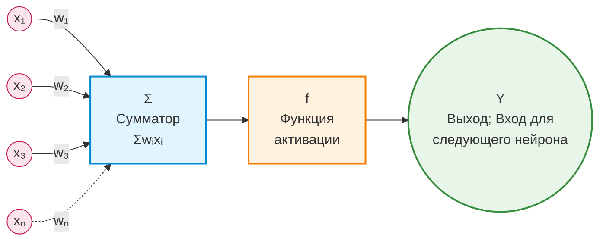
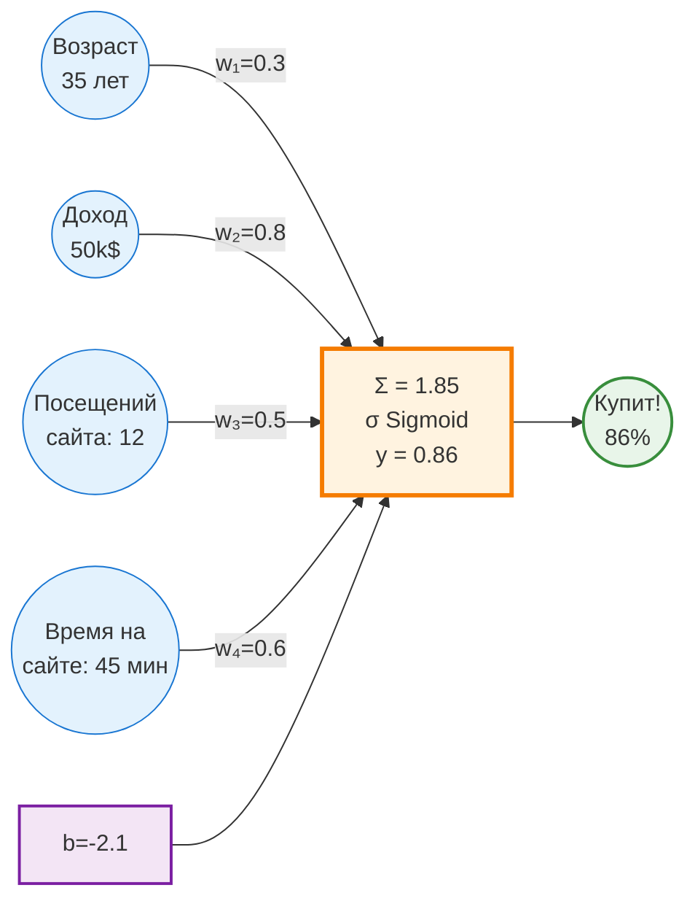
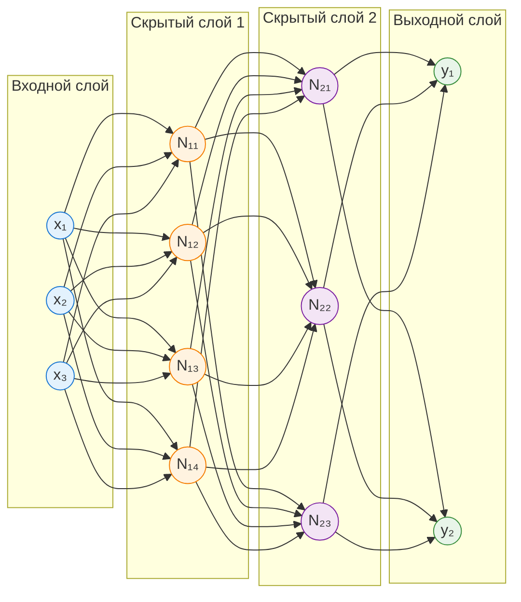
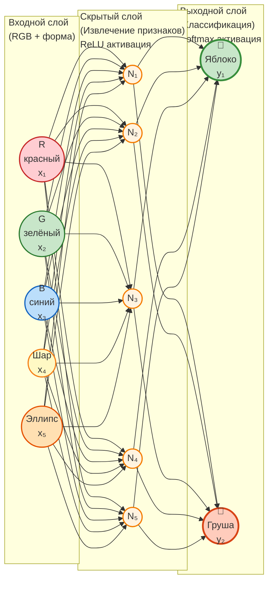
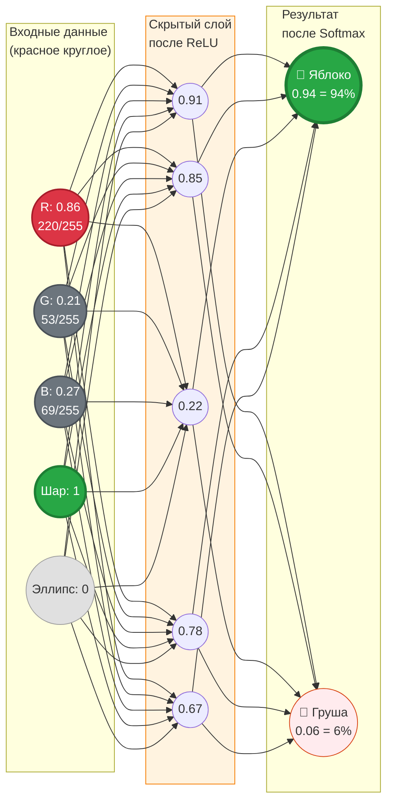
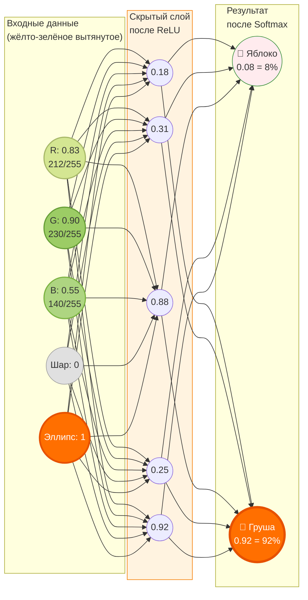
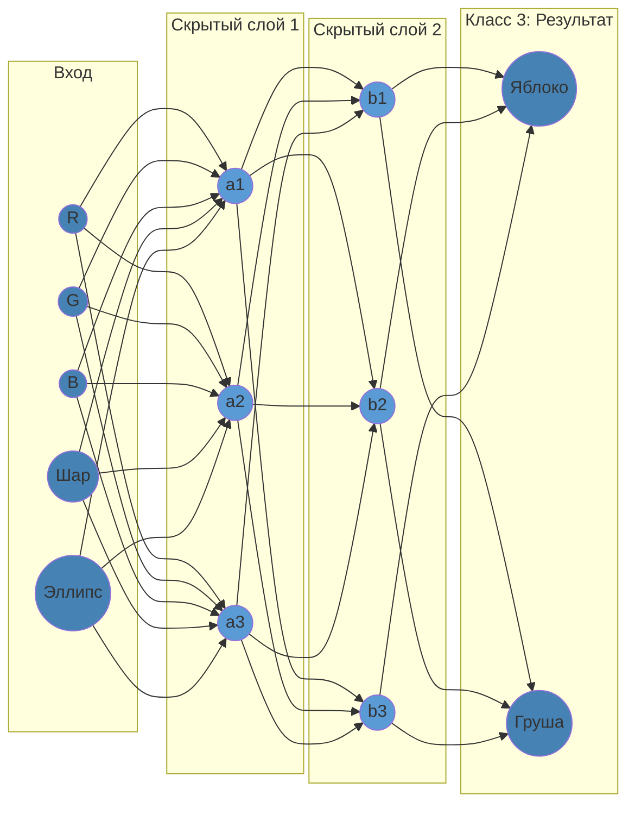

# Введение в Data Science

[Презентация](https://docs.yandex.ru/docs/view?url=ya-disk-public%3A%2F%2F3xs3DkSMawrEZ6kRQrOeB5EtCaoB%2FjzsZZ7D%2BxwzSGFAfOGHvznjItrO6uk9i8T9q%2FJ6bpmRyOJonT3VoXnDag%3D%3D%3A%2FDS_Fundamentals_v6_2025.pptx&name=DS_Fundamentals_v6_2025.pptx)

[ГОСТ Р 59277-2020](./gost-r-59277-2020.pdf)

## [Модуль 1] Область применения больших данных. Постановка задачи

### Информация общего характера

- Для построения нейронной сети используется **метод наименьших квадратов** (изобретённый математиками в XVII веке). В настоящее время просто появились достаточные вычислительные мощности для такого построения, этим объясняется хайп вокруг данной темы (генерируется больше данных, для обработки которых нужны большие мощности, которые могут генерировать и обрабатывать ещё больше данных, в частности большие количества переборов, которые нужны для обучения нейросетей)
- Нейросеть это граф (очень упрощённый). (см. "Задачу о Кенигсбергских мостах")
- Современные "Новые модели" сетей это очень частные модификации общих алгоритмов, заточнные под конкретные задачи

### История

- XVII в. Сэр Исаак Ньютон анализ типа зависимости между двумя переменными (метод Ньютона)
- 1920-е, сэр Фишер — основы статистики
- 1960-е гг. Комитет по данным для науки и техники (CODATA)
- 1974 г. Первое использование термина Data Science (Питер Наур)
- 2002 г. Начат выпуск Data Science Journal
- 2011 — н.в. — взлет популярности, массовые конференции,
открытие учебных программ в ведущих учебных заведениях.
- 2023 — массовое применение генеративных (GPT) сетей

### Основные понятия и термины

#### Искуственный интеллект

Искуственный интеллект, ИИ (англ. Artificial intelligence, AI) это *(Определение крайне размытое)*:

1. Наука и технология создания интеллектуальных машин, особенно интеллектуальных компьютерных программ.
2. Свойство интеллектуальных систем выполнять творческие функции, которые традиционно считаются прерогативой человека.

#### Большие данные
**Cовокупность подходов, инструментов и методов** (а не только сами данные) обработки структурированных и неструктурированных данных огромных объёмов и значительного многообразия для получения воспринимаемых человеком результатов, эффективных в условиях непрерывного прироста, распределения по многочисленным узлам вычислительной сети.

#### Машинное обучение (англ. Machine Learning)
Класс методов искусственного интеллекта, характерной чертой которых является не прямое решение задачи, а обучение в процессе применения решению множества сходных задач. Для построения таких методов используются средства математической статистики, численных методов, методов оптимизации, теории вероятностей, теории графов, различные техники работы с данными в цифровой форме.

### Классификация систем искусственного интеллекта

Из [ГОСТа Р 59277-2020](./gost-r-59277-2020.pdf).

### Скрытые знания

Обучение нейросетей помогает (в том числе) выявить скрытые (ранее неизвестные) зависимости.

- Ранее неизвестные — то есть такие знания, которые должны быть новыми (а не подтверждающими какие-то ранее
полученные сведения).
- Нетривиальные, неочевидные — то есть такие, которые нельзя просто увидеть при непосредственном визуальном анализе данных.
- Практически полезные — то есть такие знания, которые
представляют ценность для исследователя или потребителя (современные AI модели могут генерировать галлюцинации).
- Доступные для интерпретации — знания, которые легко
представить в наглядной для пользователя форме и легко
объяснить в терминах предметной области (невозможно/сложно объяснить почему AI модель выдаёт определённый ответ).

## [Модуль 2] Сбор и подготовка исходных данных. Методика CRISP-DM

### Знание из данных (KDD)

KDD (Knowledge Discovery in Databases) — извлечение знаний из
баз данных это процесс поиска полезных знаний в «сырых данных».

KDD включает в себя вопросы подготовки данных, выбора
информативных признаков, очистки данных, применения
методов Data Mining (DM), постобработки данных и
интерпретации полученных результатов.

### Модель DIKW (Data - Information - Knowledge - Wisdom)

DIKW — это иерархическая модель, описывающая переход от данных к мудрости через информацию и знания. Каждый уровень пирамиды добавляет ценность предыдущему

#### 1. Data (Данные) — базовый уровень

- **Определение**: Необработанные факты, символы, цифры без контекста
- **Характеристики**: 
  - Неструктурированные или структурированные наблюдения
  - Не имеют значения сами по себе
  - Количественные или качественные показатели
- **Примеры**: температура 25°C, число 42, набор пикселей изображения, строки в базе данных
- **В Data Science**: логи, сенсорные показания, транзакции

#### 2. Information (Информация) — данные в контексте

- **Определение**: Обработанные, организованные данные, имеющие контекст и значение. Связанные друг с другом данные
- **Характеристики**:
  - Данные с добавленным контекстом (кто, что, где, когда)
  - Отвечает на вопросы: "Что произошло?"
  - Результат агрегации, фильтрации, анализа данных
- **Примеры**: "Температура повысилась на 5°C за час", "Продажи выросли на 20%"
- **В Data Science**: визуализации, отчеты, дашборды, статистические сводки

#### 3. Knowledge (Знания) — информация с пониманием

- **Определение**: Информация с добавленным пониманием связей, паттернов и закономерностей
- **Характеристики**:
  - Отвечает на вопрос "Как?" и "Почему?"
  - Включает опыт, контекст и интерпретацию
  - Позволяет делать прогнозы
- **Примеры**: "Повышение температуры вызывает рост продаж мороженого", понимание корреляций и причинно-следственных связей
- **В Data Science**: модели машинного обучения, правила, паттерны, выявленные зависимости

#### 4. Wisdom (Мудрость) — высший уровень

- **Определение**: Способность принимать оптимальные решения на основе знаний с учетом этики, ценностей и последствий
- **Характеристики**:
  - Отвечает на вопрос "Что делать?" и "Зачем?"
  - Включает суждения, оценку и предвидение
  - Учитывает долгосрочные последствия
- **Примеры**: "Стоит ли увеличивать производство мороженого, учитывая сезонность и экологические факторы?"
- **В Data Science**: стратегические решения на основе аналитики, этические соображения при использовании AI

---

**Ключевая идея**: В Data Science мы собираем **данные**, преобразуем их в **информацию** через анализ, извлекаем **знания** с помощью ML/AI моделей, и применяем **мудрость** для принятия обоснованных бизнес-решений.

Эта иерархия соответствует процессу KDD (Knowledge Discovery in Databases), описанному выше.

### Инструменты обработки данных

- Excel
- IBM SPSS, GNU PSPP
- Tableau — инструмент визуализации аналитики, интерпретируемый язык для статистической обработки данных и работы с графикой. Использует режим командной строки
- Python — высокоуровневый язык программирования, поддерживающий  структурное, объектно-ориентированное, функциональное, императивное и аспектно-ориентированное программирование
- Octave — система для математических вычислений, использующая совместимый с MATLAB язык высокого уровня
- NoSQL базы данных, в которых делается попытка решить проблемы масштабируемости и доступности за счёт атомарности (англ. atomicity) и согласованности данных:
    - Хранилища «ключ-значение», документоориентированные БД (Cache, MongoSQL), разреженные (bigtable OLAP, Hadoop) БД, графовые БД.
- ИИ ассистенты
- ИИ агенты

### Методология CRISP-DM

**CRISP-DM** (Cross-Industry Standard Process for Data Mining) — стандартная отраслевая методология для проектов по анализу данных и машинному обучению, разработанная в 1996 году консорциумом европейских компаний.

#### Что это такое

CRISP-DM — это итеративный циклический процесс, описывающий жизненный цикл проекта Data Science от начала до конца. Методология не привязана к конкретным инструментам или отраслям и применима к любым проектам анализа данных.

#### Зачем нужен CRISP-DM

- **Структурированный подход**: Предоставляет четкий план действий для организации и выполнения Data Science проектов
- **Снижение рисков**: Помогает избежать типичных ошибок благодаря проверенной последовательности этапов
- **Коммуникация**: Обеспечивает общий язык между бизнесом, аналитиками и техническими специалистами
- **Итеративность**: Позволяет возвращаться к предыдущим этапам при необходимости улучшения результатов
- **Масштабируемость**: Применим как к небольшим, так и к крупным проектам

#### Шесть этапов CRISP-DM

**1. Business Understanding (Понимание бизнеса)**
- Определение бизнес-целей
- Оценка ситуации и ресурсов
- Определени целей аналитики
- Подготовка плана проекта

**2. Data Understanding (Понимание данных)**
- Сбор данных
- Описание данных
- Изучение данных (EDA)
- Проверка качества данных

**3. Data Preparation (Подготовка данных)**
- Выборка данных
- Очистка данных. Трансформация и нормализация
- Генерация данных
- Форматирование данных

**4. Modeling (Моделирование)**
- Выбор методов и алгоритмов моделирования
- Подготовка плана тестирования
- Обучение моделей
- Оценка качества моделей

**5. Evaluation (Оценка)**
- Оценка результатов
- Оценка процесса
- Определение следующих шагов

**6. Deployment (Развертывание)**
- Внедрение
- Планирование мониторинга и поддержки
- Подготовка отчёта
- Ревью проекта

#### Циклический характер

CRISP-DM — это не линейный процесс. На любом этапе может потребоваться вернуться к предыдущим шагам:
- Низкое качество данных → возврат к сбору данных
- Плохие результаты моделирования → возврат к подготовке данных
- Изменение бизнес-требований → возврат к пониманию бизнеса

**Вывод**: CRISP-DM обеспечивает систематический и воспроизводимый подход к реализации Data Science проектов, увеличивая вероятность их успешного завершения.

### Обработка данных

#### Подготовка исходного набора данных
Этот этап заключается в создании набора данных, в том числе консолидации сведений из различных источников, определение выборки, которая и будет в последствии анализироваться.

#### Предобработка и очистка данных
Данные могут содержать пропуски, шумы, аномальные значения, могут быть избыточны, недостаточны и т.д. В некоторых задачах требуется дополнить данные некоторой априорной информацией. Данные должны быть качественны и корректны с точки зрения используемого метода анализа.

#### Трансформация данных
Для различных методов анализа требуются данные, подготовленные в специальном виде. Например, некоторые методы анализа в качестве входных полей могут использовать только числовые данные, а некоторые, наоборот,только категориальные.

#### Data Mining
На этом шаге применяются различные алгоритмы для поиска зависимостей, новых знаний, или говорят, что строятся модели. Выделяют два больших класса моделей — описательные и предсказательные. Для этого используются как классические статистические методы, так и самообучающиеся алгоритмы и машинное обучение (нейронные сети, деревья решений и др.).

#### Постобработка данных
Тестирование, интерпретация результатов и практическое применение полученных знаний в выбранной прикладной области.

### Очистка и подготовка данных

- Удалить дублирующие записи (могут возникнуть вследствие использования различных источников первичных данных)
- Заполнить пропущенные значение (например, с помощью средних значений или ожидаемых (математическое ожидание))
- Преобразовать данные к сравнимым значения (например, вместо количество покупателей и сумма покупок использовать средний чек)
- Сгруппировать значения по «корзинам». Например, уровень дохода: низкий, средний, высокий
- Свести данные к единым временным интервалам. Обычно наиболее длительному из имеющихся
- Удалить случайные значения (например, данные о случайно крупной покупке)
- Проверить данные на соответствие выборки реальным распределениям по типам (например, в выборке данные 80% мужчин и 20% женщин, что нерепрезентативно для популяции)

### «Добыча» данных. Data mining

#### Ассоциация
Выявление зависимостей между связанными событиями, указывающих, что из события X следует событие Y. Такие правила называются ассоциативными.

#### Регрессия
Установление функциональной зависимости между входными и непрерывными выходными переменными.

#### Классификация
Установление функциональной зависимости между входными и дискретными выходными переменными.

#### Кластеризация
Группировка объектов (наблюдений, событий) на основе данных (свойств), описывающих сущность объектов. Чем больше похожи объекты внутри кластера и чем больше отличий между кластерами, тем точнее кластеризация.

### Озера данных (Data Lakes)

Это метод хранения данных системой или репозиторием в натуральном (RAW) формате, который предполагает одновременное хранение данных в различных схемах и форматах. Обычно используется blob-объект (binary large object) или файл. Идея озера данных в том чтобы иметь логически определенное, единое хранилище всех данных в организации (enterprise data) начиная от сырых, необработанных исходных данных (RAW data) до предварительно обработанных (transformed) данных, которые используются для различных задач: отчеты, визуализация, аналитика и машинное обучение.

Data lake включает структурированные данные из реляционных баз данных (строки и колонки), полуструктурированные данные (CSV, лог файлы, XML, JSON), неструктурированные данные (почтовые сообщения, документы, pdf) и даже бинарные данные (видео, аудио, графические файлы).

#### Требования к озёрам данных

- **Масштабируемость** — хранение петабайт данных, горизонтальное масштабирование (HDFS, S3, Azure Data Lake)
- **Гибкость** — Schema-on-Read, поддержка всех форматов данных без предварительной схемы
- **Безопасность** — шифрование, RBAC, аудит, соответствие законодательству (GDPR, ФЗ-152)
- **Метаданные** — каталогизация, Data Lineage, автоматическое индексирование
- **Качество данных** — валидация, мониторинг, версионирование
- **Производительность** — batch/streaming загрузка, параллельная обработка
- **Интеграция** — API, ETL/ELT, поддержка SQL
- **Жизненный цикл** — политики хранения, архивирование, оптимизация затрат

**Отличия от Data Warehouse:** Data Lake использует Schema-on-Read (схема при чтении), хранит все форматы данных в сыром виде с низкой стоимостью, подходит для Data Scientists. Data Warehouse использует Schema-on-Write, хранит структурированные обработанные данные, подходит для бизнес-аналитиков.

#### Состав озёр данных

Озеро данных — многослойная архитектура из следующих элементов:

**1. Слой хранения данных (Storage Layer)**
- **Raw Zone** — сырые данные в исходном формате
- **Processed Zone** — очищенные и трансформированные данные
- **Curated Zone** — готовые для анализа данные, агрегаты
- Технологии: HDFS, Amazon S3, Azure Blob Storage, Google Cloud Storage

**2. Слой приёма данных (Ingestion Layer)**
- Batch загрузка — периодическая загрузка больших объёмов
- Streaming — потоковая загрузка в реальном времени
- Технологии: Apache Kafka, Apache Flume, Spark, AWS Glue, Kinesis

**3. Слой метаданных (Metadata & Catalog Layer)**
- Каталог данных с описанием схем и структур
- Data Lineage — отслеживание происхождения и трансформаций данных
- Технологии: Apache Atlas, AWS Glue Catalog, Azure Purview

**4. Слой обработки (Processing & Analytics Layer)**
- Batch обработка — пакетная обработка больших объёмов (Apache Spark, MapReduce, Hive)
- Stream обработка — обработка потоковых данных (Apache Flink, Spark Streaming)
- SQL движки — запросы к данным (Presto, Athena, Apache Drill)
- ML фреймворки — машинное обучение (TensorFlow, PyTorch, MLlib)

**5. Слой безопасности (Governance & Security Layer)**
- Управление доступом (RBAC/ABAC), шифрование, аудит, compliance
- Технологии: Apache Ranger, Apache Knox

**6. Слой потребления (Consumption Layer)**
- BI инструменты (Tableau, Power BI), Notebooks (Jupyter, Zeppelin), API для приложений

**7. Слой оркестрации (Orchestration Layer)**
- Управление workflow, планировщики задач
- Технологии: Apache Airflow, Luigi, Oozie

**Зоны по температуре данных:**
- **Hot Zone** — часто используемые данные, быстрый доступ, высокая стоимость
- **Warm Zone** — периодически используемые данные
- **Cold Zone** — архивные данные, редкий доступ (Amazon Glacier, Azure Archive)

## [Модуль 3] Задачи численного прогнозирования. Понятие машинного обучения. Корреляция. Регрессионный анализ

До **70%** задач из Data Science решается методам статистики.

### Описательная статистика

Цель описательной (дескриптивной) статистики это обработка эмпирических данных, их систематизация, наглядное представление, а также их количественное описание посредством основных статистических показателей.

#### Медиана. Мода. Среднее

- **Среднее арифметическое (СА)** — отношение суммы значений к их количеству. Использовать среднее это плохая идея, так как оно неустойчиво к выбросам
- **Медиана** — значение, которое делит набор данных на 2 равные части
- **Мода** — величина признака (значение), которая чаще всего встречается в данной совокупности

##### Пример: распределение зарплат

**Условие:** 10 человек получили деньги. 9 человек получили по 1 рублю, 1 человек получил 100 рублей.

**Данные:** 1, 1, 1, 1, 1, 1, 1, 1, 1, 100

**Среднее арифметическое:**
- (1 + 1 + 1 + 1 + 1 + 1 + 1 + 1 + 1 + 100) / 10 = 109 / 10 = **10.9 рубля**
- Интерпретация: "В среднем каждый получил 10.9 рубля" — вводит в заблуждение! 9 из 10 человек получили всего 1 рубль

**Медиана:**
- Упорядоченные данные: 1, 1, 1, 1, 1 | 1, 1, 1, 1, 100
- Среднее между 5-м и 6-м значением: (1 + 1) / 2 = **1 рубль**
- Интерпретация: "Половина людей получили не более 1 рубля" — точно отражает реальность

**Мода:**
- Значение 1 встречается 9 раз, значение 100 встречается 1 раз
- Результат: **1 рубль**
- Интерпретация: "Большинство людей (90%) получили 1 рубль"

**Вывод:** При наличии выбросов (экстремальных значений) медиана и мода показывают типичную ситуацию лучше, чем среднее. Если в новостях скажут "средняя зарплата в компании 10.9 рублей", это правда, но 90% сотрудников получают всего 1 рубль.

#### Математическое ожидание

**Математическое ожидание (Expected Value, E(X))** — это среднее значение случайной величины при большом числе испытаний. Показывает, какое значение можно ожидать "в среднем" при многократном повторении случайного эксперимента.

**Формула для дискретной случайной величины:**

$$
E(X) = \sum_{i=1}^{n} x_i \cdot p_i
$$

где:
- $x_i$ — возможные значения случайной величины
- $p_i$ — вероятность каждого значения
- $n$ — количество возможных исходов

##### Пример: бросок игральной кости

**Условие:** Бросаем честную шестигранную игральную кость один раз. Какое математическое ожидание выпавшего числа?

**Исходные данные:**
- Возможные значения: 1, 2, 3, 4, 5, 6
- Вероятность каждого значения: $p = \frac{1}{6}$ (кость честная)

**Расчёт:**

$$
E(X) = 1 \cdot \frac{1}{6} + 2 \cdot \frac{1}{6} + 3 \cdot \frac{1}{6} + 4 \cdot \frac{1}{6} + 5 \cdot \frac{1}{6} + 6 \cdot \frac{1}{6}
$$

$$
E(X) = \frac{1 + 2 + 3 + 4 + 5 + 6}{6} = \frac{21}{6} = 3.5
$$

**Результат:** $E(X) = 3.5$

**Интерпретация:** 
- При многократных бросках кости среднее значение будет стремиться к 3.5
- Хотя на кости нет грани с числом 3.5, это теоретическое среднее для большого числа бросков
- Если бросить кость 1000 раз и вычислить среднее арифметическое выпавших чисел, оно будет близко к 3.5

**Практическое применение:**
- **В играх:** расчёт средней выгоды от игры (например, казино)
- **В инвестициях:** ожидаемая доходность портфеля
- **В ML:** ожидаемая ошибка модели
- **В бизнесе:** средний доход от клиента, средний чек

**Свойства математического ожидания:**
- $E(c) = c$ (константа равна сама себе)
- $E(aX + b) = aE(X) + b$ (линейность)
- $E(X + Y) = E(X) + E(Y)$ (сумма ожиданий равна ожиданию суммы)

#### Дисперсия и среднеквадратичное отклонение

**Дисперсия (Variance, $\sigma^2$ или D(X))** — это мера разброса (рассеяния) значений случайной величины относительно её математического ожидания. Показывает, насколько сильно значения отклоняются от среднего.

**Формула дисперсии для случайной величины:**

$$
\text{D}(X) = E[(X - E(X))^2] = E(X^2) - (E(X))^2
$$

**Среднеквадратичное отклонение (Standard Deviation, $\sigma$ или SD)** — это квадратный корень из дисперсии. Измеряется в тех же единицах, что и исходные данные, поэтому более интерпретируемо.

**Формула:**

$$
\sigma = \sqrt{\text{D}(X)}
$$

##### Пример: оценки студентов

**Условие:** Два студента сдали по 5 экзаменов. Найти дисперсию и СКО для каждого.

**Данные:**
- Студент А: 3, 3, 3, 3, 3 (стабильные оценки)
- Студент Б: 1, 2, 3, 4, 5 (разброс оценок)

**Расчёт для студента А:**

Среднее: $\bar{x}_A = \frac{3 + 3 + 3 + 3 + 3}{5} = 3$

Дисперсия:

$$
\sigma_A^2 = \frac{(3-3)^2 + (3-3)^2 + (3-3)^2 + (3-3)^2 + (3-3)^2}{5} = \frac{0}{5} = 0
$$

СКО: $\sigma_A = \sqrt{0} = 0$

**Расчёт для студента Б:**

Среднее: $\bar{x}_B = \frac{1 + 2 + 3 + 4 + 5}{5} = 3$

Дисперсия:

$$
\sigma_B^2 = \frac{(1-3)^2 + (2-3)^2 + (3-3)^2 + (4-3)^2 + (5-3)^2}{5} = \frac{4 + 1 + 0 + 1 + 4}{5} = \frac{10}{5} = 2
$$

СКО: $\sigma_B = \sqrt{2} \approx 1.41$

**Интерпретация:**
- У обоих студентов средний балл = 3
- У студента А разброс = 0 (всегда одинаковые оценки, стабильность)
- У студента Б разброс = 1.41 (оценки варьируются, нестабильность)

**Практическое применение:**

- **В финансах:** измерение риска (волатильность акций)
- **В производстве:** контроль качества (отклонение от стандарта)
- **В ML:** оценка стабильности модели, нормализация данных
- **В бизнесе:** анализ предсказуемости метрик

**Свойства дисперсии:**
- D(c) = 0 (дисперсия константы равна нулю)
- D(aX + b) = a² · D(X) (константа b не влияет)
- Дисперсия всегда неотрицательна: D(X) ≥ 0

**Правило "трёх сигм" (для нормального распределения):**
- ~68% значений лежат в пределах $E(X) \pm \sigma$
- ~95% значений лежат в пределах $E(X) \pm 2\sigma$
- ~99.7% значений лежат в пределах $E(X) \pm 3\sigma$

#### Стандартная ошибка среднего

**Стандартная ошибка среднего (Standard Error of the Mean, SE или SEM)** — это оценка стандартного отклонения распределения выборочных средних. Показывает, насколько выборочное среднее может отличаться от истинного среднего в генеральной совокупности.

**Формула:**

$$
SE = \frac{\sigma}{\sqrt{n}}
$$

где:
- $\sigma$ — стандартное отклонение генеральной совокупности (или выборочное СКО)
- $n$ — размер выборки

**Ключевое отличие:**
- **Стандартное отклонение ($\sigma$)** — измеряет разброс отдельных значений
- **Стандартная ошибка (SE)** — измеряет точность оценки среднего значения

##### Пример: измерение роста студентов

**Условие:** Проведено два исследования роста студентов университета. Стандартное отклонение роста = 10 см.

**Исследование 1:** Выборка из 25 студентов

$$
SE_1 = \frac{10}{\sqrt{25}} = \frac{10}{5} = 2 \text{ см}
$$

**Исследование 2:** Выборка из 100 студентов

$$
SE_2 = \frac{10}{\sqrt{100}} = \frac{10}{10} = 1 \text{ см}
$$

**Интерпретация:**
- В обоих случаях разброс роста отдельных студентов = 10 см
- Но точность оценки среднего роста разная:
  - С выборкой 25 человек: среднее может отличаться от истинного на ~2 см
  - С выборкой 100 человек: среднее может отличаться от истинного на ~1 см
- **Вывод:** Чем больше выборка, тем точнее оценка среднего (SE уменьшается)

**Практическое применение:**

- **В исследованиях:** оценка точности результатов эксперимента
- **Доверительные интервалы:** построение интервалов для среднего (обычно $\bar{x} \pm 2 \cdot SE$)
- **A/B тестирование:** определение статистической значимости различий
- **Опросы:** оценка погрешности среднего мнения в выборке

**Важное свойство**  
Стандартная ошибка уменьшается пропорционально корню из размера выборки. Чтобы уменьшить SE в 2 раза, нужно увеличить выборку в 4 раза.

### Ассоциативная статистика. Корреляция

**Корреляция или корреляционная зависимость** — статистическая взаимосвязь двух или более случайных величин (либо величин, которые можно с некоторой допустимой степенью точности считать таковыми). При этом изменения значений одной или нескольких из этих величин сопутствуют систематическому изменению значений другой или других величин.

**Математической мерой корреляции** двух случайных величин служит коэффициент корреляции **R** либо корреляционное отношение **F**.

#### Коэффициент корреляции Пирсона

**Коэффициент корреляции Пирсона (Pearson correlation coefficient, r)** — мера линейной зависимости между двумя переменными X и Y. Принимает значения от -1 до +1.

**Формула:**

$$
r = \frac{\sum_{i=1}^{n}(x_i - \bar{x})(y_i - \bar{y})}{\sqrt{\sum_{i=1}^{n}(x_i - \bar{x})^2} \cdot \sqrt{\sum_{i=1}^{n}(y_i - \bar{y})^2}}
$$

Альтернативная форма записи:

$$
r = \frac{n\sum x_iy_i - \sum x_i \sum y_i}{\sqrt{n\sum x_i^2 - (\sum x_i)^2} \cdot \sqrt{n\sum y_i^2 - (\sum y_i)^2}}
$$

где:
- $x_i, y_i$ — значения переменных X и Y
- $\bar{x}, \bar{y}$ — средние значения переменных X и Y
- $n$ — количество наблюдений

**Интерпретация значений:**
- $r = 0$ — отсутствие линейной корреляции
- $r > 0.5$ — положительная корреляция
- $r < -0.5$ — отрицательная корреляция
- $r = 1$ — полная положительная линейная корреляция
- $r = -1$ — полная отрицательная линейная корреляция

**Важно:** Коэффициент Пирсона измеряет только линейную зависимость. Если r = 0, это не означает отсутствие зависимости вообще — может существовать нелинейная связь.

### Сравнительная статистика

Помогает ответить на такие вопросы
- Это тенденция или случайность?
- Каков риск принятия гипотезы?
- Выборки должны быть независимыми

**Например:** продажи товара А ведут к увеличению продаж
товара В

#### T-тест на одной и двух выборках

**T-тест (Student's t-test)** — статистический критерий для проверки гипотез о средних значениях. Используется для определения, значимо ли отличается среднее значение выборки от известного значения или средние двух выборок друг от друга.

##### T-тест на одной выборке (One-Sample t-test)

**Назначение:** Проверяет, отличается ли среднее значение выборки от известного (гипотетического) значения генеральной совокупности.

**Формула:**

$$
t = \frac{\bar{x} - \mu_0}{s / \sqrt{n}}
$$

где:
- $\bar{x}$ — среднее значение выборки
- $\mu_0$ — гипотетическое среднее значение генеральной совокупности (с которым сравниваем)
- $s$ — стандартное отклонение выборки
- $n$ — размер выборки
- $s / \sqrt{n}$ — стандартная ошибка среднего (SE)

##### T-тест для двух независимых выборок (Two-Sample t-test)

**Назначение:** Проверяет, отличаются ли средние значения двух независимых выборок друг от друга.

**Формула (для выборок с неравными дисперсиями — тест Уэлча):**

$$
t = \frac{\bar{x}_1 - \bar{x}_2}{\sqrt{\frac{s_1^2}{n_1} + \frac{s_2^2}{n_2}}}
$$

где:
- $\bar{x}_1$ — среднее арифметическое значение **первой выборки** (например, средний балл группы А)
- $\bar{x}_2$ — среднее арифметическое значение **второй выборки** (например, средний балл группы Б)
- $s_1$ — стандартное отклонение **первой выборки** (мера разброса данных в группе А)
- $s_2$ — стандартное отклонение **второй выборки** (мера разброса данных в группе Б)
- $n_1$ — количество наблюдений (размер) **первой выборки** (сколько человек в группе А)
- $n_2$ — количество наблюдений (размер) **второй выборки** (сколько человек в группе Б)

**P-значение** (англ. P-value)— вероятность получить для данной вероятностной модели распределения значений случайной величины такое же или более экстремальное значение статистики (среднего арифметического, медианы и др.), по сравнению с ранее наблюдаемым, при условии, что нулевая гипотеза верна

Если p(t) меньше заданного уровня значимости, то нулевая
гипотеза отвергается в пользу альтернативной. В противном
случае она не отвергается.

Критерий Стьюдента (Т-тест) оценивает вероятность попадания значения из выборки в область принятия. Если оценка попадает в область отклонения, то мы вправе отклонить гипотезу.

Обычно принимают, что вероятность попадания в область отклонения
не должна превышать 5%.

### Основы машинного обучения

(от англ. – machine learning) – алгоритмы, позволяющие компьютеру делать выводы на основании данных, не следуя определенным правилам.

#### Некоторые области применения

- Распознавание речи
- Распознавание жестов
- Распознавание рукописного ввода
- Распознавание образов
- Техническая диагностика
- Медицинская диагностика
- Прогнозирование временных рядов
- Биоинформатика
- Обнаружение мошенничества
- Обнаружение спама
- Категоризация документов
- Биржевой технический анализ
- Финансовый надзор
- Кредитный скоринг
- Предсказание ухода клиентов

#### Обучение «с учителем». Supervised learning

Один из способов машинного обучения, в ходе которого испытуемая система принудительно обучается с помощью примеров «стимул-реакция». Между входами и эталонными выходами (стимул-реакция) может существовать некоторая зависимость, но она неизвестна. Известна только конечная совокупность прецедентов — пар «стимул-реакция», называемая обучающей выборкой.

#### Обучение «без учителя». Unsupervised learning

Обучение без учителя (самообучение, спонтанное обучение) — один из способов машинного обучения, при котором испытуемая система спонтанно обучается выполнять поставленную задачу без вмешательства со стороны экспериментатора. С точки зрения кибернетики, это является одним из видов кибернетического эксперимента. Как правило, это пригодно только для задач, в которых известны описания множества объектов (обучающей выборки), и требуется обнаружить внутренние взаимосвязи, зависимости, закономерности, существующие между объектами.

#### Обучение с «подкреплением»

Обучение с подкреплением (Reinforcement Learning) – это метод машинного обучения, в котором наша система (агент) обучается методом проб и ошибок. Идея заключается в том, что агент взаимодействует со средой, параллельно обучаясь, и получает вознаграждение за выполнение действий.

### Регрессия

**Регрессия** — статистическая зависимость среднего значения случайной величины от значений другой случайной величины или нескольких случайных величин.

- $h(x) = θ(0) + θ(1)x(1)$ – линейная регрессия
- $h(x) = θ(0) +f(x(1,2,3,…))$ - нелинейная регрессия

#### Регрессия в машинном обучении

Стоимостная функция (или функция потерь - $J$) – оценка отклонения предсказанных значений от значений в реальной тестовой выборке. Должна быть минимизирована.

**Задача:** найти коэффициенты $(θ(i))$, при которых дисперсия и
стандартное отклонение будут минимальны.

Регрессионный анализ — поиск коэффициентов регрессии, при
которых стоимостная функция минимальна.

**Функция потерь (стоимостная функция):**

$$
J(\theta) = \frac{1}{2m} \sum_{i=1}^{m} (h_\theta(x^{(i)}) - y^{(i)})^2
$$

где:
- $J(\theta)$ — функция потерь
- $m$ — количество обучающих примеров
- $h_\theta(x^{(i)})$ — предсказанное значение для i-го примера
- $y^{(i)}$ — истинное значение для i-го примера
- $\theta$ — вектор параметров модели

#### Обучающий алгоритм Ньютона (Рафтона)

- `Repeat` {выбор регрессионной функции}
- `Repeat { //(Cycle for selecting the appropriate coefficients)` 
    - `Repeat (j) {`
    - $\theta_j = 0$
      - `For i=0 to N`
      - Считаем $\theta_j$ (формула ниже)
      - `If` $(J(Ɵj))<J(j)$ `then` $J(j)=J(Ɵj)$
      - `Next I`
    - `Inc(j)`
- `}}`

**Дополнение от Рафтона:** α — 0..1 — шаг изменения для θ.

**Формула вычисления $θ_j$ (градиентный спуск):**

$$
\theta_j := \theta_j + \alpha \sum_{i=1}^{m} (y^{(i)} - h_\theta(x^{(i)})) \cdot x_j^{(i)}
$$

где:
- $\theta_j$ — j-й параметр модели;
- $\alpha$ — скорость обучения (learning rate), значение от 0 до 1;
- $m$ — количество обучающих примеров;
- $x_j^{(i)}$ — значение j-го признака в i-м примере.

### Библиотека Scikit-learn

www.scikit-learn.org

Open-source инструменты для работы с нейросетями.

### Основные инструменты

- IBM SPS Statistics
- PSPP
- MatLab
- Octave

## [Модуль 4] Задачи классификации и распознавания образов, видео, речи, текста. Понятие нейронных сетей. Примеры применения

### Сегментирование данных (slice & dice)

В контексте машинного обучения и, в частности, логистической регрессии, выражение "slice and dice" (разрезать и нарезать кубиками) используется в переносном смысле и означает детальный, многомерный анализ данных.

#### Метод опорных векторов

##### Анализ текста. Задача кластеризации: спам-фильтр

**Задача:** выделить e-мейлы, относящиеся к спаму (на примере 2х факторов):
- х1 — количество определённых слов;
- х2 — объём вложений.

##### Задача кластеризации: медицина

**Задача:** выделить кластер пациентов с заболеванием щитовидной железы.

#### К – кластерный анализ

### Ассоциативные правила

Ассоциативное правило устанавливается между множествами $X$ и $Y$:

$$
X \Rightarrow Y \quad [S\%, C\%]
$$

где $X$, $Y$ — продукты и/или услуги (например).

**Параметры:**
- $X$ — левосторонний элемент или предшественник;
- $Y$ — правосторонний элемент или последователь;
- $S$ (Support) — критерий поддержки гипотезы;
- $C$ (Confidence) — критерий гарантии (уверенности).

**Пример:** Ассоциативные правила – основной инструмент, используемый Amazon.

**Формула поддержки (Support):**

$$
S(X \Rightarrow Y) = \frac{|X \cap Y|}{N}
$$

где:
- $|X \cap Y|$ — количество транзакций, содержащих и $X$, и $Y$;
- $N$ — общее количество транзакций.

**Интерпретация:** Как часто элементы $X$ и $Y$ встречаются вместе в общей выборке.

**Формула уверенности (Confidence):**

$$
C(X \Rightarrow Y) = \frac{|X \cap Y|}{|X|} = \frac{S(X \cap Y)}{S(X)}
$$

где:
- $|X \cap Y|$ — количество транзакций, содержащих и $X$, и $Y$;
- $|X|$ — количество транзакций, содержащих $X$.

**Интерпретация:** Как часто $Y$ идёт совместно с $X$ из общего числа элементов $X$.

#### Пример: анализ покупок в магазине электроники

**Правило:** Ноутбук ⇒ Гарнитура

**Данные о покупках клиентов:**

| № | Покупки клиента |
|---|---|
| 1 | Ноутбук, принтер, планшет, гарнитура |
| 2 | Монитор, принтер, планшет |
| 3 | Ноутбук, принтер, планшет, гарнитура |
| 4 | Ноутбук, монитор, планшет, гарнитура |
| 5 | Монитор, принтер, планшет, гарнитура |
| 6 | Принтер, планшет, гарнитура |
| 7 | Монитор, планшет |
| 8 | Ноутбук, принтер, монитор |
| 9 | Ноутбук, планшет, гарнитура |
| 10 | Принтер, гарнитура |

**Подсчёт:**
- $X$ (Ноутбук): встречается в транзакциях 1, 3, 4, 8, 9 → $|X| = 5$
- $Y$ (Гарнитура): встречается в транзакциях 1, 3, 4, 5, 6, 9, 10 → $|Y| = 7$
- $X \cap Y$ (оба товара): встречается в транзакциях 1, 3, 4, 9 → $|X \cap Y| = 4$
- $N$ (всего транзакций) = 10

**Расчёт метрик:**

$$
S(\text{Ноутбук} \Rightarrow \text{Гарнитура}) = \frac{|X \cap Y|}{N} = \frac{4}{10} = 0.4 = 40\%
$$

$$
C(\text{Ноутбук} \Rightarrow \text{Гарнитура}) = \frac{|X \cap Y|}{|X|} = \frac{4}{5} = 0.8 = 80\%
$$

**Результат:** Ноутбук ⇒ Гарнитура [40%, 80%]

**Интерпретация:**
- **Support = 40%:** В 40% всех покупок клиенты покупают и ноутбук, и гарнитуру вместе.
- **Confidence = 80%:** Из всех клиентов, купивших ноутбук, 80% также покупают гарнитуру.

**Вывод:** Это сильное ассоциативное правило. Рекомендуется размещать гарнитуры рядом с ноутбуками или предлагать их в качестве дополнительного товара при покупке ноутбука.

#### Метод перебора для поиска ассоциативных правил

**Задача:** Найти все значимые ассоциативные правила в данных о покупках.

**Алгоритм поиска методом перебора:**

**Шаг 1. Определение всех уникальных товаров**

Из 10 транзакций выделяем уникальные товары:
- Ноутбук
- Монитор
- Принтер
- Планшет
- Гарнитура

**Шаг 2. Генерация всех возможных пар (правил X ⇒ Y)**

Перебираем все возможные комбинации товаров:

| № | Правило | $\|X\|$ | $\|Y\|$ | $\|X \cap Y\|$ | Support | Confidence |
|---|---|---|---|---|---|---|
| 1 | Ноутбук ⇒ Монитор | 5 | 4 | 2 | 20% | 40% |
| 2 | Ноутбук ⇒ Принтер | 5 | 6 | 3 | 30% | 60% |
| 3 | Ноутбук ⇒ Планшет | 5 | 8 | 4 | 40% | 80% |
| 4 | **Ноутбук ⇒ Гарнитура** | **5** | **7** | **4** | **40%** | **80%** |
| 5 | Монитор ⇒ Ноутбук | 4 | 5 | 2 | 20% | 50% |
| 6 | Монитор ⇒ Принтер | 4 | 6 | 3 | 30% | 75% |
| 7 | Монитор ⇒ Планшет | 4 | 8 | 4 | 40% | 100% |
| 8 | Монитор ⇒ Гарнитура | 4 | 7 | 2 | 20% | 50% |
| 9 | Принтер ⇒ Ноутбук | 6 | 5 | 3 | 30% | 50% |
| 10 | Принтер ⇒ Монитор | 6 | 4 | 3 | 30% | 50% |
| 11 | Принтер ⇒ Планшет | 6 | 8 | 5 | 50% | 83% |
| 12 | Принтер ⇒ Гарнитура | 6 | 7 | 4 | 40% | 67% |
| 13 | Планшет ⇒ Ноутбук | 8 | 5 | 4 | 40% | 50% |
| 14 | Планшет ⇒ Монитор | 8 | 4 | 4 | 40% | 50% |
| 15 | Планшет ⇒ Принтер | 8 | 6 | 5 | 50% | 63% |
| 16 | Планшет ⇒ Гарнитура | 8 | 7 | 5 | 50% | 63% |
| 17 | Гарнитура ⇒ Ноутбук | 7 | 5 | 4 | 40% | 57% |
| 18 | Гарнитура ⇒ Монитор | 7 | 4 | 2 | 20% | 29% |
| 19 | Гарнитура ⇒ Принтер | 7 | 6 | 4 | 40% | 57% |
| 20 | Гарнитура ⇒ Планшет | 7 | 8 | 5 | 50% | 71% |

**Шаг 3. Применение порогов (минимальных значений)**

Устанавливаем пороговые значения:
- Минимальный Support: 40%
- Минимальный Confidence: 70%

**Шаг 4. Фильтрация правил**

Отбираем правила, удовлетворяющие обоим критериям:

| Правило | Support | Confidence | Статус |
|---|---|---|---|
| **Ноутбук ⇒ Гарнитура** | 40% | 80% | ✓ Подходит |
| **Монитор ⇒ Планшет** | 40% | 100% | ✓ Подходит |
| **Принтер ⇒ Планшет** | 50% | 83% | ✓ Подходит |
| **Гарнитура ⇒ Планшет** | 50% | 71% | ✓ Подходит |

**Примечание:** Ассоциативные правила, обычно, принимают как работающие при $S>33\%$ и $С > 50\%$.

**Результат перебора:**

Найдено 4 сильных ассоциативных правила. Правило **Ноутбук ⇒ Гарнитура** является одним из наиболее значимых с точки зрения уверенности (80%).

**Примечание:** В реальных задачах с большим количеством товаров используются оптимизированные алгоритмы (Apriori, FP-Growth), которые не требуют полного перебора всех комбинаций.

### Нейронные сети

- **Искусственные нейронные сети** (ИНС) — математические модели, а также их программные или аппаратные реализации, построенные по принципу организации и функционирования биологических нейронных сетей — сетей нервных клеток живого организма. Это понятие возникло при изучении процессов, протекающих в мозге, и при попытке смоделировать эти процессы.

- **ИНС** представляют собой систему соединённых и взаимодействующих между собой простых процессоров (искусственных нейронов). Каждый процессор подобной сети имеет дело только с сигналами, которые он периодически получает, и сигналами, которые он периодически посылает другим процессорам.

- Нейронные сети не программируются в привычном смысле этого слова, они **обучаются**. Технически обучение заключается в нахождении коэффициентов связей между нейронами. В процессе обучения нейронная сеть способна выявлять сложные зависимости между входными данными и выходными, а также выполнять обобщение.

#### Решаемые задачи

- Распознавание образов
  - Символы
  - Речь
  - Штрих- и QR-коды
  - Лица
- Прогнозирование
- Искусственный интеллект (AI) первого рода

#### Структура искусственного нейрона

Искусственный нейрон (перцептрон) — базовая вычислительная единица нейронной сети, имитирующая работу биологического нейрона.

**Основные компоненты нейрона:**

1. **Входы** ($x_1, x_2, ..., x_n$) — входные сигналы (признаки)
2. **Веса** ($w_1, w_2, ..., w_n$) — коэффициенты важности каждого входа
3. **Смещение** ($b$, bias) — пороговое значение активации
4. **Сумматор** ($\Sigma$) — вычисляет взвешенную сумму входов
5. **Функция активации** ($f$) — нелинейное преобразование суммы
6. **Выход** ($y$) — результат работы нейрона

**Математическая модель нейрона:**

$$
y = f\left(\sum_{i=1}^{n} w_i \cdot x_i + b\right) = f(w_1x_1 + w_2x_2 + ... + w_nx_n + b)
$$

**Структурная схема нейрона:**

#### 1. Функция активации Step (Пороговая)

$$
\text{step}(x) = \begin{cases} 
0, & \text{если } x < 0 \\
1, & \text{если } x \geq 0
\end{cases}
$$

<svg width="200" height="120" xmlns="http://www.w3.org/2000/svg">
  <line x1="30" y1="60" x2="200" y2="60" stroke="#ccc" stroke-width="1"/>
  <line x1="100" y1="10" x2="100" y2="110" stroke="#ccc" stroke-width="1"/>
  <path d="M 35,105 L 100,105 L 100,15 L 165,15" stroke="#ff6f00" fill="none" stroke-width="3"/>
  <text x="5" y="20" font-size="11" fill="#666">1</text>
  <text x="5" y="110" font-size="11" fill="#666">0</text>
</svg>

Диапазон: {0, 1} — самая простая, моментальный скачок в точке x=0

#### 2. Функция активации ReLU

$$
\text{ReLU}(x) = \max(0, x) = \begin{cases} 
x, & \text{если } x \geq 0 \\
0, & \text{если } x < 0
\end{cases}
$$

<svg width="200" height="120" xmlns="http://www.w3.org/2000/svg">
  <line x1="30" y1="60" x2="200" y2="60" stroke="#ccc" stroke-width="1"/>
  <line x1="100" y1="0" x2="100" y2="120" stroke="#ccc" stroke-width="1"/>
  <path d="M 35,60 L 100,60 L 165,15" stroke="#388e3c" fill="none" stroke-width="3"/>
  <text x="5" y="65" font-size="11" fill="#666">0</text>
  <text x="5" y="20" font-size="11" fill="#666">+</text>
</svg>

Диапазон: [0, +∞) — две прямые линии: горизонталь (0) слева, наклон 45° справа

#### 3. Функция активации Leaky ReLU

$$
\text{LeakyReLU}(x) = \begin{cases} 
x, & \text{если } x \geq 0 \\
\alpha x, & \text{если } x < 0
\end{cases}
\quad (\alpha = 0.01)
$$

<svg width="200" height="120" xmlns="http://www.w3.org/2000/svg">
  <line x1="30" y1="60" x2="200" y2="60" stroke="#ccc" stroke-width="1"/>
  <line x1="100" y1="0" x2="100" y2="120" stroke="#ccc" stroke-width="1"/>
  <path d="M 35,70 L 100,60 L 165,15" stroke="#e91e63" fill="none" stroke-width="3"/>
  <text x="5" y="65" font-size="11" fill="#666">0</text>
  <text x="5" y="20" font-size="11" fill="#666">+</text>
</svg>

Диапазон: (-∞, +∞) — как ReLU, но слева небольшой наклон вместо нуля

#### 4. Функция активации Sigmoid (Логистическая)

**Для одного входа:**

$$
\sigma(x) = \frac{1}{1 + e^{-x}}
$$

**Для N входов (логистическая регрессия):**

$$
\sigma(x_1, \ldots, x_n) = \frac{1}{1 + e^{-(w_1x_1 + \ldots + w_nx_n + b)}}
$$

<svg width="200" height="120" xmlns="http://www.w3.org/2000/svg">
  <line x1="30" y1="60" x2="200" y2="60" stroke="#ccc" stroke-width="1"/>
  <line x1="100" y1="10" x2="100" y2="110" stroke="#ccc" stroke-width="1"/>
  <path d="M 35,105 C 60,105 80,85 100,60 C 120,35 140,15 165,15" stroke="#2196F3" fill="none" stroke-width="3"/>
  <text x="5" y="20" font-size="11" fill="#666">1</text>
  <text x="5" y="65" font-size="11" fill="#666">0.5</text>
  <text x="5" y="110" font-size="11" fill="#666">0</text>
</svg>

Диапазон: (0, 1) — плавная S-образная кривая, экспоненциальная функция

#### 5. Функция активации Tanh

$$
\tanh(x) = \frac{e^x - e^{-x}}{e^x + e^{-x}}
$$

<svg width="200" height="120" xmlns="http://www.w3.org/2000/svg">
  <line x1="30" y1="60" x2="200" y2="60" stroke="#ccc" stroke-width="1"/>
  <line x1="100" y1="0" x2="100" y2="120" stroke="#ccc" stroke-width="1"/>
  <path d="M 35,105 C 60,105 80,90 100,60 C 120,30 140,15 165,15" stroke="#7b1fa2" fill="none" stroke-width="3"/>
  <text x="5" y="15" font-size="11" fill="#666">1</text>
  <text x="5" y="65" font-size="11" fill="#666">0</text>
  <text x="5" y="110" font-size="11" fill="#666">-1</text>
</svg>

Диапазон: (-1, 1) — плавная S-образная кривая через центр, симметричная относительно нуля

---

### Пример обученного нейрона

**Задача:** Определить, купит ли клиент товар (бинарная классификация)

**Расчёт:**

$$
\begin{aligned}
\Sigma &= w_1x_1 + w_2x_2 + w_3x_3 + w_4x_4 + b \\
       &= 0.3 \cdot 35 + 0.8 \cdot 50 + 0.5 \cdot 12 + 0.6 \cdot 45 - 2.1 \\
       &= 10.5 + 40 + 6 + 27 - 2.1 = 81.4 \text{ (нормализовано до 1.85)} \\[0.5em]
y &= \sigma(1.85) = \frac{1}{1+e^{-1.85}} = 0.86 = 86\%
\end{aligned}
$$

**Интерпретация:** Нейрон предсказывает с вероятностью 86%, что клиент купит товар.

---

### Пример многослойной нейронной сети

**Архитектура:** 3 входа → 4 нейрона (слой 1) → 3 нейрона (слой 2) → 2 выхода

**Структура сети:**

- **Входной слой:** 3 нейрона (признаки x₁, x₂, x₃)
- **Скрытый слой 1:** 4 нейрона (N₁₁, N₁₂, N₁₃, N₁₄) — оранжевые
- **Скрытый слой 2:** 3 нейрона (N₂₁, N₂₂, N₂₃) — фиолетовые
- **Выходной слой:** 2 нейрона (y₁, y₂) — зелёные (например, "класс А" и "класс Б")

**Обозначения:** Nᵢⱼ — j-й нейрон в i-м скрытом слое

**Полносвязная архитектура:** Каждый нейрон одного слоя соединён со **всеми** нейронами следующего слоя.

**Количество параметров:**
- Связи входной → скрытый 1: $3 \times 4 = 12$ весов
- Связи скрытый 1 → скрытый 2: $4 \times 3 = 12$ весов
- Связи скрытый 2 → выходной: $3 \times 2 = 6$ весов
- Смещения: $4 + 3 + 2 = 9$
- **Всего параметров:** $12 + 12 + 6 + 9 = 39$ обучаемых весов

**Обозначения:**
- $m = 4$ — количество слоёв (входной + 2 скрытых + выходной)
- Количество выходов обычно равно количеству классов в задаче классификации

#### Практический пример: нейросеть для распознавания фруктов (яблоко или груша)

**Задача:** Классификация фруктов на основе цвета (RGB) и формы

**Входные признаки (5 нейронов):**
- x₁ — R (красный компонент, 0-255, нормализованный к 0-1)
- x₂ — G (зелёный компонент, 0-255, нормализованный к 0-1)
- x₃ — B (синий компонент, 0-255, нормализованный к 0-1)
- x₄ — Шар (1 = круглая форма, 0 = не круглая)
- x₅ — Эллипс (1 = вытянутая форма, 0 = не вытянутая)

**One-hot encoding для формы:**
- Шар: [1, 0]
- Эллипс: [0, 1]

**Выходы:**
- y₁ — Вероятность "Яблоко"
- y₂ — Вероятность "Груша"

**Архитектура:** 5 входов → 5 нейронов (скрытый слой) → 2 выхода

**Описание работы сети:**

1. **Входной слой:** Принимает 5 признаков
   - **3 нейрона для цвета:** RGB компоненты описывают цвет фрукта (например, красный для яблока, зеленовато-жёлтый для груши)
   - **2 нейрона для формы:** One-hot encoding [1,0] = шар (яблоко круглое), [0,1] = эллипс (груша вытянутая)

2. **Скрытый слой:** 5 нейронов с функцией активации ReLU
   - Каждый нейрон получает все 5 входов
   - Извлекает сложные признаки: комбинации цвета и формы (например, "красный + шар" → яблоко, "жёлто-зелёный + эллипс" → груша)
   - **Всего связей:** 5 × 5 = 25 весов + 5 смещений = **30 параметров**

3. **Выходной слой:** 2 нейрона с функцией активации Softmax
   - Каждый нейрон представляет класс (яблоко или груша)
   - Softmax нормализует выходы так, чтобы их сумма = 1 (интерпретируется как вероятности)
   - **Всего связей:** 5 × 2 = 10 весов + 2 смещения = **12 параметров**

4. **Общее количество обучаемых параметров:** 30 + 12 = **42 веса**

**Пример предсказания №1: Яблоко**

Дано: фрукт с признаками RGB(220, 53, 69) + форма = шар [1, 0]

**Интерпретация:** Красный круглый фрукт → нейросеть с уверенностью **94%** классифицирует как **яблоко** 🍎

**Пример предсказания №2: Груша**

Дано: фрукт с признаками RGB(212, 230, 140) + форма = эллипс [0, 1]

**Интерпретация:** Жёлто-зелёный эллиптический фрукт → нейросеть с уверенностью **92%** классифицирует как **груша** 🍐

**Как происходит обучение:**
1. Подаём сети примеры с известными ответами (обучающая выборка)
2. Сравниваем выход сети с правильным ответом (вычисляем ошибку)
3. Методом обратного распространения корректируем веса
4. Повторяем процесс тысячи раз на разных примерах
5. Сеть "учится" распознавать паттерны: **красный + шар → яблоко**, **жёлто-зелёный + эллипс → груша**

**Типичные данные для обучения:**

| R | G | B | Шар | Эллипс | Класс |
|---|---|---|-----|--------|-------|
| 0.86 | 0.21 | 0.27 | 1 | 0 | 🍎 Яблоко (красное) |
| 0.91 | 0.15 | 0.18 | 1 | 0 | 🍎 Яблоко (красное) |
| 0.24 | 0.70 | 0.29 | 1 | 0 | 🍎 Яблоко (зелёное) |
| 0.18 | 0.75 | 0.22 | 1 | 0 | 🍎 Яблоко (зелёное) |
| 0.83 | 0.90 | 0.55 | 0 | 1 | 🍐 Груша |
| 0.78 | 0.85 | 0.48 | 0 | 1 | 🍐 Груша |
| 0.59 | 0.73 | 0.31 | 0 | 1 | 🍐 Груша |
| 0.67 | 0.82 | 0.41 | 0 | 1 | 🍐 Груша |
| ... | ... | ... | ... | ... | ... |

**Преимущества one-hot encoding для формы:**
- **Интерпретируемость:** Явное указание класса формы через активацию соответствующего нейрона
- **Отсутствие порядка:** Модель не предполагает, что "эллипс > шар" (как было бы при кодировании 0/1)
- **Расширяемость:** Легко добавить третью форму (например, "овал"), добавив ещё один входной нейрон

**Ключевые паттерны:**
- **Яблоко:** преобладание красного (высокий R) ИЛИ зелёного (высокий G) + круглая форма [1, 0]
- **Груша:** жёлто-зелёный оттенок (высокие G и R, средний B) + вытянутая форма [0, 1]

**Замечание:** В реальных приложениях для распознавания изображений фруктов используются **свёрточные нейронные сети (CNN)**, которые работают напрямую с пикселями изображения, автоматически извлекая RGB-компоненты и форму, а не получая их как заранее подготовленные признаки.

---

**Правила разбиения на выборки (для задач классификации):**

✅ **Требования к выборкам:**
1. Должны быть из **одной генеральной совокупности**
2. **Не должны пересекаться** (каждый пример попадает только в одну выборку)
3. Формируются **случайным образом** (random sampling)
4. Сохраняют **пропорции классов** (stratified sampling рекомендуется)

📌 **Назначение проверочной выборки (Dev/Validation):**
- Используется для **тонкой настройки** гиперпараметров модели
- Помогает **проверить гипотезы** об улучшении алгоритма
- Позволяет **сравнивать** разные версии модели без использования тестовой выборки

### Обучающие и тестовые выборки

**1. Обучающая выборка (Training Sample)**
- **Назначение:** настройка и оптимизация параметров модели
- **Размер:** ~**80%** от всех данных (рекомендация Andrew Ng)
- ⚠️ **Проблема:** оценка качества модели по той же выборке, на которой она обучалась, является **оптимистически смещённой** (завышенной)
- **Риск:** **переобучение** (overfitting) — модель запоминает обучающие данные, но плохо работает на новых

**2. Тестовая выборка (Test Sample)**
- **Назначение:** финальная оценка качества построенной модели
- **Размер:** ~**10%** от всех данных (рекомендация Andrew Ng)
- ✅ **Преимущество:** если обучающая и тестовая выборки независимы, оценка является **несмещённой** (объективной)
- **Важно:** тестовая выборка НЕ используется при обучении

**3. Проверочная выборка (Validation Sample)**
- **Назначение:** выбор наилучшей модели из нескольких кандидатов
- **Размер:** ~**10%** от всех данных (оставшиеся после обучающей и тестовой)
- **Использование:** для подбора гиперпараметров и сравнения разных архитектур

**Типичное разбиение данных:**
- 🟦 Обучающая (Training): **80%**
- 🟨 Проверочная (Validation): **10%**
- 🟩 Тестовая (Test): **10%**

---

Обучающая выборка должна представлять все возможные варианты из генеральной выборки но в меньшем количестве, наприме при выборе фруктов если в генеральной выборке 30% груш и из них 5% покусанных, то в обучающей выборке это соотношение желаетльно сохранить.

### Классы методов обучения нейросети

**1. Обратное распространение ошибки (Backpropagation)**
- Самый популярный метод обучения нейросетей
- Вычисляет градиент функции потерь и распространяет ошибку от выхода к входу
- Использует градиентный спуск для корректировки весов: $w_{new} = w_{old} - \alpha \cdot \frac{\partial L}{\partial w}$
- **Плюсы:** быстрый, эффективный для больших сетей
- **Минусы:** может застрять в локальных минимумах

**2. Генетический алгоритм (Genetic Algorithm)**
- Имитирует естественный отбор: создание популяции сетей, отбор лучших, скрещивание, мутация
- Не требует вычисления градиентов
- **Плюсы:** не застревает в локальных минимумах, подходит для дискретных параметров
- **Минусы:** медленный, требует много вычислительных ресурсов

**3. Упругое распространение (Resilient Propagation, RProp)**
- Модификация **backpropagation**: использует только знак градиента, игнорируя величину
- Адаптивный шаг обучения для каждого веса индивидуально
- **Плюсы:** быстрее сходится, меньше гиперпараметров
- **Минусы:** не подходит для мини-батчей, используется реже **backpropagation**

### Стоимостная функция 

Стоимостная функция это сумма ошибок (по аналогии с регрессией, где стоимостная функция это дисперсия).

#### Алгоритм

Как найти
$$
\min_\theta J(\theta)
$$

**Цель оптимизации:**
- $\min_\theta$ — минимизация по параметрам $\theta$
- $J(\theta)$ — функция потерь, которую мы хотим минимизировать
- Задача: найти такие значения параметров $\theta$, при которых ошибка модели будет наименьшей

- `Repeat (j) {`
  - Вычисляем $\theta_j$
  - Вычислить $J(\theta)$
  - Если $J(\theta_j) < J(j)$ то $J(j) = J(\theta_j)$
  - `next i`
- `inc j`

**Градиентный спуск:**

$$
\theta_j := \theta_j - \alpha \sum_{i=1}^{m} (h_\theta(x^{(i)}) - y^{(i)})x_j^{(i)}
$$

где:
- $\theta_j$ — j-й параметр (коэффициент) модели, который мы оптимизируем
- $\alpha$ — скорость обучения (learning rate), определяет размер шага при обновлении параметров
- $m$ — количество обучающих примеров в выборке
- $h_\theta(x^{(i)})$ — предсказанное значение модели для i-го примера
- $y^{(i)}$ — истинное (реальное) значение для i-го примера
- $x_j^{(i)}$ — значение j-го признака для i-го примера

**Функция потерь (логистическая регрессия):**

$$
J(\theta) = -\frac{1}{m}\left[\sum_{i=1}^{m} y^{(i)} \log h_\theta(x^{(i)}) + (1 - y^{(i)}) \log (1 - h_\theta(x^{(i)}))\right]
$$

где:
- $J(\theta)$ — функция потерь (cost function), которая измеряет ошибку модели
- $\theta$ — вектор всех параметров модели $(\theta_0, \theta_1, ..., \theta_n)$
- $m$ — количество обучающих примеров
- $y^{(i)}$ — истинная метка класса для i-го примера (0 или 1 для бинарной классификации)
- $h_\theta(x^{(i)})$ — предсказанная вероятность того, что $y=1$ для i-го примера
- $\log$ — натуральный логарифм

**Интерпретация:**
- Если $y^{(i)} = 1$: штраф равен $-\log h_\theta(x^{(i)})$ (чем ближе предсказание к 1, тем меньше потери)
- Если $y^{(i)} = 0$: штраф равен $-\log(1 - h_\theta(x^{(i)}))$ (чем ближе предсказание к 0, тем меньше потери)

**Типы ошибок в формуле:**

1. **Ложноотрицательные ошибки (False Negative, FN):**
   - Компонент формулы: $y^{(i)} \log h_\theta(x^{(i)})$
   - Когда: $y^{(i)} = 1$ (реально положительный класс), но $h_\theta(x^{(i)}) \approx 0$ (предсказали отрицательный)
   - Штраф: $-\log(0) \to \infty$ — очень большая потеря за пропущенный положительный случай

2. **Ложноположительные ошибки (False Positive, FP):**
   - Компонент формулы: $(1 - y^{(i)}) \log (1 - h_\theta(x^{(i)}))$
   - Когда: $y^{(i)} = 0$ (реально отрицательный класс), но $h_\theta(x^{(i)}) \approx 1$ (предсказали положительный)
   - Штраф: $-\log(0) \to \infty$ — очень большая потеря за ложное срабатывание

**Балансировка ошибок:**
- Формула одинаково штрафует оба типа ошибок
- Для дисбаланса классов можно использовать взвешенную функцию потерь

##### Пример

**Архитектура нейросети для классификации объектов:**

**Описание сети:**
- **Входной слой:** 5 признаков (R, G, B — цветовые каналы; Шар, Эллипс — форма)
- **Скрытый слой 1:** 3 нейрона (a1, a2, a3)
- **Скрытый слой 2:** 3 нейрона (b1, b2, b3)
- **Выходной слой:** 2 класса (Яблоко, Груша)
- **Всего весов:** 5×3 + 3×3 + 3×2 = 15 + 9 + 6 = 30 весов + смещения

**Веса на шаге 1 (заполнены какой-то константой, в нашем случае 0):**

Входной → Скрытый слой 1:
- $W(R, a1) = 0$
- $W(G, a1) = 0$
- $W(B, a1) = 0$
- $W(Шар, a1) = 0$
- $W(Эллипс, a1) = 0$
- $...$

Вычисляем $J(1)$

**Начальное значение функции потерь:** $J(\theta_0) = ?$ (вычисляется после первого прямого прохода)

**Процесс обучения:**
1. Прямое распространение с начальными весами
2. Вычисление ошибки для каждого класса
3. Обратное распространение градиентов
4. Обновление весов по формуле градиентного спуска
5. Повторение до минимизации $J(\theta)$

**Шаг 2 - После первой итерации обучения:**

Входной → Скрытый слой 1:
- $W(R, a1) = 0$
- $W(G, a1) = 0$
- $W(B, a1) = 0$
- $W(Шар, a1) = 0$
- $W(Эллипс, a2) = 0$
- $...$
- $W(Яблоко, b1) = 0$
- $W(Яблоко, b2) = 0 + 0.1 = 0.1$ ← вес изменился

**Значение функции потерь:** $J(\theta_2) < J(\theta_1)$ (ошибка уменьшилась)
