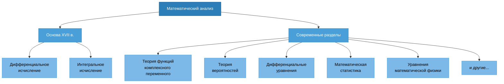
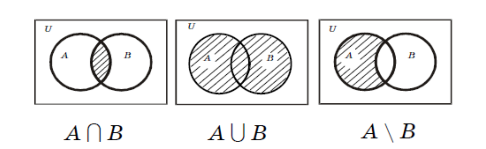
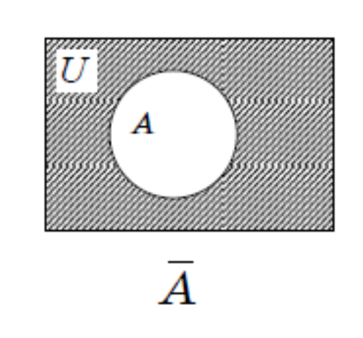

# Математический Анализ. Занятие 1

## Литература

- Матанализ с человеческим лицом
- Ильин В. А., Садовничий В. А., Сендов Б. Х. Математический анализ в 2 ч.
- Архипов Г.И., Садовничий В.А., Чубариков В.Н. Лекции по математическому анализу
- Фихтенгольц Г. М. Курс дифференциального и интегрального исчисления. В 3 т.
- Кудрявцев Л.Д. Курс математического анализа (в двух томах)
- Демидович Б.П. Сборник задач и упражнений по математическому анализу
- Кудрявцев Л.Д. Сборник задач по математическому анализу

## Основные понятия математического анализа. Предмет

Под термином «математический анализ» подразумевается прежде всего дифференциальное и интегральное исчисление, созданное Ньютоном и Лейбницем в XVII в.

Составные части математического анализа разрослись, что стали отдельными математическими дисциплинами: теория функции комплексного переменного, теория вероятностей, дифференциальные уравнения, математическая статистика, уравнения математической физики и т.д.

В широком смысле математический анализ включает в себя все эти области.



## Теория множеств

**Множество** — совокупность объектов любой природы.

> «Под многообразием или множеством я понимаю вообще всякое многое, т.е. всякую совокупность определённых элементов, которая может быть связана в одно целое с помощью некоторого закона».
> 
> — **Георг Кантор**

**Обозначения:**

- $a \in M$ — элемент $a$ принадлежит множеству $M$
- $a \notin M$ — элемент $a$ не принадлежит множеству $M$

### Способы задания множеств

**1) Указанием признаков (характеристических свойств)**

Указываются свойства, присущие всем элементам множества и только им:

$$M = \{x \mid P(x)\}$$

где $P(x)$ — свойство.

**Пример:**

$$A = \{x \mid x \in \mathbb{R}, \, x^2 - 4 = 0\}$$

**2) Перечислением всех элементов множества**

Если это возможно, элементы перечисляются явно:

$$M = \{a; b; ...\}$$

**Пример:**

$$A = \{-2; 2\}$$

**Пустое множество** $\emptyset$

Множество, не содержащее ни одного элемента:

$$B = \{x \mid x \in \mathbb{R}, \, x^2 + 1 = 0\}$$

Это пустое множество, так как нет действительных чисел, квадрат которых равен $-1$.

### Стандартные числовые множества

- $\mathbb{N}$ — множество натуральных чисел
- $\mathbb{R}$ — множество действительных чисел

**Примеры:**

$$A = \{x \mid x \in \mathbb{R}, \, 0 \leq x \leq 4\}$$

Множество всех действительных чисел от 0 до 4 включительно (отрезок $[0, 4]$).

$$C = \{x \mid x \in \mathbb{N}, \, 0 \leq x \leq 4\} = \{1; 2; 3; 4\}$$

Множество натуральных чисел от 0 до 4. Так как натуральные числа начинаются с 1, получаем конечное множество $\{1; 2; 3; 4\}$.

## Операции над множествами

### Равенство множеств

Два множества $A$ и $B$ называются **равными**, если каждый элемент множества $A$ является элементом множества $B$ и, наоборот, каждый элемент множества $B$ является элементом множества $A$.

$$A = B \text{ — множество } A \text{ равно множеству } B$$

**Свойства отношения равенства множеств:**

1. $A = A$ — **рефлексивность**

2. $(A = B) \Rightarrow (B = A)$ — **симметричность**

3. $((A = B) \land (B = C)) \Rightarrow (A = C)$ — **транзитивность**

### Подмножество

Множество $A$ называется **подмножеством** множества $B$, если каждый элемент множества $A$ является элементом множества $B$.

**Обозначение:** $A \subseteq B$

$$A \neq B \land A \subseteq B \Rightarrow A \subset B$$

$\subset$ — отношение **строгого включения**

### Объединение множеств

**Объединением** двух множеств $A$ и $B$ называется множество $C$, состоящее из элементов, которые принадлежат хотя бы одному из этих множеств.

**Обозначение:**

$$C = A \cup B$$

**Определение через свойства элементов:**

$$C = A \cup B = \{x \mid (x \in A) \lor (x \in B) \lor ((x \in A) \land (x \in B))\}$$

где $\lor$ — логическое "или", $\land$ — логическое "и".

### Пересечение множеств

**Пересечением** двух множеств $A$ и $B$ называется множество $C$, состоящее из элементов, которые принадлежат обоим множествам одновременно.

**Обозначение:**

$$C = A \cap B$$

**Определение через свойства элементов:**

$$C = A \cap B = \{x \mid (x \in A) \land (x \in B)\}$$

### Разность множеств

**Разностью** двух множеств $A$ и $B$ называется множество $C$, состоящее из элементов множества $A$, не принадлежащих множеству $B$.

**Обозначение:**

$$C = A \setminus B$$

**Определение через свойства элементов:**

$$C = A \setminus B = \{x \mid (x \in A) \land (x \notin B)\}$$

### Пример операций над множествами

Даны множества:

$$A = \{1; 2; 3; 4; 5\}$$

$$B = \{3; 4; 5; 6; 7\}$$

**Объединение:**

$$A \cup B = \{1; 2; 3; 4; 5; 6; 7\}$$

**Пересечение:**

$$A \cap B = \{3; 4; 5\}$$

**Разность:**

$$A \setminus B = \{1; 2\}$$

## Диаграммы Эйлера-Венна

Диаграммы Эйлера-Венна — это графический способ представления множеств и операций над ними.

### Универсальное множество

$U$ — **универсальное множество** — множество, содержащее все рассматриваемые элементы в данной задаче.

### Дополнение множества

**Дополнением множества** $A$ до универсального множества $U$ называется множество $\overline{A}$, состоящее из элементов универсального множества, не принадлежащих $A$.

**Обозначение:** $\overline{A}$ (читается "A с чертой" или "дополнение A")

**Определение:**

$$\overline{A} = U \setminus A = \{x \mid x \notin A\}$$

### Визуализация операций




## Свойства операций над множествами

**1. Коммутативность объединения:**

$$A \cup B = B \cup A$$

**2. Ассоциативность объединения:**

$$A \cup (B \cup C) = (A \cup B) \cup C$$

**3. Коммутативность пересечения:**

$$A \cap B = B \cap A$$

**4. Ассоциативность пересечения:**

$$A \cap (B \cap C) = (A \cap B) \cap C$$

**5. Дистрибутивность (распределительное свойство):**

$$A \cup (B \cap C) = (A \cup B) \cap (A \cup C)$$

$$A \cap (B \cup C) = (A \cap B) \cup (A \cap C)$$

**6. Идемпотентность:**

$$A \cup A = A$$

$$A \cap A = A$$

**7. Свойства пустого множества:**

$$A \cap \emptyset = \emptyset$$

$$A \cup \emptyset = A$$

**8. Свойства универсального множества:**

$$A \cup U = U$$

$$A \cap U = A$$

**9. Свойства дополнения:**

$$A \cap \overline{A} = \emptyset$$

$$A \cup \overline{A} = U$$

$$\overline{\overline{A}} = A$$

**10. Дополнение универсального и пустого множества:**

$$\overline{\emptyset} = U$$

$$\overline{U} = \emptyset$$

## Числовые множества

### Множество натуральных чисел $\mathbb{N}$

$$\mathbb{N} = \{1, 2, 3, ...\}$$

**Множество $\mathbb{N}$ упорядочено**, т.е. для любых $a, b \in \mathbb{N}$ выполняется:

$$\forall a, b \in \mathbb{N} \Rightarrow (a > b) \lor (a = b) \lor (a < b)$$

### Множество целых чисел $\mathbb{Z}$

$$\mathbb{Z} = \{0, \pm 1, \pm 2, \pm 3, ...\}$$

При этом:

$$\mathbb{N} \subset \mathbb{Z}$$

### Множество рациональных чисел $\mathbb{Q}$

$$\mathbb{Q} = \{ q \mid q = \frac{p}{n}, \, p \in \mathbb{Z}, \, n \in \mathbb{N} \}$$

Рациональные числа — это все числа, которые можно представить в виде дроби $\frac{p}{n}$, где $p$ — целое число (числитель), $n$ — натуральное число (знаменатель).

### Множество действительных чисел $\mathbb{R}$

Множество $\mathbb{R}$ включает в себя все рациональные и иррациональные числа.

**Иерархия числовых множеств:**

$$\mathbb{N} \subset \mathbb{Z} \subset \mathbb{Q} \subset \mathbb{R}$$

## Подмножества числовой прямой

Вся числовая прямая: $\mathbb{R} = (-\infty; +\infty)$

| Название | Обозначение | Изображение |
|----------|-------------|-------------|
| **Отрезок** | $[a; b] = \{x \mid x \in \mathbb{R}, \, a \leq x \leq b\}$ | ●———————● <br/>(оба конца закрашены) |
| **Интервал** | $(a; b) = \{x \mid x \in \mathbb{R}, \, a < x < b\}$ | ○———————○ <br/>(оба конца пустые) |
| **Полуинтервалы** | $[a; b) = \{x \mid x \in \mathbb{R}, \, a \leq x < b\}$ <br/><br/> $(a; b] = \{x \mid x \in \mathbb{R}, \, a < x \leq b\}$ | ●———————○ <br/><br/> ○———————● |

### Бесконечные промежутки

| Обозначение | Определение |
|-------------|-------------|
| $[a; +\infty)$ | $\{x \mid x \in \mathbb{R}, \, x \geq a\}$ |
| $(a; +\infty)$ | $\{x \mid x \in \mathbb{R}, \, x > a\}$ |
| $(-\infty; b]$ | $\{x \mid x \in \mathbb{R}, \, x \leq b\}$ |
| $(-\infty; b)$ | $\{x \mid x \in \mathbb{R}, \, x < b\}$ |

**Примечание:** Символы $\infty$ и $-\infty$ не являются числами, поэтому около них всегда используется круглая скобка (они не могут быть включены в множество).

### Пример: объединение и пересечение промежутков

**Найти объединение и пересечение множеств:**

$$A = [0; 5]$$

$$B = (1; 6)$$

**Визуализация на числовой прямой:**

```
    ●═══════════════════════●
    0   1   2   3   4   5   6
        ○═══════════════════○
```

Отрезок $A = [0; 5]$ включает концы 0 и 5.
Интервал $B = (1; 6)$ не включает концы 1 и 6.

**Пересечение:**

$$A \cap B = (1; 5]$$

Пересечение включает все точки, которые принадлежат одновременно обоим промежуткам. Это полуинтервал от 1 (не включая) до 5 (включая).

**Объединение:**

$$A \cup B = [0; 6)$$

Объединение включает все точки, которые принадлежат хотя бы одному из промежутков. Это полуинтервал от 0 (включая) до 6 (не включая).

## Мощность множества

### Эквивалентные множества

Множества $A$ и $B$ называются **эквивалентными**, если между ними существует взаимно однозначное соответствие, т.е.

$$\forall a \in A \mapsto b \in B$$

$$\forall b \in B \mapsto a \in A$$

**Обозначение:** $A \sim B$

### Конечное множество

$M$ — **конечное множество**, если:

$$\forall M \quad \exists n \in \mathbb{N}: \quad M \sim \{1, 2, ..., n\}$$

### Мощность множества

$n$ — **мощность множества** $M$

**Обозначение:** $|M| = n$